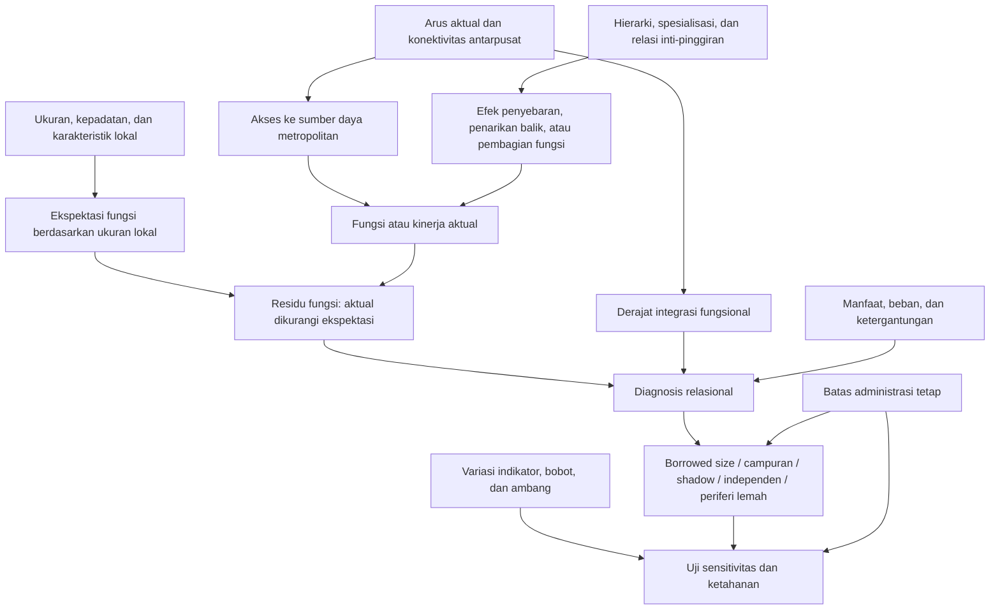

# Bab 2 — Dasar Teori dan Konsep Kunci *Borrowed Size* dan *Agglomeration Shadow* Jakarta

> **Status dokumen:** catatan kerja untuk menyusun Bab 2, bukan naskah final. Dokumen ini memetakan teori, konsep, penelitian terdahulu, kerangka konseptual, dan daftar bacaan prioritas. Formulasi yang masih perlu diuji melalui tinjauan pustaka sistematis ditandai sebagai **kandidat**, bukan sebagai kesimpulan final.

## Kedudukan dokumen

Dokumen ini diturunkan dari arah penelitian dalam [[Skripsi S1 - Borrowed Size dan Agglomeration Shadow Jakarta]], struktur Bab 2 pada [[source/official-document/Template TGA Penelitian 2026.docx|Template TGA Penelitian 2026]], batas klaim dalam [[output/permohonan_data/skenario_akses_data_metodologis_revisi.pdf]] dan [[output/permohonan_data/skenario_akses_data_64.pdf]], serta pilihan bacaan perencanaan dalam [[output/atlas/atlas_masalah_mazhab_dan_sumber_keilmuan_urban_planning_interaktif.html]].

Struktur template memisahkan tiga pekerjaan yang memang tampak mirip, tetapi mempunyai fungsi berbeda:

| Bagian | Pertanyaan yang dijawab | Isi yang semestinya masuk | Hal yang perlu dihindari |
|---|---|---|---|
| **2.1 Konsep-konsep kunci** | Apa arti istilah yang dipakai dalam penelitian ini? | Definisi eksplisit dan pilihan definisi kerja | Menumpuk banyak definisi tanpa memilih satu |
| **2.2 Penelitian terdahulu** | Apa yang sudah diketahui, bagaimana cara mengetahuinya, dan apa yang belum dijawab? | Perbandingan fokus, data, metode, temuan, keterbatasan, dan perbedaan penelitian | Menjadi daftar ringkasan artikel yang tidak membentuk argumen kesenjangan |
| **2.3 Kerangka teori/konseptual** | Mengapa dan melalui mekanisme apa antarkonsep dapat berhubungan? | Rantai mekanisme, konstruk, indikator, proposisi, batas klaim, dan diagram | Mengulang definisi 2.1 atau langsung melompat ke indeks tanpa mekanisme |

Dengan demikian, **konsep kunci adalah kosakata penelitian**, sedangkan **kerangka teori adalah tata hubungan dan mekanisme yang menghubungkan kosakata tersebut**.

## Keputusan arsitektur teoretis

Bab 2 sebaiknya tidak menjadikan *borrowed size* sebagai satu-satunya teori yang berdiri sendiri. Arsitektur yang paling dapat dipertahankan secara akademik terdiri atas empat lapisan:

1. **Ekonomi aglomerasi dan disekonomi aglomerasi** menjelaskan mengapa ukuran, kepadatan, dan kedekatan dapat menghasilkan manfaat sekaligus biaya.
2. **Polarisasi spasial dan kausasi kumulatif** menjelaskan mengapa pertumbuhan pusat besar dapat menyebar ke wilayah sekitar atau justru menarik sumber daya dari wilayah tersebut.
3. **Sistem perkotaan, polisentrisitas, spesialisasi fungsi, dan eksternalitas jaringan** menjelaskan bahwa manfaat metropolitan tidak hanya ditentukan oleh ukuran lokal, tetapi juga oleh posisi suatu pusat dalam jaringan antarkota.
4. ***Borrowed size–agglomeration shadow*** menjadi kerangka diagnosis tingkat menengah yang menghubungkan integrasi jaringan dengan fungsi atau kinerja aktual relatif terhadap yang diharapkan dari ukuran lokal.

Konsep aksesibilitas, geografi fungsional, pusat sekunder, kematangan fungsi lokal, residu fungsi–ukuran, ketergantungan, dan skenario sensitivitas berperan sebagai **konsep jembatan dan operasional**. Teori *post-suburbanization*, *mega-urban region*, dan *desakota* dipakai sebagai **lensa kontekstual Jakarta**, bukan sebagai bukti otomatis terjadinya *borrowed size* atau *agglomeration shadow*.

### Peta hubungan awal

Diagram tersebut adalah **kerangka diagnosis**, bukan model sebab-akibat yang sudah terbukti.

## 2.1 Penjelasan konsep-konsep kunci

### 2.1.1 Ekonomi aglomerasi dan disekonomi aglomerasi

**Definisi kerja.** Ekonomi aglomerasi adalah manfaat yang diperoleh rumah tangga atau perusahaan karena berlokasi dekat dengan banyak orang, perusahaan, pekerja, pemasok, pengetahuan, infrastruktur, dan amenitas. Duranton dan Puga merangkum mekanismenya sebagai **berbagi (*sharing*), mencocokkan (*matching*), dan belajar (*learning*)**: berbagi input atau fasilitas, mencocokkan pasar kerja dan kebutuhan, serta memperoleh pembelajaran dan limpahan pengetahuan. Disekonomi aglomerasi adalah biaya yang meningkat bersama konsentrasi, seperti kemacetan, harga lahan dan perumahan, polusi, tekanan infrastruktur, serta kompetisi yang menyingkirkan fungsi tertentu.

**Peran dalam penelitian.** Teori ini memberi alasan mengapa ukuran lokal perlu dijadikan garis dasar. Jika kota yang lebih besar secara umum mampu menopang lebih banyak fungsi, maka *borrowed size* tidak dapat diidentifikasi hanya dari banyaknya fasilitas; fungsi aktual harus dibandingkan dengan tingkat yang lazim untuk ukuran lokal yang setara.

**Batas penggunaan.** Aglomerasi tidak berarti semua dimensi kinerja selalu meningkat bersama kepadatan. Hasil dapat berbeda menurut sektor, fungsi, kelompok sosial, skala spasial, dan konteks negara. Kepadatan juga bukan sinonim langsung dari produktivitas.

### 2.1.2 Ukuran lokal, fungsi metropolitan, dan kinerja

Tiga objek ini perlu dipisahkan:

- **ukuran lokal** adalah massa yang dimiliki unit itu sendiri, misalnya penduduk, tenaga kerja, jumlah usaha, atau kepadatan;
- **fungsi metropolitan** adalah kapasitas unit menyediakan aktivitas atau layanan berorde lebih tinggi, misalnya pekerjaan tertentu, layanan khusus, fungsi bisnis, pendidikan, kesehatan, budaya, atau pusat kegiatan;
- **kinerja** adalah hasil yang dicapai, misalnya produktivitas, pendapatan, inovasi, atau hasil kesejahteraan.

Sebuah pusat dapat berpenduduk besar tetapi mempunyai fungsi berorde tinggi yang terbatas. Sebaliknya, pusat yang lebih kecil dapat mempunyai fungsi lebih banyak daripada yang lazim bagi ukurannya. Karena itu, penelitian ini tidak boleh memakai fasilitas, PDRB, atau jumlah pekerjaan sebagai pengganti satu sama lain tanpa menjelaskan konstruk yang sebenarnya diukur.

### 2.1.3 Sistem perkotaan, hierarki pusat, dan pusat sekunder

**Sistem perkotaan** adalah himpunan pusat yang saling terkait melalui arus manusia, barang, jasa, modal, informasi, dan pembagian fungsi. Teori tempat sentral memberi titik awal untuk memahami hierarki: layanan berorde lebih tinggi cenderung membutuhkan ambang permintaan dan jangkauan pasar yang lebih besar. Literatur sistem kota dan jaringan kemudian menunjukkan bahwa fungsi sebuah pusat tidak hanya bergantung pada pasar lokal, tetapi juga pada posisi dan relasinya dengan pusat lain.

**Definisi kerja pusat sekunder.** Pusat sekunder adalah pusat selain inti Jakarta yang mempunyai konsentrasi penduduk, pekerjaan, layanan, atau aktivitas dan berpotensi menjalankan fungsi subregional atau metropolitan. Status “sekunder” harus ditentukan melalui kriteria empiris yang konsisten, bukan sekadar karena unit tersebut bersebelahan dengan Jakarta atau berstatus kota administratif.

**Catatan.** Teori tempat sentral berguna sebagai garis dasar hierarki fungsi, tetapi asumsi pasar seragam dan ruang isotropiknya terlalu sederhana untuk langsung diterapkan pada Jabodetabek.

### 2.1.4 Polisentrisitas morfologis dan fungsional

**Polisentrisitas morfologis** menunjuk pada keberadaan beberapa konsentrasi penduduk atau pekerjaan yang relatif berimbang. **Polisentrisitas fungsional** menunjuk pada intensitas dan pola hubungan antarpusat, misalnya arus komuter, perjalanan, transaksi, atau jaringan organisasi.

Pembedaan ini krusial: adanya beberapa pusat pada peta tidak membuktikan bahwa wilayah tersebut berfungsi sebagai jaringan yang terintegrasi. Sebaliknya, hubungan kuat dengan Jakarta dapat tetap terjadi dalam struktur yang hierarkis dan asimetris. Karena itu, penelitian tidak boleh memakai “banyak pusat” sebagai sinonim dari pemerataan fungsi, kemandirian, atau keberhasilan metropolitan.

### 2.1.5 Aksesibilitas, konektivitas, dan integrasi fungsional

Ketiga istilah ini tidak identik:

- **aksesibilitas** adalah potensi menjangkau peluang dengan mempertimbangkan distribusi peluang dan hambatan perjalanan;
- **konektivitas** adalah keberadaan dan kualitas hubungan dalam jaringan;
- **integrasi fungsional** adalah hubungan yang benar-benar termanifestasi melalui arus atau interaksi aktual antarpusat.

Jika data hanya berisi waktu tempuh, jaringan jalan, atau jarak, hasil harus disebut **aksesibilitas potensial**, bukan integrasi aktual. Klaim integrasi lebih kuat memerlukan bukti relasional, seperti asal–tujuan komuter, perjalanan, transaksi, jaringan perusahaan, atau bentuk arus lain yang dapat dipertanggungjawabkan.

### 2.1.6 Kematangan fungsi lokal dan residu fungsi–ukuran

**Kematangan fungsi lokal** adalah kemampuan suatu pusat untuk menopang kombinasi pekerjaan, layanan, dan aktivitas yang sepadan atau lebih tinggi daripada basis ukuran dan karakteristik lokalnya. Ia tidak sama dengan swasembada absolut dan tidak mengharuskan terputus dari Jakarta.

Secara konseptual, untuk fungsi $k$ pada unit $i$:

$$
\widehat{F}_{ik}=f_k(S_i,X_i)
$$

$$
R_{ik}=F_{ik}-\widehat{F}_{ik}
$$

dengan:

- $F_{ik}$: fungsi atau kinerja aktual yang benar-benar diukur;
- $S_i$: ukuran lokal;
- $X_i$: karakteristik pembanding yang relevan dan tersedia;
- $\widehat{F}_{ik}$: fungsi yang diharapkan berdasarkan unit pembanding atau model transparan;
- $R_{ik}$: residu berupa surplus atau defisit relatif pada konstruk $k$.

Residu positif tidak otomatis membuktikan *borrowed size*; residu negatif tidak otomatis membuktikan *shadow*. Keduanya baru bermakna relasional ketika dibaca bersama integrasi dengan Jakarta atau jaringan pusat lain.

### 2.1.7 *Borrowed size*

**Definisi teoretis.** *Borrowed size* adalah keadaan ketika suatu tempat memiliki fungsi atau tingkat kinerja yang lazimnya diasosiasikan dengan kota yang lebih besar karena tempat tersebut dapat mengakses dan memobilisasi manfaat aglomerasi melalui jaringan dengan pusat lain. Alonso memperkenalkan intuisi awalnya, sedangkan Meijers dan Burger memperluasnya dari kedekatan dalam kompleks metropolitan menjadi hubungan jaringan pada berbagai skala.

**Definisi operasional sementara.** Suatu unit menunjukkan pola yang konsisten dengan *borrowed size* apabila:

1. terdapat bukti hubungan aktual atau bukti relasional yang memadai dengan Jakarta atau jaringan pusat;
2. fungsi aktual menunjukkan surplus yang substantif terhadap ekspektasi berdasarkan ukuran dan karakteristik lokal;
3. unit, periode, wilayah tangkapan (*catchment*), dan konstruk antara integrasi dan fungsi cukup kompatibel; dan
4. klasifikasi tidak runtuh hanya karena satu indikator, satu bobot, satu ambang, atau satu proksi bermutu rendah.

Dengan desain potong lintang atau observasional nonkausal, formulasi hasil yang aman adalah **“pola konsisten dengan borrowed size”**, bukan “Jakarta menyebabkan pusat tersebut meminjam ukuran.”

### 2.1.8 *Agglomeration shadow*

**Definisi teoretis.** *Agglomeration shadow* adalah keadaan ketika posisi dekat atau terhubung dengan pusat yang dominan berkaitan dengan fungsi atau kinerja lokal yang lebih rendah daripada yang sewajarnya diharapkan, antara lain karena kompetisi permintaan, tenaga terampil, investasi, atau fungsi berorde tinggi terkonsentrasi pada pusat besar.

**Definisi operasional sementara.** Label ketat memerlukan empat gerbang bukti yang sama dengan *borrowed size*, tetapi residu fungsinya negatif dan idealnya diperkuat oleh bukti beban atau ketergantungan asimetris. Kedekatan, waktu tempuh singkat, arus keluar komuter, atau defisit fasilitas secara sendiri-sendiri belum cukup.

**Bukti tandingan penting.** Literatur empiris menunjukkan bahwa kedekatan ke pusat besar tidak selalu menekan pertumbuhan. Efek dapat positif, negatif, tidak signifikan, atau berbeda menurut fungsi dan posisi jaringan. Oleh sebab itu, *shadow* harus diuji, bukan diasumsikan.

### 2.1.9 Spesialisasi fungsi dan ketergantungan asimetris

Duranton dan Puga menunjukkan bahwa organisasi ekonomi dapat berubah dari spesialisasi menurut sektor menuju spesialisasi menurut fungsi: kantor pusat dan layanan bisnis terkonsentrasi di kota besar, sedangkan pabrik atau produksi berpindah ke kota yang lebih kecil. Implikasinya bagi Jakarta adalah bahwa pertumbuhan pekerjaan industri di pinggiran belum tentu identik dengan pematangan seluruh fungsi lokal.

**Ketergantungan asimetris** berarti hubungan dengan inti penting bagi pusat sekunder, sementara kepentingan timbal baliknya tidak seimbang. Ia dapat muncul melalui dominasi tujuan komuter, ketergantungan pada layanan berorde tinggi di inti, konsentrasi fungsi keputusan di Jakarta, atau beban infrastruktur dan lingkungan yang tidak disertai penguatan kapasitas lokal.

Ketergantungan harus dilaporkan sebagai dimensi tersendiri. Manfaat akses metropolitan dan ketergantungan dapat hadir secara bersamaan.

### 2.1.10 Kondisi campuran atau *contested*

Kategori campuran diperlukan untuk pusat yang:

- menikmati akses atau surplus pada satu fungsi tetapi mengalami defisit pada fungsi lain;
- memiliki surplus fungsi sekaligus beban ketergantungan tinggi;
- menunjukkan hasil yang berubah-ubah ketika indikator atau ambang diganti; atau
- belum memenuhi gerbang bukti untuk label *borrowed size* maupun *shadow*.

Kategori ini bukan “tempat sisa”, melainkan perlindungan terhadap klasifikasi biner yang terlalu percaya diri.

### 2.1.11 Geografi fungsional dan yurisdiksi administratif

Geografi fungsional dibentuk oleh arus, jangkauan pasar, waktu tempuh, dan wilayah tangkapan kegiatan. Yurisdiksi administratif menentukan kewenangan, pelayanan, fiskal, dan akuntabilitas. Penelitian dapat memetakan hubungan yang melintasi batas, tetapi tidak boleh menafsirkan perluasan jejak fungsional sebagai perluasan wilayah administratif Jakarta.

Pendekatan *functional urban area* berguna sebagai referensi untuk mengidentifikasi wilayah inti dan zona komuter, tetapi definisinya perlu disesuaikan secara transparan dengan unit dan ketersediaan data Indonesia.

### 2.1.12 Diagnosis *status quo*, sensitivitas, dan skenario

- **Diagnosis *status quo*** menggunakan data observasi untuk menggambarkan integrasi, fungsi relatif, manfaat, beban, dan kelas dasar.
- **Analisis sensitivitas** mengubah asumsi teknis—indikator, bobot, ambang, atau spesifikasi model—untuk menguji kestabilan hasil.
- **Skenario** adalah konfigurasi nilai atau asumsi yang eksplisit untuk mengeksplorasi konsekuensi kondisional; ia bukan ramalan dan bukan bukti perubahan kausal.

Literatur *planning support systems* membantu merancang antarmuka yang membuat asumsi, hasil dasar, perubahan kelas, dan ketidakpastian terlihat. WebGL adalah medium komunikasi dan eksplorasi model, bukan teori substantif tentang metropolitan Jakarta.

## 2.2 Kajian penelitian terdahulu

### 2.2.1 Sintesis menurut rumpun literatur

| Rumpun | Yang telah ditunjukkan literatur | Batas yang relevan | Implikasi untuk penelitian |
|---|---|---|---|
| Asal dan perluasan *borrowed size* | Pusat kecil dapat memiliki fungsi/kinerja di atas ekspektasi ukuran melalui jaringan; skala dan fungsi penting | Basis empiris awal didominasi Eropa dan hasilnya bergantung pada jenis fungsi | Uji per fungsi dan jangan menganggap transfer ke Jakarta otomatis |
| Operasionalisasi fungsi–ukuran | Fungsi aktual dapat dibandingkan dengan hubungan umum antara ukuran kota dan fungsi | Residu dapat berubah menurut unit, model, dan proksi | Gunakan model pembanding yang transparan serta diagnostik sensitivitas |
| *Agglomeration shadow* | Pusat dominan dapat menaungi pusat lain, tetapi kedekatan juga dapat menghasilkan limpahan positif | Bukti tidak universal dan tidak semua studi mengukur hubungan aktual | Perlakukan *shadow* sebagai hipotesis relasional, bukan efek jarak |
| Polisentrisitas dan jaringan kota | Morfologi dan fungsi merupakan dimensi berbeda; integrasi dapat memperkuat akses pada fungsi metropolitan | Banyak pusat tidak otomatis berarti jaringan kohesif atau kinerja tinggi | Arus aktual harus dipisahkan dari jumlah dan ukuran pusat |
| Aglomerasi dan spesialisasi fungsi | Manfaat aglomerasi bekerja melalui mekanisme berbagi–mencocokkan–belajar; fungsi keputusan dan produksi dapat terpisah | Produktivitas, fasilitas, pekerjaan, dan kesejahteraan bukan konstruk yang identik | Pilih indikator sesuai konstruk dan laporkan hasil secara multidimensi |
| Transformasi metropolitan Jakarta | Terjadi suburbanisasi industri, kota baru, transformasi peri-urban, privatisasi, dan kecenderungan multisentris | Sebagian studi bersifat deskriptif atau menekankan morfologi, tata guna lahan, dan satu sektor | Menyediakan konteks, tetapi belum langsung mengklasifikasikan *borrowed size–shadow* |
| Mobilitas dan post-suburbanisasi Jakarta | Arus komuter memperlihatkan hubungan inti–pinggiran dan antarpinggiran yang berubah | Skala data dan periode tertentu membatasi generalisasi | Menunjukkan pentingnya bukti arus untuk integrasi dan kematangan pusat |

### 2.2.2 Kandidat kesenjangan penelitian

Berdasarkan penelusuran awal, literatur Jakarta telah membahas dekonsentrasi industri, perkembangan kota baru, transformasi periurban, polisentrisitas morfologis/fungsional, dan komuter. Literatur *borrowed size* telah mengembangkan hubungan antara ukuran, konektivitas jaringan, fungsi, dan *shadow*, terutama di Eropa.

**Kandidat kesenjangan** penelitian ini adalah belum ditemukannya studi Jakarta yang secara bersamaan:

1. mengukur integrasi relasional pusat sekunder dengan Jakarta dan pusat lain;
2. membandingkan fungsi aktual dengan ekspektasi berdasarkan ukuran dan karakteristik lokal;
3. memisahkan surplus/defisit fungsi, manfaat akses, dan beban ketergantungan;
4. membentuk tipologi *borrowed size–campuran–shadow* beserta kelas pembanding; dan
5. menguji kestabilan jejak spasial klasifikasi terhadap pilihan indikator, bobot, ambang, serta spesifikasi model dengan batas administratif tetap.

Rumusan ini **belum boleh ditulis sebagai kesenjangan final** sebelum pencarian bibliografi yang lebih sistematis—termasuk literatur Indonesia yang mungkin tidak terindeks baik—selesai dilakukan.

### 2.2.3 Matriks penelitian Jakarta yang paling relevan

| Sumber | Fokus/data utama | Kontribusi untuk skripsi | Perbedaan yang perlu dipertahankan |
|---|---|---|---|
| Henderson, Kuncoro, & Nasution (1996) | Pergeseran residensi dan industri Jabotabek; perubahan dari monosentris ke multisentris | Dasar historis restrukturisasi pusat dan pekerjaan | Belum memakai kerangka *borrowed size–shadow* atau residu fungsi–ukuran |
| Firman (2009) | Mega-urbanisasi koridor Jakarta–Bandung dan perubahan multi-inti | Menempatkan Jakarta dalam sistem urban yang meluas | Transformasi bentuk tidak otomatis menunjukkan integrasi produktif |
| Hudalah & Firman (2012) | Kawasan industri dan elemen *post-suburbia* | Menunjukkan dekonsentrasi fungsi ekonomi ke pinggiran | Fokus sektoral dan transformasi kawasan, bukan diagnosis fungsi relatif |
| Hudalah et al. (2013) | Dekonsetrasi manufaktur dan pusat industri privat | Bukti bahwa pusat industri pinggiran menangkap pekerjaan manufaktur | Pekerjaan manufaktur tidak boleh disamakan dengan seluruh kematangan fungsi |
| Winarso, Hudalah, & Firman (2015) | Transformasi sosial-ekonomi peri-urban dan segregasi | Menghubungkan pertumbuhan dengan distribusi manfaat dan ketimpangan | Perlu memisahkan manfaat, fungsi, dan beban pada unit analisis penelitian ini |
| Firman & Fahmi (2017) | Privatisasi pinggiran, kota baru, dan fase awal *post-suburbanization* | Konteks perkembangan pusat pinggiran yang lebih mandiri | Pendekatan deskriptif; tidak membuktikan *borrowed size* |
| Sadewo et al. (2021) | Polisentrisitas morfologis dan fungsional Medan, Jakarta, Denpasar | Dasar operasional pemisahan pusat dan hubungan antarpusat | Polisentrisitas bukan sinonim surplus fungsi atau rendahnya ketergantungan |
| Sadewo et al. (2023) | Panel spasial komuter antarpinggiran 2008–2015 | Bukti interaksi antarpinggiran dan pengaruh dekonsentrasi pekerjaan | Fokus komuter; perlu ditautkan ke fungsi relatif dan beban |
| Aritenang (2023) | Survei komuter 2014 dan 2019; independensi, kematangan, segregasi | Sumber terdekat untuk konstruksi kematangan pusat dan relasi komuter | Kerangka *post-suburbanization*, bukan klasifikasi *borrowed size–shadow* |

## 2.3 Kerangka teori dan kerangka konseptual

### 2.3.1 Rantai mekanisme

#### Mekanisme A — Manfaat dan biaya ukuran lokal

Ukuran dan kepadatan lokal dapat meningkatkan variasi pemasok, pasar tenaga kerja, peluang pencocokan, pembelajaran, infrastruktur bersama, dan permintaan terhadap fungsi berorde tinggi. Pada saat yang sama, konsentrasi meningkatkan biaya lahan, kemacetan, polusi, dan kompetisi. Hubungan antara ukuran dan fungsi menjadi garis dasar yang perlu diestimasi, bukan diasumsikan linear dan seragam.

#### Mekanisme B — Eksternalitas jaringan dan peminjaman ukuran

Pusat yang terhubung dapat mengakses pasar, tenaga kerja, pengetahuan, fasilitas, dan fungsi di luar ukuran lokalnya. Jaringan dapat menjadi pelengkap atau sebagian substitusi bagi kedekatan internal. Efeknya bergantung pada kualitas konektivitas, arus aktual, fungsi yang diukur, ukuran pusat itu sendiri, dan kemampuan lokal menyerap manfaat.

#### Mekanisme C — Polarisasi, *backwash*, dan pembagian fungsi

Keterhubungan juga dapat memusatkan permintaan, fungsi keputusan, tenaga terampil, modal, dan layanan berorde tinggi pada Jakarta. Pusat pinggiran dapat tumbuh sebagai lokasi produksi atau perumahan tanpa memperoleh fungsi pengendalian, layanan strategis, atau kapasitas fiskal yang sebanding. Karena itu, pertumbuhan absolut dapat hadir bersamaan dengan defisit fungsi relatif atau beban tinggi.

#### Mekanisme D — Struktur urban dan kondisi perantara

Efek jaringan dimoderasi oleh ukuran pusat sendiri, hierarki, spesialisasi, posisi dalam jaringan, akses multimoda, struktur ekonomi, ketersediaan lahan, institusi, dan batas administratif. Satu pusat dapat meminjam fungsi tertentu, tetap bergantung pada fungsi lain, dan terbebani pada dimensi ketiga.

### 2.3.2 Model pengukuran konseptual

Untuk setiap pusat $i$ dan dimensi fungsi $k$, penelitian membedakan:

1. **Ukuran dan karakteristik lokal**: $S_i, X_i$;
2. **Integrasi relasional**: $I_i$, idealnya berasal dari arus aktual;
3. **Fungsi atau kinerja aktual**: $F_{ik}$;
4. **Fungsi yang diharapkan**: $\widehat{F}_{ik}$;
5. **Residu fungsi relatif**: $R_{ik}$;
6. **Manfaat akses**: $A_{ik}$;
7. **Beban atau ketergantungan**: $D_{ik}$;
8. **Ketahanan klasifikasi**: $Q_i$, diperoleh dari variasi spesifikasi yang masuk akal.

Hubungan inti yang diuji adalah:

$$
R_{ik}=g_k(I_i,S_i,X_i,Z_i)+\varepsilon_{ik}
$$

dengan $Z_i$ sebagai moderator kontekstual. Persamaan ini adalah bentuk umum. Spesifikasi akhirnya harus mengikuti data dan desain Bab 3; persamaan tidak mengharuskan regresi kausal apabila data hanya mendukung diagnosis deskriptif.

### 2.3.3 Tipologi diagnosis sementara

| Integrasi relasional | Residu fungsi | Beban atau ketergantungan | Kelas sementara | Interpretasi aman |
|---|---:|---:|---|---|
| Tinggi | Positif | Rendah–sedang | *Borrowed size* / integrasi produktif | Pola konsisten dengan akses jaringan yang memperbesar fungsi relatif |
| Tinggi | Positif | Tinggi | Campuran/*contested* | Surplus fungsi hadir, tetapi manfaat disertai ketergantungan atau beban besar |
| Tinggi | Negatif | Tinggi | *Agglomeration shadow* / ketergantungan asimetris | Pola konsisten dengan integrasi yang tidak diikuti pematangan fungsi lokal |
| Tinggi | Negatif | Rendah atau belum terbukti | Terintegrasi tetapi tertinggal/belum pasti | Belum cukup bukti untuk menyebut *shadow* |
| Rendah | Positif | Bervariasi | Relatif independen atau matang lokal | Surplus fungsi tidak terutama dibaca sebagai hasil hubungan dengan Jakarta |
| Rendah | Negatif | Bervariasi | Periferi lemah | Basis lokal dan hubungan metropolitan sama-sama terbatas |

Kelas akhir sebaiknya dibuat per dimensi terlebih dahulu. Indeks komposit hanya layak dibuat setelah arah indikator, skala, kualitas data, korelasi antarkonstruk, dan sensitivitas bobot diperiksa.

### 2.3.4 Proposisi empiris kandidat

Jika desain Bab 3 mendukung pengujian inferensial, proposisi berikut dapat diubah menjadi hipotesis. Jika tidak, gunakan sebagai ekspektasi interpretif.

1. **P1 — Efek jaringan bersyarat.** Setelah ukuran dan karakteristik lokal diperhitungkan, integrasi fungsional yang lebih kuat berasosiasi dengan surplus pada sebagian fungsi, tetapi tidak harus pada semua fungsi.
2. **P2 — Kemungkinan *shadow*.** Pada pusat tertentu, integrasi kuat dengan Jakarta berasosiasi dengan defisit fungsi relatif dan/atau beban ketergantungan yang lebih tinggi.
3. **P3 — Heterogenitas fungsi.** Arah dan besar hubungan berbeda antara pekerjaan, layanan, amenitas, fungsi keputusan, dan konstruk kinerja.
4. **P4 — Peran *own mass* dan posisi jaringan.** Pusat dengan basis lokal, sentralitas, dan kapasitas penyerapan yang lebih kuat lebih mampu mengubah akses jaringan menjadi pematangan fungsi lokal.
5. **P5 — Morfologi tidak cukup.** Tingkat polisentrisitas morfologis tidak dengan sendirinya menjelaskan integrasi fungsional, surplus fungsi, atau rendahnya ketergantungan.
6. **P6 — Ketidakpastian klasifikasi.** Sebagian unit akan berpindah kelas ketika proksi, bobot, ambang, atau wilayah tangkapan diubah; unit yang stabil lebih layak menjadi dasar kesimpulan kebijakan.

### 2.3.5 Gerbang penggunaan label ketat

Label *borrowed size* atau *agglomeration shadow* hanya digunakan jika empat syarat terpenuhi:

1. **Bukti relasional:** ada hubungan dengan Jakarta, bukan hanya kedekatan atau waktu tempuh.
2. **Pembanding substantif:** fungsi aktual dibandingkan dengan ekspektasi ukuran pada unit yang memadai.
3. **Kompatibilitas:** unit, periode, wilayah tangkapan, populasi sasaran, dan konstruk cukup sepadan.
4. **Ketahanan:** hasil tidak bergantung pada satu proksi lemah atau satu keputusan teknis.

Jika salah satu syarat utama tidak terpenuhi, gunakan istilah seperti “aksesibilitas potensial”, “surplus/defisit fungsi relatif”, “ketergantungan komuter”, atau “pola belum terklasifikasi”, sesuai bukti yang benar-benar tersedia.

### 2.3.6 Klaim yang dapat dan tidak dapat dibuat

**Dapat dibuat dengan desain *status quo* dan sensitivitas:** pola spasial, asosiasi, arus, aksesibilitas potensial, surplus/defisit relatif, tipologi relasional, multidimensionalitas, serta kestabilan klasifikasi.

**Belum dapat dibuat tanpa desain tambahan:** Jakarta secara kausal “mengisap” pusat tertentu; integrasi menyebabkan produktivitas; perubahan bobot pada WebGL memprediksi masa depan; terdapat radius optimal universal; atau batas administratif harus diubah.

## Daftar bacaan prioritas

Daftar berikut disusun untuk dibaca, bukan sebagai pernyataan bahwa seluruh teks lengkapnya sudah diakses. Urutan menunjukkan kegunaan bagi skripsi, bukan peringkat mutu universal. Tidak dilakukan penyaringan berdasarkan status gratis atau berbayar, sesuai kebutuhan awal.

### A. Lima belas bacaan pertama

1. **Meijers, E., & Burger, M. (2017). [“Stretching the concept of ‘borrowed size’”](https://doi.org/10.1177/0042098015597642).** Bacaan konseptual utama untuk definisi *borrowed size*, perluasan skala, fungsi, kinerja, dan peran jaringan.
2. **Meijers, E., Burger, M., & Hoogerbrugge, M. (2016). [“Borrowing size in networks of cities: City size, network connectivity and metropolitan functions in Europe”](https://doi.org/10.1111/pirs.12181).** Dasar hubungan ukuran lokal, konektivitas, dan fungsi metropolitan.
3. **Burger, M., Meijers, E., Hoogerbrugge, M., & Masip Tresserra, J. (2015). [“Borrowed Size, Agglomeration Shadows and Cultural Amenities in North-West Europe”](https://doi.org/10.1080/09654313.2014.905002).** Contoh langsung operasionalisasi fungsi–ukuran dan *shadow*; perlu dibaca dengan kesadaran bahwa amenitas budaya hanya satu konstruk.
4. **Alonso, W. (1973). [“Urban Zero Population Growth”](https://www.jstor.org/stable/20024174).** Sumber intuisi awal *borrowed size* dalam kompleks metropolitan.
5. **Burger, M., & Meijers, E. (2016). [“Agglomerations and the rise of urban network externalities”](https://doi.org/10.1111/pirs.12223).** Jembatan antara ekonomi aglomerasi dan manfaat posisi dalam jaringan kota.
6. **Duranton, G., & Puga, D. (2004). [“Micro-foundations of urban agglomeration economies”](https://doi.org/10.1016/S1574-0080(04)80005-1).** Landasan mekanisme berbagi–mencocokkan–belajar.
7. **Duranton, G., & Puga, D. (2020). [“The Economics of Urban Density”](https://doi.org/10.1257/jep.34.3.3).** Ringkasan modern manfaat dan biaya kepadatan; berguna untuk menahan narasi aglomerasi yang hanya positif.
8. **Myrdal, G. (1957). [*Economic Theory and Under-developed Regions*](https://books.google.com/books?id=aujSAAAAMAAJ).** Landasan *spread effects*, *backwash effects*, dan kausasi kumulatif. Catatan vault: [[source/book/Myrdal - 1957 - Economic Theory and Under-Developed Regions]].
9. **Partridge, M. D., Rickman, D. S., Ali, K., & Olfert, M. R. (2009). [“Do New Economic Geography agglomeration shadows underlie current population dynamics across the urban hierarchy?”](https://doi.org/10.1111/j.1435-5957.2008.00211.x).** Counterevidence penting: kedekatan ke pusat besar tidak otomatis menghasilkan *shadow*.
10. **Burger, M., & Meijers, E. (2012). [“Form Follows Function? Linking Morphological and Functional Polycentricity”](https://doi.org/10.1177/0042098011407095).** Dasar pemisahan polisentrisitas morfologis dan fungsional.
11. **Duranton, G., & Puga, D. (2005). [“From sectoral to functional urban specialisation”](https://doi.org/10.1016/j.jue.2004.12.002).** Mekanisme penting untuk membedakan pertumbuhan produksi pinggiran dari pematangan fungsi keputusan dan layanan.
12. **Geurs, K. T., & van Wee, B. (2004). [“Accessibility evaluation of land-use and transport strategies: Review and research directions”](https://doi.org/10.1016/j.jtrangeo.2003.10.005).** Dasar memilih dan membatasi makna indikator aksesibilitas.
13. **Firman, T., & Fahmi, F. Z. (2017). [“The Privatization of Metropolitan Jakarta’s (Jabodetabek) Urban Fringes”](https://doi.org/10.1080/01944363.2016.1249010).** Konteks utama perkembangan pusat pinggiran, kota baru, kawasan industri, dan *post-suburbanization*. Catatan vault: [[source/journal/Firman - 2017 - Privatization of Metropolitan Jakarta Urban Fringes]].
14. **Sadewo, E., Hudalah, D., Antipova, A., Cheng, L., & Syabri, I. (2023). [“The role of urban transformation on inter-suburban commuting”](https://doi.org/10.1080/02723638.2022.2125649).** Bukti empiris tentang dekonsentrasi pekerjaan dan arus komuter antarpinggiran Jakarta.
15. **Aritenang, A. F. (2023). [“Identifying post-suburbanization: The case of the Jakarta metropolitan area”](https://doi.org/10.1016/j.habitatint.2023.102857).** Bacaan terdekat untuk independensi spasial, kematangan wilayah pinggiran, segregasi, dan data komuter 2014–2019.

#### Rute baca minimum bila waktu terbatas

Baca berurutan: **Meijers & Burger (2017) → Meijers et al. (2016) → Burger et al. (2015) → Duranton & Puga (2004) → Myrdal (1957) → Burger & Meijers (2012) → Firman & Fahmi (2017) → Sadewo et al. (2023) → Aritenang (2023)**.

### B. Bacaan penguat dan penguji argumen

- **Krugman, P. (1991). [“Increasing Returns and Economic Geography”](https://doi.org/10.1086/261763).** Landasan *new economic geography* untuk interaksi *increasing returns*, biaya transportasi, dan pemusatan kegiatan.
- **Fujita, M., Krugman, P., & Venables, A. J. (1999). [*The Spatial Economy: Cities, Regions, and International Trade*](https://mitpress.mit.edu/9780262561471/the-spatial-economy/).** Sintesis teoretis aglomerasi pada berbagai skala; berguna sebagai dasar mekanisme, bukan sebagai model empiris yang langsung dipindahkan ke Jakarta.
- **Phelps, N. A., Fallon, R. J., & Williams, C. L. (2001). [“Small Firms, Borrowed Size and the Urban–Rural Shift”](https://doi.org/10.1080/00343400120075885).** Aplikasi awal *borrowed size* pada perusahaan kecil dan perubahan urban–rural.
- **Arthur, W. B. (1990). [“‘Silicon Valley’ locational clusters: When do increasing returns imply monopoly?”](https://doi.org/10.1016/0165-4896(90)90064-E).** Latar mekanisme increasing returns dan konsentrasi yang sering dirujuk dalam genealogi *shadow*.
- **Dobkins, L. H., & Ioannides, Y. M. (2001). [“Spatial interactions among U.S. cities: 1900–1990”](https://doi.org/10.1016/S0166-0462(01)00067-9).** Pengujian kedekatan dengan kota berhierarki lebih tinggi; hasil tidak selalu signifikan.
- **Sohn, C., Licheron, J., & Meijers, E. (2022). [“Border cities: Out of the shadow”](https://doi.org/10.1111/pirs.12653).** Menunjukkan bahwa batas dan integrasi pasar dapat memoderasi hubungan *borrowing–shadowing*.
- **Volgmann, K., & Rusche, K. (2020). [“The Geography of Borrowing Size: Exploring Spatial Distributions for German Urban Regions”](https://doi.org/10.1111/tesg.12362).** Mengoperasionalkan *borrowed size*, *borrowed performance*, *borrowed function*, dan *agglomeration shadow* pada unit lokal; sangat berguna untuk merancang tipologi.
- **Kwon, Y.-H. (2026). [“Borrowed Size of Small and Medium Cities in a Hierarchical Urban System”](https://doi.org/10.1111/tesg.70061).** Perluasan terbaru ke sistem perkotaan Korea yang hierarkis; relevan sebagai penguji transfer dari konteks Eropa, bukan sebagai dasar klasik.
- **Meijers, E., Hoogerbrugge, M., & Cardoso, R. (2018). [“Beyond Polycentricity: Does Stronger Integration Between Cities in Polycentric Urban Regions Improve Performance?”](https://doi.org/10.1111/tesg.12292).** Integrasi fungsional, institusional, dan kultural; relevan untuk membedakan bentuk dari kohesi jaringan.
- **Meijers, E. (2008). [“Measuring Polycentricity and its Promises”](https://doi.org/10.1080/09654310802401805).** Kritik terhadap ambiguitas dan basis empiris polisentrisitas. Catatan vault: [[source/journal/Meijers - 2008 - Measuring Polycentricity and its Promises]].
- **Meijers, E. J., & Burger, M. J. (2010). [“Spatial Structure and Productivity in US Metropolitan Areas”](https://doi.org/10.1068/a42151).** Bukti komparatif bahwa struktur spasial dapat berkaitan dengan produktivitas, tetapi temuan AS tidak boleh ditransfer langsung. Catatan vault: [[source/journal/Meijers - 2010 - Spatial Structure and Productivity in US Metropolitan Areas]].
- **Rosenthal, S. S., & Strange, W. C. (2004). [“Evidence on the Nature and Sources of Agglomeration Economies”](https://doi.org/10.1016/S1574-0080(04)80006-3).** Tinjauan bukti empiris aglomerasi.
- **Ahlfeldt, G. M., & Pietrostefani, E. (2019). [“The economic effects of density: A synthesis”](https://doi.org/10.1016/j.jue.2019.04.006).** Sintesis kuantitatif efek kepadatan.
- **Grover, A., Lall, S. V., & Timmis, J. (2023). [“Agglomeration economies in developing countries: A meta-analysis”](https://doi.org/10.1016/j.regsciurbeco.2023.103901).** Penguji transfer teori aglomerasi ke konteks negara berkembang.
- **Christaller, W. (1966 [1933]). [*Central Places in Southern Germany*](https://books.google.com/books/about/Central_places_in_southern_Germany.html?id=BONEAAAAIAAJ).** Dasar hierarki pusat, ambang, dan jangkauan fungsi. Catatan vault: [[source/book/Christaller - 1933 - Die zentralen Orte in Süddeutschland]].
- **Mulligan, G. F., Partridge, M. D., & Carruthers, J. I. (2012). [“Central place theory and its reemergence in regional science”](https://doi.org/10.1007/s00168-011-0496-7).** Jembatan dari teori tempat sentral klasik ke ilmu regional kontemporer.
- **Hirschman, A. O. (1958). [*The Strategy of Economic Development*](https://books.google.com/books/about/The_Strategy_of_Economic_Development.html?id=wls-AAAAYAAJ).** *Trickling-down* dan polarisasi sebagai pembanding terhadap Myrdal.
- **Perroux, F. (1955). [“Note sur la notion de pôle de croissance”](https://doi.org/10.3406/ecoap.1955.2522).** Genealogi *growth pole*; berguna sebagai konteks, bukan sinonim dari Jakarta sebagai pusat yang otomatis menyebarkan pertumbuhan.
- **Hansen, W. G. (1959). [“How Accessibility Shapes Land Use”](https://doi.org/10.1080/01944365908978307).** Sumber klasik aksesibilitas berbasis peluang.
- **Dijkstra, L., Poelman, H., & Veneri, P. (2019). [“The EU–OECD definition of a functional urban area”](https://doi.org/10.1787/d58cb34d-en).** Acuan metodologis untuk inti kota dan zona komuter; perlu adaptasi terhadap data Indonesia.

### C. Bacaan konteks Jakarta/Jabodetabek

- **Henderson, J. V., Kuncoro, A., & Nasution, D. (1996). [“The Dynamics of Jabotabek Development”](https://doi.org/10.1080/00074919612331336898).** Sejarah perubahan spasial residensi, industri, infrastruktur, dan multisentrisitas.
- **Firman, T. (2009). [“The continuity and change in mega-urbanization in Indonesia”](https://doi.org/10.1016/j.habitatint.2008.08.005).** Sistem Jakarta–Bandung, perluasan koridor, dan transformasi multi-inti.
- **Hudalah, D., & Firman, T. (2012). [“Beyond property: Industrial estates and post-suburban transformation in Jakarta Metropolitan Region”](https://doi.org/10.1016/j.cities.2011.07.003).** Peran kawasan industri dalam transformasi pinggiran.
- **Hudalah, D., Viantari, D., Firman, T., & Woltjer, J. (2013). [“Industrial Land Development and Manufacturing Deconcentration in Greater Jakarta”](https://doi.org/10.1080/02723638.2013.783281).** Bukti penangkapan pekerjaan manufaktur oleh pusat industri suburban.
- **Winarso, H., Hudalah, D., & Firman, T. (2015). [“Peri-urban transformation in the Jakarta metropolitan area”](https://doi.org/10.1016/j.habitatint.2015.05.024).** Transformasi sosial-ekonomi, pekerjaan, dan segregasi.
- **Sadewo, E., Syabri, I., Antipova, A., Pradono, & Hudalah, D. (2021). [“Using morphological and functional polycentricity analyses to study the Indonesian urban spatial structure”](https://doi.org/10.1080/10225706.2020.1737829).** Perbandingan polisentrisitas termasuk Jakarta.
- **Herlambang, S., Leitner, H., Tjung, L. J., Sheppard, E., & Anguelov, D. (2019). [“Jakarta’s great land transformation: Hybrid neoliberalisation and informality”](https://doi.org/10.1177/0042098018756556).** Ekonomi politik perubahan lahan metropolitan; penting untuk menafsirkan siapa yang memperoleh manfaat.
- **Hudalah, D. (2017). [“Governing industrial estates on Jakarta’s periurban area”](https://doi.org/10.1111/sjtg.12177).** Tata kelola kawasan industri dan perubahan dari *shadow government* menuju jaringan.
- **McGee, T. G. (1991). “The Emergence of Desakota Regions in Asia.”** Lensa konteks campuran desa–kota dan urbanisasi koridor. Catatan vault: [[source/book/McGee - 1991 - The Emergence of Desakota Regions in Asia]].

### D. Bacaan konsep dan metode terpilih dari Atlas Urban Planning

Bacaan berikut bukan seluruhnya teori kausal inti, tetapi paling berguna untuk menjelaskan konsep kunci, desain diagnosis, skenario, dan implikasi perencanaan:

#### Aksesibilitas dan mobilitas

- **Bertolini, L., le Clercq, F., & Kapoen, L. (2005). [“Sustainable Accessibility”](https://doi.org/10.1016/j.tranpol.2005.01.006).** Integrasi transportasi–tata guna lahan.
- **Banister, D. (2008). [“The Sustainable Mobility Paradigm”](https://doi.org/10.1016/j.tranpol.2007.10.005).** Pergeseran dari kecepatan dan kapasitas menuju aksesibilitas.
- **Levine, J., Grengs, J., Shen, Q., & Shen, Q. (2012). [“Does Accessibility Require Density or Speed?”](https://doi.org/10.1080/01944363.2012.677119).** Trade-off kedekatan peluang dan kecepatan perjalanan.
- **Levine, J., Grengs, J., & Merlin, L. A. (2019). [*From Mobility to Accessibility*](https://www.cornellpress.cornell.edu/book/9781501716096/from-mobility-to-accessibility/).** Transformasi metrik dan praktik perencanaan transportasi–tata guna lahan.

#### Urban science, model, dan *planning support systems*

- **Batty, M. (2013). [*The New Science of Cities*](https://mitpress.mit.edu/9780262534567/the-new-science-of-cities/).** Kota sebagai jaringan, arus, dan sistem kompleks.
- **Wegener, M. (1994). [“Operational Urban Models: State of the Art”](https://doi.org/10.1080/01944369408975547).** Tradisi model perkotaan terintegrasi dan evaluasi kebijakan.
- **Klosterman, R. E. (1997). [“Planning Support Systems: A New Perspective on Computer-Aided Planning”](https://doi.org/10.1177/0739456X9701700105).** PSS sebagai dukungan penalaran dan keputusan.
- **Geertman, S., & Stillwell, J. (2004). [“Planning Support Systems: An Inventory of Current Practice”](https://doi.org/10.1016/S0198-9715(03)00024-3).** Diagnosis, analisis spasial-temporal, skenario, evaluasi, dan partisipasi.
- **Klosterman, R. E. (1999). [“The What If? Collaborative Planning Support System”](https://doi.org/10.1068/b260393).** Acuan langsung untuk mengomunikasikan kondisi dasar, asumsi skenario, dan hasil alternatif.

#### Strategi dan tata kelola lintas batas

- **Albrechts, L. (2004). [“Strategic (Spatial) Planning Reexamined”](https://doi.org/10.1068/b3065).** Strategi spasial sebagai pilihan transformatif, bukan sekadar proyeksi.
- **Healey, P. (2009). [“In Search of the ‘Strategic’ in Spatial Strategy Making”](https://doi.org/10.1080/14649350903417191).** Cara strategi mengubah perhatian dan lintasan tindakan.
- **Albrechts, L., Healey, P., & Kunzmann, K. R. (2003). [“Strategic Spatial Planning and Regional Governance in Europe”](https://doi.org/10.1080/01944360308976301).** Koordinasi skala regional dan governance.
- **Healey, P. (2006). [“Transforming Governance”](https://doi.org/10.1080/09654310500420792).** Adaptasi institusional dan politik ruang.
- **Faludi, A. (2012). [“Multi-Level (Territorial) Governance: Three Criticisms”](https://doi.org/10.1080/14649357.2012.677578).** Kritik terhadap pembacaan wilayah yang terlalu teritorial dan bertingkat kaku.
- **Allmendinger, P., & Haughton, G. (2009). [“Soft Spaces, Fuzzy Boundaries, and Metagovernance”](https://doi.org/10.1068/a40208).** Berguna untuk membedakan ruang fungsional yang lentur dari batas yurisdiksi yang tetap.

## Urutan penulisan Bab 2 yang disarankan

1. **Mulai 2.1 dari pilihan definisi**, bukan sejarah istilah: pusat sekunder → integrasi fungsional → fungsi/kinerja → kematangan lokal → *borrowed size* → *shadow* → kondisi campuran → geografi fungsional dan skenario.
2. **Susun 2.2 sebagai perdebatan**, bukan daftar artikel: (a) manfaat jaringan, (b) kemungkinan *shadow* dan bukti tandingan, (c) masalah pengukuran, (d) bukti Jakarta, dan (e) kandidat kesenjangan.
3. **Bangun 2.3 dari empat lapisan teori**, lalu turunkan ke konstruk, persamaan umum, tipologi, proposisi, gerbang bukti, dan diagram.
4. **Tunda indikator final** sampai audit data Bab 3 selesai. Bab 2 menetapkan arti konstruk dan hubungan yang perlu diuji; Bab 3 memilih proksi yang benar-benar tersedia dan sah.

## Kata kunci pencarian lanjutan

- `"borrowed size" AND "agglomeration shadow"`
- `"borrowed size" AND city network AND metropolitan functions`
- `agglomeration shadow AND secondary cities AND proximity`
- `functional polycentricity AND commuting AND metropolitan region`
- `function-size relationship AND urban functions AND residual`
- `Jakarta OR Jabodetabek AND commuting AND polycentricity`
- `Jakarta AND post-suburbanization AND functional maturity`
- `Greater Jakarta AND employment decentralization AND commuting`
- `Indonesia AND secondary cities AND agglomeration economies`
- `Global South AND borrowed size OR urban network externalities`

## Catatan asal sumber dan audit

- Penelusuran menggunakan mesin pencari umum dan indeks akademik; daftar tidak disaring menurut status akses atau harga.
- Metadata 53 karya ber-DOI diperiksa terhadap pengenal tersebut: 51 cocok secara langsung; dua bab *Handbook of Regional and Urban Economics* mengarah ke DOI yang benar tetapi ditandai ambigu oleh pencocokan otomatis karena judul registrinya diawali “Chapter 48/49”. Tidak ditemukan pasangan judul–DOI yang salah atau catatan pencabutan artikel (*retraction*) pada pemeriksaan tersebut.
- Atlas dipakai sebagai bibliografi terkurasi dan peta disiplin perencanaan, bukan sebagai tinjauan sistematis atau sumber bukti empiris tunggal.
- Beberapa catatan sumber lokal hanya berbasis metadata atau abstrak. Keberadaan suatu bacaan dalam daftar tidak berarti seluruh teksnya telah dibaca.
- Kesenjangan penelitian dan kerangka indikator masih perlu diperbarui setelah audit literatur Indonesia, data aktual, unit analisis, dan konstruk hasil selesai.
