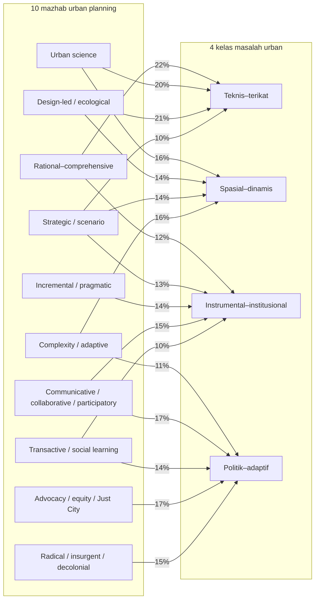

# Atlas Masalah, Mazhab, dan Sumber Keilmuan Urban Planning

> **Status epistemik:** Atlas konseptual yang dihasilkan AI dari diskusi. Koordinat dan bobot merupakan penilaian *ideal-typical* dan heuristik, bukan hasil pengukuran empiris, estimasi statistik, atau posisi intelektual pengguna yang telah dikonfirmasi.

[Buka atlas interaktif](<atlas_masalah_mazhab_dan_sumber_keilmuan_urban_planning_interaktif.html>).

## Diagram

## Definisi Sumbu

- **Sumbu X — Lokasi dominan mekanisme kausal:** `0` berarti terutama material–spasial; `10` berarti terutama sosial–institusional.
- **Sumbu Y — Derajat keterkendalian rekayasa:** `0` berarti terbuka, emergen, dan membutuhkan adaptasi; `10` berarti lebih terikat, terprediksi, dan dapat dikendalikan langsung.
- Garis `x = 5` dan `y = 5` membentuk empat kuadran analitis. Batas tersebut bersifat konseptual, bukan ambang alamiah.

## Posisi Konseptual

| Masalah | X | Y | Kuadran |
|---|---:|---:|---|
| Infrastruktur dan layanan | 1.6 | 8.8 | Q1 — Teknis–terikat |
| Jaringan mobilitas | 2.9 | 8.0 | Q1 — Teknis–terikat |
| Proteksi bahaya | 2.1 | 7.0 | Q1 — Teknis–terikat |
| Operasi pelayanan | 6.2 | 8.3 | Q2 — Instrumental–institusional |
| Fiskal dan insentif | 7.2 | 7.4 | Q2 — Instrumental–institusional |
| Regulasi dan penegakan | 8.1 | 6.4 | Q2 — Instrumental–institusional |
| Lahan dan perumahan | 4.1 | 4.9 | Q3 — Spasial–dinamis |
| Bentuk kota dan *lock-in* | 3.3 | 4.1 | Q3 — Spasial–dinamis |
| Ekologi dan iklim | 2.6 | 3.1 | Q3 — Spasial–dinamis |
| Ekonomi dan aglomerasi | 6.2 | 4.6 | Q4 — Politik–adaptif |
| Governance dan skala | 7.7 | 3.8 | Q4 — Politik–adaptif |
| Equity dan displacement | 8.7 | 2.5 | Q4 — Politik–adaptif |
| Perilaku dan legitimasi | 9.1 | 1.5 | Q4 — Politik–adaptif |
| Pengetahuan dan pembelajaran | 5.7 | 1.8 | Q4 — Politik–adaptif |

## Cara Membaca

- Posisi semakin ke kanan menunjukkan bahwa hasil makin bergantung pada institusi, perilaku, distribusi kekuasaan, dan legitimasi.
- Posisi semakin ke atas menunjukkan bahwa mekanisme relatif lebih dapat dibatasi, dihitung, dan dipengaruhi melalui kontrol engineering langsung.
- Posisi di bawah tidak berarti masalah tersebut tidak dapat direkayasa. Ia menunjukkan bahwa bentuk intervensinya perlu lebih adaptif, iteratif, politis, atau berbasis pembelajaran.
- Satu masalah dapat berpindah posisi menurut skala dan perumusan kasus. Contohnya, kapasitas teknis drainase relatif terikat, sedangkan distribusi risiko banjir dan keputusan relokasi jauh lebih sosial-institusional dan terbuka.

## Batas Pemetaan

Diagram tidak menyatakan bahwa kategori bersifat independen. Masalah urban biasanya saling berkopel: intervensi infrastruktur mengubah harga tanah, harga tanah mengubah distribusi penduduk, dan perubahan distribusi memengaruhi legitimasi serta kelayakan implementasi. Posisi perlu diuji kembali ketika diagram diterapkan pada kota, skala, periode, dan tujuan planning tertentu.

## Mazhab × Kelas Masalah Urban

Diagram berikut memetakan portofolio intervensi yang disarankan secara heuristik. Untuk menjaga keterbacaan, panah hanya ditampilkan jika bobot suatu mazhab pada kelas masalah mencapai sedikitnya 10%. Matriks lengkap di bagian berikutnya tetap mencatat seluruh bobot.

## Matriks Bobot Portofolio Intervensi

| Mazhab urban planning | Teknis–terikat | Spasial–dinamis | Instrumental–institusional | Politik–adaptif |
|---|---:|---:|---:|---:|
| Rational–comprehensive | 22% | 8% | 12% | 3% |
| Urban science | 20% | 16% | 8% | 4% |
| Design-led / ecological | 21% | 14% | 6% | 3% |
| Strategic / scenario | 10% | 14% | 13% | 9% |
| Incremental / pragmatic | 8% | 8% | 14% | 7% |
| Complexity / adaptive | 6% | 16% | 9% | 11% |
| Communicative / collaborative / participatory | 4% | 7% | 15% | 17% |
| Transactive / social learning | 3% | 6% | 10% | 14% |
| Advocacy / equity / Just City | 4% | 7% | 9% | 17% |
| Radical / insurgent / decolonial | 2% | 4% | 4% | 15% |
| **Jumlah portofolio per kelas masalah** | **100%** | **100%** | **100%** | **100%** |

### Cara Menafsirkan Bobot

- Setiap **kolom** adalah satu portofolio intervensi untuk satu kelas masalah dan berjumlah 100%.
- Persentase menunjukkan **porsi relatif peran pendekatan**, bukan peluang keberhasilan, frekuensi penggunaan aktual, besaran anggaran, atau estimasi efek kausal.
- Bobot tinggi tidak berarti satu mazhab dapat bekerja sendiri. Ia menunjukkan bahwa logika, alat, dan bentuk intervensi mazhab tersebut lebih dominan untuk mekanisme masalah yang bersangkutan.
- Bobot perlu dikalibrasi ulang menurut konteks kasus. Masalah banjir, misalnya, dapat berpindah dari teknis–terikat menuju politik–adaptif ketika fokus bergeser dari kapasitas drainase ke distribusi risiko, relokasi, atau konflik tata guna lahan.

## Ringkasan Portofolio Dominan

| Kelas masalah | Mazhab dengan porsi terbesar | Logika dominan |
|---|---|---|
| Teknis–terikat | Rational–comprehensive 22%; Design-led / ecological 21%; Urban science 20% | Optimasi, desain performatif, pemodelan, standar, dan kontrol teknis |
| Spasial–dinamis | Urban science 16%; Complexity / adaptive 16%; Design-led / ecological dan Strategic / scenario masing-masing 14% | Pemodelan dinamika, umpan balik, skenario, desain spasial, dan adaptasi |
| Instrumental–institusional | Communicative / collaborative / participatory 15%; Incremental / pragmatic 14%; Strategic / scenario 13% | Koordinasi aktor, penyelarasan instrumen, implementasi bertahap, dan kapasitas kelembagaan |
| Politik–adaptif | Communicative / collaborative / participatory 17%; Advocacy / equity / Just City 17%; Radical / insurgent / decolonial 15% | Legitimasi, representasi, konflik nilai, distribusi kuasa, keadilan, dan pembelajaran sosial |

## Hirarki Sumber Keilmuan untuk Sepuluh Mazhab

[Telusuri treemap interaktif](<atlas_masalah_mazhab_dan_sumber_keilmuan_urban_planning_interaktif.html#sumber-mazhab>).

Hierarki ini menunjukkan titik temu bacaan pada tingkat disiplin, rumpun epistemik, mazhab, dan bacaan jembatan. Mode ringkas mempertahankan 28 penempatan bacaan inti, sedangkan mode lengkap memperluasnya menjadi 72 penempatan. Dari lapisan lengkap itu, 60 penempatan berada langsung pada sepuluh cabang terminal mazhab—masing-masing enam bacaan—dan 12 sisanya berada pada batang bersama, tingkat rumpun, atau bagian jembatan.

> **Cara membaca:** posisi yang lebih tinggi dalam hierarki berarti cakupannya lebih luas, bukan otoritasnya lebih tinggi. Daftar ini merupakan kurasi orientasi, bukan bibliometri, silabus universal, atau tinjauan literatur sistematis. Treemap HTML menyediakan tombol **Tampilkan lebih banyak/lebih sedikit** dan bibliografi lengkap per cabang; tabel bibliografi di bawah dipertahankan sebagai lapisan inti yang ringkas.

### Audit cakupan cabang mazhab

| Cabang terminal mazhab | Rumpun | Bacaan langsung · inti | Bacaan langsung · lengkap |
|---|---|---:|---:|
| 1 · Rational–comprehensive | Teknis–analitis | 1 | 6 |
| 2 · Urban science | Teknis–analitis | 1 | 6 |
| 3 · Design-led / ecological | Teknis–analitis | 2 | 6 |
| 4 · Strategic / scenario | Strategis–adaptif | 1 | 6 |
| 5 · Incremental / pragmatic | Strategis–adaptif | 1 | 6 |
| 6 · Complexity / adaptive | Strategis–adaptif | 1 | 6 |
| 7 · Communicative / collaborative / participatory | Deliberatif–learning | 2 | 6 |
| 8 · Transactive / social learning | Deliberatif–learning | 2 | 6 |
| 9 · Advocacy / equity / Just City | Keadilan–transformasi | 3 | 6 |
| 10 · Radical / insurgent / decolonial | Keadilan–transformasi | 2 | 6 |
| **Subtotal cabang terminal** | **10 cabang** | **16** | **60** |
| Batang bersama, rumpun, dan jembatan | Lintas cabang | 12 | 12 |
| **Total penempatan pada treemap** |  | **28** | **72** |

Angka pada tabel adalah **penempatan** bacaan di dalam struktur, bukan jumlah karya unik. Satu karya dapat ditempatkan pada lebih dari satu lokasi ketika fungsinya memang menjembatani mazhab.

### Batang bersama · 10 mazhab

Bacaan orientasi untuk mengenali medan planning theory, masalah planning, dan perbedaan antartradisi.

| Posisi dalam hierarki | Bacaan | Pemakaian dalam atlas |
|---|---|---|
| Bacaan langsung | [Fainstein & DeFilippis 2016](https://onlinelibrary.wiley.com/doi/book/10.1002/9781119084679) — Fainstein, S. S., & DeFilippis, J. (eds.). Readings in Planning Theory, 4th ed. Wiley-Blackwell, 2016. | Orientasi komparatif untuk seluruh 10 mazhab |
| Bacaan langsung | [Hudson et al. 1979 · SITAR](https://doi.org/10.1080/01944367908976980) — Hudson, B. M., Galloway, T. D., & Kaufman, J. L. “Comparison of Current Planning Theories: Counterparts and Contradictions.” JAPA 45(4), 387–398, 1979. | Kerangka pembanding synoptic, incremental, transactive, advocacy, dan radical |
| Bacaan langsung | [Rittel & Webber 1973](https://doi.org/10.1007/BF01405730) — Rittel, H. W. J., & Webber, M. M. “Dilemmas in a General Theory of Planning.” Policy Sciences 4(2), 155–169, 1973. | Landasan bersama untuk membedakan masalah tame dan wicked |
| Bacaan langsung | [Allmendinger 2017](https://www.bloomsbury.com/uk/planning-theory-9780230380035/) — Allmendinger, P. Planning Theory, 4th ed. Red Globe Press, 2017. | Peta kontemporer lintas rational, pragmatic, advocacy, collaborative, postcolonial, dan insurgent planning |

### Rumpun teknis–analitis

Berbagi kepercayaan relatif lebih tinggi pada analisis eksplisit, representasi spasial, desain, dan evaluasi performa.

| Posisi dalam hierarki | Bacaan | Pemakaian dalam atlas |
|---|---|---|
| Bacaan rumpun | [Berke et al. 2006](https://www.press.uillinois.edu/books/?id=c030796) — Berke, P. R., Godschalk, D. R., Kaiser, E. J., & Rodriguez, D. A. Urban Land Use Planning, 5th ed. University of Illinois Press, 2006. | Rational–comprehensive · urban science · design-led/ecological |
| 1 · Rational–comprehensive | [Faludi 1973](https://books.google.com/books/about/Planning_Theory.html?id=kZhPAAAAMAAJ) — Faludi, A. Planning Theory. Pergamon Press, 1973. | Kanon khusus rational–comprehensive; juga penting untuk debat prosedural |
| 2 · Urban science | [Batty 2013](https://mitpress.mit.edu/9780262534567/the-new-science-of-cities/) — Batty, M. The New Science of Cities. MIT Press, 2013. | Kanon khusus urban science; beririsan kuat dengan complexity |
| 3 · Design-led / ecological | [Lynch 1981/1984](https://mitpress.mit.edu/9780262620468/good-city-form/) — Lynch, K. A Theory of Good City Form (1981); paperback as Good City Form. MIT Press, 1984. | Design-led; menjembatani nilai normatif dan evaluasi bentuk kota |
| 3 · Design-led / ecological | [McHarg 1969](https://www.wiley.com/en-us/Design+with+Nature%2C+25th+Anniversary+Edition-p-9780471114604) — McHarg, I. L. Design with Nature. Natural History Press, 1969; 25th anniversary ed., Wiley, 1995. | Kanon ecological planning dan suitability analysis |

### Rumpun strategis–adaptif

Berbagi fokus pada ketidakpastian, pilihan selektif, proses bertahap, umpan balik, dan kapasitas beradaptasi.

| Posisi dalam hierarki | Bacaan | Pemakaian dalam atlas |
|---|---|---|
| Bacaan rumpun | [Alexander 1984](https://doi.org/10.1080/01944368408976582) — Alexander, E. R. “After Rationality, What? A Review of Responses to Paradigm Breakdown.” JAPA 50(1), 62–69, 1984. | Strategic · incremental · complexity/adaptive |
| 4 · Strategic / scenario | [Albrechts 2004](https://doi.org/10.1068/b3065) — Albrechts, L. “Strategic (Spatial) Planning Reexamined.” Environment and Planning B 31(5), 743–758, 2004. | Kanon strategic spatial planning |
| 5 · Incremental / pragmatic | [Faludi 1971](https://doi.org/10.1068/a030253) — Faludi, A. “Towards a Three-Dimensional Model of Planning Behaviour.” Environment and Planning A 3(3), 253–266, 1971. | Incremental dan rational; memetakan blueprint–process serta rational–incremental |
| 6 · Complexity / adaptive | [Portugali 2000](https://link.springer.com/book/10.1007/978-3-662-04099-7) — Portugali, J. Self-Organization and the City. Springer, 2000. | Kanon self-organization untuk complexity/adaptive planning |

### Rumpun deliberatif–learning

Berbagi perhatian pada dialog, pengetahuan praktis, pembelajaran timbal balik, dan pembentukan makna bersama.

| Posisi dalam hierarki | Bacaan | Pemakaian dalam atlas |
|---|---|---|
| Bacaan rumpun | [Forester 1999](https://mitpress.mit.edu/9780262062077/the-deliberative-practitioner/) — Forester, J. The Deliberative Practitioner: Encouraging Participatory Planning Processes. MIT Press, 1999. | Communicative/collaborative · transactive/social learning |
| 7 · Communicative / collaborative / participatory | [Healey 1996](https://doi.org/10.1068/b230217) — Healey, P. “The Communicative Turn in Planning Theory and its Implications for Spatial Strategy Formation.” Environment and Planning B 23(2), 217–234, 1996. | Kanon communicative planning; juga menjembatani strategic planning |
| 7 · Communicative / collaborative / participatory | [Innes 1995](https://doi.org/10.1177/0739456X9501400307) — Innes, J. E. “Planning Theory’s Emerging Paradigm: Communicative Action and Interactive Practice.” JPER 14(3), 183–189, 1995. | Kanon communicative dan interactive planning |
| 8 · Transactive / social learning | [Friedmann 1973](https://books.google.com/books/about/Retracking_America.html?id=EtbZAAAAIAAJ) — Friedmann, J. Retracking America: A Theory of Transactive Planning. Anchor Press, 1973. | Kanon transactive planning |
| 8 · Transactive / social learning | [Friedmann 1981](https://escholarship.org/uc/item/0q47v754) — Friedmann, J. Planning as Social Learning. UCLA Working Paper 343, 1981. | Kanon social learning dalam planning |

### Rumpun keadilan–transformasi

Berbagi fokus pada distribusi, representasi, kuasa, mobilisasi, dan transformasi tatanan yang menghasilkan ketidakadilan.

| Posisi dalam hierarki | Bacaan | Pemakaian dalam atlas |
|---|---|---|
| Bacaan rumpun | [Friedmann 2011](https://www.routledge.com/Insurgencies-Essays-in-Planning-Theory-1st-Edition/Friedmann/p/book/9780415781510) — Friedmann, J. Insurgencies: Essays in Planning Theory. Routledge, 2011. | Advocacy/equity · radical/insurgent; juga menghubungkan transactive planning |
| 9 · Advocacy / equity / Just City | [Davidoff 1965](https://doi.org/10.1080/01944366508978187) — Davidoff, P. “Advocacy and Pluralism in Planning.” Journal of the American Institute of Planners 31(4), 331–338, 1965. | Kanon advocacy planning |
| 9 · Advocacy / equity / Just City | [Krumholz 1982](https://doi.org/10.1080/01944368208976535) — Krumholz, N. “A Retrospective View of Equity Planning: Cleveland 1969–1979.” JAPA 48(2), 163–174, 1982. | Kanon equity planning berbasis praktik |
| 9 · Advocacy / equity / Just City | [Fainstein 2010](https://cornellpress.cornell.edu/book/9780801476907/the-just-city/) — Fainstein, S. S. The Just City. Cornell University Press, 2010. | Kanon Just City; juga relevan untuk ekonomi politik dan displacement |
| 10 · Radical / insurgent / decolonial | [Miraftab 2009](https://doi.org/10.1177/1473095208099297) — Miraftab, F. “Insurgent Planning: Situating Radical Planning in the Global South.” Planning Theory 8(1), 32–50, 2009. | Kanon insurgent dan decolonial planning |
| 10 · Radical / insurgent / decolonial | [Roy 2009](https://doi.org/10.1177/1473095208099299) — Roy, A. “Why India Cannot Plan Its Cities: Informality, Insurgence and the Idiom of Urbanization.” Planning Theory 8(1), 76–87, 2009. | Radical/insurgent; kritik pada formality dan rezim planning |

### Bacaan jembatan lintas rumpun

Sumber yang tidak pas ditempatkan di satu rumpun saja; bagian ini mencegah treemap memaksakan irisan menjadi cabang tunggal.

| Posisi dalam hierarki | Bacaan | Pemakaian dalam atlas |
|---|---|---|
| Bacaan langsung | [Batty 2005 · science ↔ complexity](https://mitpress.mit.edu/9780262025836/cities-and-complexity/) — Batty, M. Cities and Complexity: Understanding Cities with Cellular Automata, Agent-Based Models, and Fractals. MIT Press, 2005. | Urban science · complexity/adaptive |
| Bacaan langsung | [Healey 2007 · strategic ↔ communicative](https://www.routledge.com/Urban-Complexity-and-Spatial-Strategies-Towards-a-Relational-Planning/Healey/p/book/9780203099414) — Healey, P. Urban Complexity and Spatial Strategies: Towards a Relational Planning for Our Times. Routledge, 2007. | Strategic · complexity · communicative/collaborative |
| Bacaan langsung | [Innes & Booher 1999 · complexity ↔ collaborative](https://doi.org/10.1080/01944369908976071) — Innes, J. E., & Booher, D. E. “Consensus Building and Complex Adaptive Systems.” JAPA 65(4), 412–423, 1999. | Complexity/adaptive · communicative/collaborative |
| Bacaan langsung | [Friedmann 1987 · learning ↔ mobilization](https://www.jstor.org/stable/j.ctv10crf8d) — Friedmann, J. Planning in the Public Domain: From Knowledge to Action. Princeton University Press, 1987. | Transactive/social learning · advocacy/equity · radical/insurgent |

## Hirarki Sumber Keilmuan untuk Empat Belas Masalah dan Empat Kuadran

[Telusuri treemap interaktif](<atlas_masalah_mazhab_dan_sumber_keilmuan_urban_planning_interaktif.html#sumber-masalah>).

Hierarki ini menunjukkan hubungan antara korpus bersama, bacaan tingkat kuadran, empat belas keluarga masalah, dan sumber yang paling langsung membantu membingkai masalah. Mode ringkas mempertahankan 33 penempatan bacaan inti, sedangkan mode lengkap memuat 107 penempatan. Dari lapisan lengkap itu, 97 penempatan berada langsung pada empat belas cabang terminal masalah—masing-masing sekurangnya enam bacaan—dan 10 sisanya berada pada batang bersama atau tingkat kuadran. Satu karya dapat muncul lebih dari sekali ketika benar-benar menjembatani beberapa masalah.

> **Cara membaca:** posisi yang lebih tinggi dalam hierarki berarti cakupannya lebih luas, bukan otoritasnya lebih tinggi. Daftar ini merupakan kurasi orientasi, bukan bibliometri, silabus universal, atau tinjauan literatur sistematis. Treemap HTML menyediakan tombol **Tampilkan lebih banyak/lebih sedikit** dan bibliografi lengkap per cabang; tabel bibliografi di bawah dipertahankan sebagai lapisan inti yang ringkas.

### Audit cakupan cabang masalah

| Cabang terminal masalah | Kuadran | Bacaan langsung · inti | Bacaan langsung · lengkap |
|---|---|---:|---:|
| 1 · Infrastruktur dan layanan | Q1 · Teknis–terikat | 1 | 6 |
| 2 · Jaringan mobilitas | Q1 · Teknis–terikat | 2 | 6 |
| 3 · Proteksi bahaya | Q1 · Teknis–terikat | 2 | 6 |
| 4 · Lahan dan perumahan | Q3 · Spasial–dinamis | 1 | 9 |
| 5 · Bentuk kota dan lock-in | Q3 · Spasial–dinamis | 1 | 8 |
| 6 · Ekologi dan iklim | Q3 · Spasial–dinamis | 2 | 7 |
| 7 · Operasi pelayanan | Q2 · Instrumental–institusional | 2 | 6 |
| 8 · Fiskal dan insentif | Q2 · Instrumental–institusional | 1 | 6 |
| 9 · Regulasi dan penegakan | Q2 · Instrumental–institusional | 2 | 7 |
| 10 · Ekonomi dan aglomerasi | Q4 · Politik–adaptif | 2 | 10 |
| 11 · Governance dan skala | Q4 · Politik–adaptif | 1 | 6 |
| 12 · Equity dan displacement | Q4 · Politik–adaptif | 2 | 6 |
| 13 · Perilaku dan legitimasi | Q4 · Politik–adaptif | 2 | 6 |
| 14 · Pengetahuan dan pembelajaran | Q4 · Politik–adaptif | 2 | 8 |
| **Subtotal cabang terminal** | **14 cabang** | **23** | **97** |
| Batang bersama dan tingkat kuadran | Lintas masalah | 10 | 10 |
| **Total penempatan pada treemap** |  | **33** | **107** |

Angka pada tabel adalah **penempatan** bacaan di dalam struktur, bukan jumlah karya unik. Pengulangan lintas cabang dipertahankan hanya ketika sebuah karya berfungsi nyata sebagai penghubung antarmasalah.

### Batang bersama · semua masalah

Bacaan untuk merumuskan masalah, menghubungkan pengetahuan dengan tindakan, dan membaca rencana sebagai proses lintas-subbidang.

| Posisi dalam hierarki | Bacaan | Pemakaian dalam atlas |
|---|---|---|
| Bacaan langsung | [Rittel & Webber 1973](https://doi.org/10.1007/BF01405730) — Rittel, H. W. J., & Webber, M. M. “Dilemmas in a General Theory of Planning.” Policy Sciences 4(2), 155–169, 1973. | Seluruh 14 masalah: membedakan komponen tame dan wicked |
| Bacaan langsung | [Friedmann 1987](https://www.jstor.org/stable/j.ctv10crf8d) — Friedmann, J. Planning in the Public Domain: From Knowledge to Action. Princeton University Press, 1987. | Seluruh 14 masalah: relasi pengetahuan, tindakan, reform, learning, dan mobilization |
| Bacaan langsung | [Berke et al. 2006](https://www.press.uillinois.edu/books/?id=c030796) — Berke, P. R., Godschalk, D. R., Kaiser, E. J., & Rodriguez, D. A. Urban Land Use Planning, 5th ed. University of Illinois Press, 2006. | Lintas teknis, spasial, institusional, serta ekonomi–equity dalam plan-making |

### Q1 · Teknis–terikat

Masalah dengan komponen fisik dan performa yang relatif dapat dibatasi, tetapi tetap bergantung pada keputusan planning.

| Posisi dalam hierarki | Bacaan | Pemakaian dalam atlas |
|---|---|---|
| Bacaan bersama kuadran | [Neuman & Smith 2010](https://doi.org/10.1177/1538513209355373) — Neuman, M., & Smith, S. “City Planning and Infrastructure: Once and Future Partners.” Journal of Planning History 9(1), 21–42, 2010. | Infrastruktur · layanan · jaringan; menempatkan kembali infrastruktur dalam disiplin planning |
| 1 · Infrastruktur dan layanan | [Graham & Marvin 2001](https://www.routledge.com/Splintering-Urbanism-Networked-Infrastructures-Technological-Mobilities/Graham-Marvin/p/book/9780415189651) — Graham, S., & Marvin, S. Splintering Urbanism: Networked Infrastructures, Technological Mobilities and the Urban Condition. Routledge, 2001. | Infrastruktur dan layanan; juga membuka dimensi ketimpangan jaringan |
| 2 · Jaringan mobilitas | [Meyer & Miller 2001](https://books.google.com/books/about/Urban_Transportation_Planning.html?id=PVomAQAACAAJ) — Meyer, M. D., & Miller, E. J. Urban Transportation Planning: A Decision-Oriented Approach, 2nd ed. McGraw-Hill, 2001. | Jaringan mobilitas; proses keputusan, demand, supply, evaluasi, dan umpan balik |
| 2 · Jaringan mobilitas | [Bertolini et al. 2005](https://doi.org/10.1016/j.tranpol.2005.01.006) — Bertolini, L., le Clercq, F., & Kapoen, L. “Sustainable Accessibility: A Conceptual Framework to Integrate Transport and Land Use Plan-Making. Two Test-Applications in the Netherlands and a Reflection on the Way Forward.” Transport Policy 12(3), 207–220, 2005. | Mobilitas ↔ tata guna lahan; jembatan menuju masalah spasial–dinamis |
| 3 · Proteksi bahaya | [Burby 1998](https://doi.org/10.17226/5785) — Burby, R. J. (ed.). Cooperating with Nature: Confronting Natural Hazards with Land-Use Planning for Sustainable Communities. Joseph Henry Press, 1998. | Proteksi bahaya melalui hazard assessment, land-use planning, dan resilience |
| 3 · Proteksi bahaya | [Godschalk et al. 1999](https://islandpress.org/books/natural-hazard-mitigation) — Godschalk, D. R., Beatley, T., Berke, P., Brower, D., & Kaiser, E. J. Natural Hazard Mitigation: Recasting Disaster Policy and Planning. Island Press, 1999. | Proteksi bahaya ↔ sistem kelembagaan mitigasi |

### Q3 · Spasial–dinamis

Masalah material–spasial dengan umpan balik, perubahan penggunaan lahan, path dependence, dan lock-in.

| Posisi dalam hierarki | Bacaan | Pemakaian dalam atlas |
|---|---|---|
| Bacaan bersama kuadran | [Kaiser & Godschalk 1995](https://doi.org/10.1080/01944369508975648) — Kaiser, E. J., & Godschalk, D. R. “Twentieth Century Land Use Planning: A Stalwart Family Tree.” JAPA 61(3), 365–385, 1995. | Lahan/perumahan · bentuk kota · integrasi desain, kebijakan, dan manajemen |
| Bacaan bersama kuadran | [Batty 2013](https://mitpress.mit.edu/9780262534567/the-new-science-of-cities/) — Batty, M. The New Science of Cities. MIT Press, 2013. | Bentuk kota · jaringan · aliran · dinamika pertumbuhan |
| 4 · Lahan dan perumahan | [Talen 2012](https://islandpress.org/books/city-rules) — Talen, E. City Rules: How Regulations Affect Urban Form. Island Press, 2012. | Lahan/perumahan ↔ bentuk kota ↔ regulasi; contoh bacaan lintas-kuadran |
| 5 · Bentuk kota dan lock-in | [Lynch 1981/1984](https://mitpress.mit.edu/9780262620468/good-city-form/) — Lynch, K. A Theory of Good City Form (1981); paperback as Good City Form. MIT Press, 1984. | Bentuk kota; kriteria normatif dan evaluasi performa spasial |
| 6 · Ekologi dan iklim | [McHarg 1969](https://www.wiley.com/en-us/Design+with+Nature%2C+25th+Anniversary+Edition-p-9780471114604) — McHarg, I. L. Design with Nature. Natural History Press, 1969; 25th anniversary ed., Wiley, 1995. | Ecological planning dan suitability analysis |
| 6 · Ekologi dan iklim | [Wheeler 2008](https://doi.org/10.1080/01944360802377973) — Wheeler, S. M. “State and Municipal Climate Change Plans: The First Generation.” JAPA 74(4), 481–496, 2008. | Climate planning; isi, target, dan kapasitas rencana subnasional |

### Q2 · Instrumental–institusional

Masalah implementasi: bagaimana rencana menjadi operasi, insentif, aturan, keputusan, dan hasil.

| Posisi dalam hierarki | Bacaan | Pemakaian dalam atlas |
|---|---|---|
| Bacaan bersama kuadran | [Alexander & Faludi 1989](https://doi.org/10.1068/b160127) — Alexander, E. R., & Faludi, A. “Planning and Plan Implementation: Notes on Evaluation Criteria.” Environment and Planning B 16(2), 127–140, 1989. | Operasi pelayanan · fiskal/instrumen · regulasi; evaluasi planning di bawah ketidakpastian |
| Bacaan bersama kuadran | [Mastop & Faludi 1997](https://doi.org/10.1068/b240815) — Mastop, H., & Faludi, A. “Evaluation of Strategic Plans: The Performance Principle.” Environment and Planning B 24(6), 815–832, 1997. | Operasi · implementasi · evaluasi performa rencana strategis |
| 7 · Operasi pelayanan | [Hoch 1994](https://openlibrary.org/books/OL1441835M/What_planners_do) — Hoch, C. What Planners Do: Power, Politics, and Persuasion. Planners Press, 1994. | Operasi pelayanan dan praktik planner di dalam organisasi nyata |
| 7 · Operasi pelayanan | [Berke et al. 2006 · implementasi](https://doi.org/10.1068/b31166) — Berke, P., Backhurst, M., Day, M., Ericksen, N., Laurian, L., Crawford, J., & Dixon, J. “What Makes Plan Implementation Successful? An Evaluation of Local Plans and Implementation Practices in New Zealand.” Environment and Planning B 33(4), 581–600, 2006. | Operasi pelayanan; hubungan kualitas rencana, praktik, dan implementasi |
| 8 · Fiskal dan insentif | [Ingram & Hong 2012](https://www.lincolninst.edu/publications/books/value-capture-land-policies/) — Ingram, G. K., & Hong, Y.-H. (eds.). Value Capture and Land Policies. Lincoln Institute of Land Policy, 2012. | Fiskal/insentif ↔ infrastruktur ↔ land policy |
| 9 · Regulasi dan penegakan | [Babcock 1966](https://books.google.com/books/about/The_Zoning_Game.html?id=36ZBAAAAIAAJ) — Babcock, R. F. The Zoning Game: Municipal Practices and Policies. University of Wisconsin Press, 1966. | Regulasi, administrasi zoning, kepentingan lokal, dan konflik regional |
| 9 · Regulasi dan penegakan | [Talen 2012 · aturan kota](https://islandpress.org/books/city-rules) — Talen, E. City Rules: How Regulations Affect Urban Form. Island Press, 2012. | Regulasi ↔ bentuk kota; konsekuensi spasial dari code dan zoning |

### Q4 · Politik–adaptif

Masalah dengan konflik nilai, kuasa terdistribusi, legitimasi, ketidakpastian, dan kebutuhan pembelajaran kolektif.

| Posisi dalam hierarki | Bacaan | Pemakaian dalam atlas |
|---|---|---|
| Bacaan bersama kuadran | [Healey 1997/2006](https://www.bloomsbury.com/us/collaborative-planning-9781403949196/) — Healey, P. Collaborative Planning: Shaping Places in Fragmented Societies, 2nd ed. Palgrave Macmillan, 2006; first ed. 1997. | Governance · legitimasi · ekonomi lokal · lingkungan · strategi |
| Bacaan bersama kuadran | [Innes & Booher 2010/2018](https://www.routledge.com/Planning-with-Complexity-An-Introduction-to-Collaborative-Rationality-for-Public-Policy/Innes-Booher/p/book/9781315147949) — Innes, J. E., & Booher, D. E. Planning with Complexity: An Introduction to Collaborative Rationality for Public Policy, 2nd ed. Routledge, 2018. | Governance · behavior/legitimacy · knowledge/learning |
| 10 · Ekonomi dan aglomerasi | [Fainstein 2001](https://kansaspress.ku.edu/9780700611331/) — Fainstein, S. S. The City Builders: Property Development in New York and London, 1980–2000, 2nd ed. University Press of Kansas, 2001. | Ekonomi pembangunan kota, properti, investasi, dan peran kebijakan publik |
| 10 · Ekonomi dan aglomerasi | [Sager 2011](https://doi.org/10.1016/j.progress.2011.09.001) — Sager, T. “Neo-liberal Urban Planning Policies: A Literature Survey 1990–2010.” Progress in Planning 76(4), 147–199, 2011. | Ekonomi politik planning dan instrumen neoliberal |
| 11 · Governance dan skala | [Albrechts et al. 2003](https://doi.org/10.1080/01944360308976301) — Albrechts, L., Healey, P., & Kunzmann, K. R. “Strategic Spatial Planning and Regional Governance in Europe.” JAPA 69(2), 113–129, 2003. | Governance, strategi, dan koordinasi skala regional |
| 12 · Equity dan displacement | [Krumholz & Forester 1990](https://tupress.temple.edu/books/making-equity-planning-work) — Krumholz, N., & Forester, J. Making Equity Planning Work: Leadership in the Public Sector. Temple University Press, 1990. | Equity planning, kepemimpinan publik, dan redistribusi manfaat urban |
| 12 · Equity dan displacement | [Fainstein 2010](https://cornellpress.cornell.edu/book/9780801476907/the-just-city/) — Fainstein, S. S. The Just City. Cornell University Press, 2010. | Equity · democracy · diversity; kriteria normatif untuk kebijakan urban |
| 13 · Perilaku dan legitimasi | [Arnstein 1969](https://doi.org/10.1080/01944366908977225) — Arnstein, S. R. “A Ladder of Citizen Participation.” Journal of the American Institute of Planners 35(4), 216–224, 1969. | Legitimasi dan partisipasi melalui distribusi kuasa keputusan |
| 13 · Perilaku dan legitimasi | [Forester 1999](https://mitpress.mit.edu/9780262062077/the-deliberative-practitioner/) — Forester, J. The Deliberative Practitioner: Encouraging Participatory Planning Processes. MIT Press, 1999. | Perilaku, konflik, deliberasi, legitimasi, dan praktik partisipatif |
| 14 · Pengetahuan dan pembelajaran | [Friedmann 1981](https://escholarship.org/uc/item/0q47v754) — Friedmann, J. Planning as Social Learning. UCLA Working Paper 343, 1981. | Pengetahuan ↔ tindakan melalui social learning |
| 14 · Pengetahuan dan pembelajaran | [Innes & Booher 1999](https://doi.org/10.1080/01944369908976071) — Innes, J. E., & Booher, D. E. “Consensus Building and Complex Adaptive Systems.” JAPA 65(4), 412–423, 1999. | Pembelajaran, eksperimen, perubahan, dan shared meaning dalam sistem adaptif |

## Provenans dan Batas Penggunaan

Peta, pemilihan sepuluh mazhab, hubungan antarkategori, bobot, dan penempatan bacaan di atas merupakan sintesis kerja dari percakapan. Kategori mazhab adalah tipe ideal; praktik nyata biasanya merupakan hibrida. Gunakan matriks ini sebagai alat diagnosis dan penyusunan tim intervensi, lalu uji kembali asumsi, aktor, mekanisme kausal, skala, dan distribusi dampaknya sebelum diterapkan pada keputusan planning yang nyata.

Korpus bacaan pada tahap ini dikurasi secara sengaja dari **keilmuan internal planning**: planning theory, plan-making, implementation, spatial strategy, design, participation, equity, dan subbidang planning terkait. Sumber donor dari ekonomi, biologi/ekologi, antropologi, arsitektur, teknik sipil, dan informatika sengaja ditunda untuk pemetaan sumber sekunder berikutnya. Konsekuensinya, atlas ini belum mengukur seberapa jauh setiap mazhab atau masalah bergantung pada disiplin donor.

Jumlah 28/72 dan 33/107 adalah jumlah **penempatan bacaan**, bukan jumlah karya unik. Karya yang relevan lintas cabang dapat dihitung lebih dari sekali. Perluasan menjadi sekurangnya enam bacaan langsung per cabang adalah ambang kuratorial untuk menjamin kedalaman minimum dan keterbandingan navigasi; cabang yang memerlukan penyeimbang substantif memuat tujuh hingga sepuluh. Angka ini bukan bukti bahwa semua cabang memiliki literatur dengan volume, konsensus, atau kematangan yang sama.

Korpus ini bukan tinjauan literatur sistematis, bukan analisis bibliometrik, bukan silabus universal, dan bukan audit exhaustif terhadap seluruh tradisi geografis maupun bahasa. Ia belum memakai protokol pencarian reproduktif, basis data tertutup yang seragam, kriteria inklusi–eksklusi formal, penilaian kualitas studi, atau analisis sitasi. HTML menyimpan bibliografi lengkap per cabang dan interaksi ringkas/lengkap; Markdown ini menyimpan tampilan metodologis, pembukuan jumlah penempatan, dan lapisan bibliografi inti yang lebih tahan lama untuk diaudit.
