# Catatan Revisi Substantif Kompilasi Bab 1-3 Setelah 70 Review

> **Rekaman historis — arah metodologis digantikan pada 18 September 2026.** Isi berikut merekam eksplorasi atau penilaian atas rancangan lama. Rancangan aktif sepenuhnya memakai proksi dan sumber terbuka serta multitemporal sesuai bukti; lihat [[output/naskah/bab_1/bab_1_pendahuluan_draf|Bab 1]] dan [[output/naskah/bab_3/bab_3_metode_penelitian_draf_rancangan_kerja|Bab 3]]. Hierarki akses, kewajiban data tertutup, dan batas potong lintang dalam rekaman ini bukan arahan kerja aktif. Locator halaman lama tetap merujuk dokumen yang dahulu diaudit, bukan naskah terbaru.

> **Status:** memo usulan revisi substantif, bukan naskah Bab 1-3 final.
>
> **Tanggal:** 10 September 2026.
>
> **Fokus:** koherensi antara pertanyaan, konstruk, operasi analitis, tipologi, dan klaim dalam kompilasi lama. Memo ini tidak menilai kemungkinan diperoleh atau tidak diperolehnya data.

## Implikasi bagi rancangan aktif

Revisi 18 September 2026 mempertahankan kebutuhan pengujian asosiasi, pemisahan konstruk, pencegahan sirkularitas, dan ketidakpastian. Lantai M2/U2 tidak digunakan sebagai syarat berdasarkan jenis sumber: estimasi relasi serta fungsi dapat menjadi dasar analisis apabila pemeriksaan independen dan kesesuaian konstruk mendukung. Data beberapa tahun digunakan pada seri yang sebanding. Penilaian memo di bawah tetap merupakan penilaian historis, bukan audit atas revisi terbaru.

## Bahan Tinjauan

Tinjauan ini membandingkan:

- kompilasi metodologis lama (berkas dihapus pada 18 September 2026; locator historis);
- `output/kajian/tier-list-kajian-pendahuluan.md`;
- `output/kajian/prioritas-penelitian-terdahulu-10-20-30.md`;
- 70 file `output/kajian/review-<kode>.md` yang mendasari kedua sintesis tersebut;
- `output/kajian/peta-dasar-teori-tier1-19-borrowed-size-agglomeration-shadow-draft.md`; dan
- `graphify-lab/runs/tier1-19-txt/graphify-out/GRAPH_REPORT.md` sebagai alat navigasi provenance teori, bukan sebagai bukti empiris.

Rujukan halaman dalam memo ini memakai halaman fisik PDF, yaitu halaman 1-83, bukan nomor footer internal masing-masing dokumen yang dikompilasi.

## Kesimpulan Utama

Kerangka lama kuat sebagai sistem pengendalian klaim dan audit metodologis, tetapi belum sepenuhnya menjadi desain yang menguji hubungan integrasi metropolitan dengan fungsi pusat sekunder. Masalah terbesarnya bukan akses data, melainkan tiga hal:

1. hubungan utama belum benar-benar diuji;
2. beberapa konstruk berisiko dibentuk dari indikator yang saling mendaur ulang; dan
3. tipologi serta perangkat skenario sudah dikembangkan lebih jauh daripada fondasi inferensinya.

Bab 2 menuliskan hubungan umum antara integrasi dan residual fungsi. Bab 3, sebaliknya, terutama menghitung integrasi, fungsi relatif, skor, dan kelas. Koeksistensi `integrasi tinggi + residual positif` adalah aturan klasifikasi. Ia belum dengan sendirinya merupakan pengujian bahwa integrasi berhubungan dengan surplus fungsi.

Karena itu, revisi terpenting bukan menambah lebih banyak teori atau kelas. Revisi terpenting adalah mengunci objek yang hendak diestimasi, memisahkan peran setiap indikator, mempertahankan arah relasi, dan menambahkan tahap yang benar-benar menguji hubungan tersebut. Jika tahap hubungan tidak ditambahkan, pertanyaan dan kontribusi perlu dipersempit menjadi diagnosis deskriptif-tipologis.

Framing substantif yang paling sesuai dengan diagnosis ini bersifat kondisional, bukan biner:

> Melalui relasi apa, pada fungsi apa, dan dalam kondisi apa hubungan metropolitan dengan Jakarta berkaitan dengan surplus fungsi, defisit fungsi, manfaat akses, beban, ketergantungan, atau konfigurasi campuran pada pusat-pusat sekunder?

Framing ini tidak mengubah estimand inti menjadi daftar semua kemungkinan hasil. Ia menegaskan bahwa tanda hubungan tidak diasumsikan universal dan dapat berbeda menurut domain fungsi, arah relasi, spesialisasi, hierarki, serta kondisi lokal. Hasil campuran dan tidak terselesaikan karena itu merupakan kemungkinan substantif, bukan kegagalan klasifikasi.

## Prinsip Integrasi Memo

Memo gabungan ini memakai audit koherensi estimand sebagai patokan. Tambahan arsitektur argumen hanya dipertahankan jika membantu:

- membedakan konstruk yang tidak ekuivalen;
- menjelaskan heterogenitas antardomain tanpa mendahului hasil;
- menempatkan mekanisme sebagai kemungkinan yang diuji atau interpretasi yang dibatasi;
- memisahkan corpus teori, penelitian terdahulu, dan konteks; atau
- memperjelas tangga klaim dan provenance.

Retensi, governance, spesialisasi, dan polarisasi tidak dinaikkan menjadi mesin penjelas inti tanpa operasi analitis yang sesuai. Dalam desain potong lintang, retensi hanya boleh menjadi indikator keadaan atau lensa interpretif terbatas, bukan klaim proses reinvestasi dari waktu ke waktu.

## Audit Keterjawaban Pertanyaan

| Pertanyaan lama | Putusan tinjauan | Implikasi revisi |
|---|---|---|
| Q1: derajat, arah, dan beban integrasi | **Terjawab sebagian.** Intensitas dan orientasi dapat dihitung, tetapi arah kemudian diringkas menjadi integrasi tinggi/rendah. Pusat penarik pekerjaan, pusat pengirim komuter, dan pusat berarus antarpinggiran dapat masuk kelas yang sama meskipun mekanismenya berbeda. | Pertahankan arah arus dan letakkan beban pada aktor serta lokasi yang tepat. |
| Q2: fungsi dan kinerja relatif | **Fungsi dapat dijawab; kinerja belum otomatis terjawab.** Metode inti lebih banyak mengukur layanan, pekerjaan, dan proksi, sedangkan `kinerja` mencakup outcome seperti produktivitas, pendapatan, atau inovasi. | Gunakan `fungsi relatif` sebagai objek utama. Pakai `kinerja relatif` hanya pada outcome yang memang mengukur kinerja. |
| Q3: kombinasi integrasi, manfaat, beban, dan fungsi | **Dapat diklasifikasikan, tetapi belum dijelaskan.** Kelas dibentuk langsung dari komponen yang didefinisikan. Belum ada tahap yang menguji hubungan integrasi dengan surplus/defisit fungsi. | Tambahkan analisis hubungan atau ubah klaim menjadi pemetaan konfigurasi observasional. |
| Q4: ketahanan diagnosis | **Terjawab untuk variasi spesifikasi, tetapi tidak seluruhnya untuk perubahan sumber bukti.** Bobot, ambang, transformasi, dan unit adalah sensitivitas model. Pergantian jenis bukti dapat mengubah konstruk dan estimand. | Pisahkan sensitivitas spesifikasi dari triangulasi dan provenance bukti. |

## Lima Belas Keputusan Revisi Prioritas

### 1. Kunci Satu Estimand Inti Dan Lantai Desain Minimum

Naskah menyatakan bahwa pertanyaan substantif tetap sama dan sumber data hanya mengubah kedalaman jawaban. Pernyataan ini terlalu longgar. Desain yang hanya memiliki aksesibilitas potensial dan fungsi proksi tidak sedang memberi jawaban dangkal atas pertanyaan relasional yang sama; desain tersebut sedang mengukur objek yang berbeda.

Estimand inti yang lebih tegas adalah:

> Hubungan antara relasi metropolitan terarah suatu pusat sekunder dan deviasi fungsi aktualnya dari fungsi yang diharapkan berdasarkan massa serta karakteristik lokal.

Estimand tersebut perlu diterapkan per domain. Surplus pekerjaan, layanan lokal, layanan orde tinggi, fungsi keputusan, produktivitas, dan kesejahteraan tidak ekuivalen. Istilah `fungsi relatif` menjadi payung hanya ketika domain pembentuknya tetap terlihat; `kinerja` dan `kesejahteraan` digunakan hanya jika outcome yang sesuai memang diukur.

Konsekuensinya:

- hubungan relasional terarah sekurang-kurangnya setara M2 dan fungsi langsung sekurang-kurangnya setara U2 menjadi lantai untuk menjawab tesis inti;
- M1-U1 tetap bernilai sebagai atlas eksploratif, tetapi tidak diperlakukan sebagai penelitian yang menghasilkan jenis diagnosis yang sama;
- keluarga di bawah lantai estimand tetap berdiri sebagai ruang kemungkinan keluaran, bukan sebagai pengganti yang ekuivalen bagi pertanyaan inti.

Lihat PDF hlm. 6, 8-10, dan 81-83.

### 2. Tambahkan Tahap Yang Benar-Benar Menguji Hubungan

Bab 2 menuliskan bentuk umum:

$$
R_{ik}=g_k(I_i,S_i,X_i,Z_i)+\varepsilon_{ik}.
$$

Namun, urutan Bab 3 berhenti pada pengukuran integrasi, residual, skor, dan kelas. Penggabungan dua skor tidak sama dengan pengujian hubungan.

Pilih salah satu dari dua posisi berikut:

1. **Posisi relasional-analitis:** tambahkan analisis asosiasi antara relasi terarah dan residual per fungsi, beserta ketidakpastian, nonlinearitas, heterogenitas, dan pemeriksaan penjelasan alternatif.
2. **Posisi deskriptif-tipologis:** pertahankan peta konfigurasi tanpa mengklaim telah menguji hubungan integrasi-fungsi.

Jika judul, rumusan masalah, dan kontribusi tetap memakai kata `hubungan`, posisi pertama lebih konsisten. Bahasa hasil tetap asosiasional, bukan kausal.

Lihat PDF hlm. 25-28, 68-69, dan 76-81.

### 3. Putus Sirkularitas Dalam Penetapan Pusat Dan Wilayah Tangkapan

Kandidat pusat dapat ditetapkan memakai pekerjaan, fungsi, posisi jaringan, dan arus. Variabel serupa kemudian dipakai kembali untuk mengukur integrasi dan fungsi relatif. Membekukan delineasi sebelum klasifikasi tidak menghapus seleksi berdasarkan outcome.

Revisi yang diperlukan:

- tetapkan daftar kandidat melalui kriteria yang telah ditentukan sebelumnya dan sejauh mungkin independen dari variabel hasil;
- pisahkan keluarga indikator delineasi dari keluarga indikator pengujian;
- jika satu indikator terpaksa dipakai pada kedua tahap, jalankan spesifikasi yang mengeluarkannya dari salah satu tahap;
- perlakukan alternatif delineasi sebagai perubahan objek analisis, bukan sekadar variasi visual.

Lihat PDF hlm. 20, 69-72, dan 76.

### 4. Pertahankan Arah Arus, Jangan Mereduksinya Menjadi Satu Skor Integrasi

Q1 menanyakan derajat dan arah, tetapi tipologi akhir memakai integrasi tinggi/rendah. Padahal tiga konfigurasi berikut tidak ekuivalen:

- pusat sekunder mengirim banyak komuter ke Jakarta;
- pusat sekunder menarik pekerja dari Jakarta atau wilayah lain;
- pusat sekunder kuat berhubungan dengan pusat sekunder lain.

Sekurang-kurangnya pertahankan sebagai dimensi terpisah:

- orientasi keluar menuju inti;
- daya tarik masuk;
- arus antarpinggiran;
- *self-containment*;
- keseimbangan atau asimetri arus;
- aksesibilitas potensial sebagai lapisan yang berbeda dari arus.

Satu skor integrasi boleh dibuat sebagai ringkasan sekunder, tetapi tidak boleh menghapus arah yang diperlukan untuk membedakan ketergantungan, daya tarik, dan jejaring antarpusat.

Asimetri relasional juga harus dibaca bersama spesialisasi fungsional. Dekonsentrasi pekerjaan produksi dapat berjalan bersamaan dengan konsentrasi kantor pusat, layanan bisnis, atau fungsi keputusan di Jakarta. Karena itu, banyaknya pekerjaan industri di pusat sekunder tidak cukup untuk menyimpulkan kematangan fungsi secara umum, sedangkan arus keluar tidak cukup untuk menyimpulkan *shadow*.

Lihat PDF hlm. 8, 20, 26-27, 76-77, dan 79.

### 5. Tetapkan Arti Kontrafaktual Benchmark Fungsi

Naskah belum sepenuhnya tegas apakah fungsi yang diharapkan dibentuk dari massa lokal saja atau juga dari posisi jaringan. Ini menentukan apa arti residual.

Jika integrasi atau posisi jaringan dimasukkan ke dalam $\widehat{F}_{ik}$, bagian fungsi yang mungkin berasal dari peminjaman skala sudah diserap oleh benchmark. Residual kemudian tidak lagi mempunyai arti yang sama dengan deviasi terhadap *own mass*.

Benchmark utama sebaiknya menjawab:

> Berapa fungsi yang diharapkan dimiliki pusat ini berdasarkan karakteristik lokal sebelum manfaat relasional yang hendak diuji diperhitungkan?

Konsekuensinya:

- integrasi tidak masuk benchmark utama;
- populasi pembanding dipilih sebelum residual dilihat;
- pusat yang telah dipilih karena fungsi tinggi tidak boleh menjadi satu-satunya sampel pembentuk benchmark;
- residual harus dilengkapi ketidakpastian atau ambang substantif;
- nilai sedikit di atas nol tidak langsung disebut surplus substantif.

Lihat PDF hlm. 20-21, 26, 54, dan 77-79.

### 6. Larang Daur Ulang Konstruk Dan Endogenitas Mekanis

Kompilasi membolehkan pekerjaan atau jumlah usaha sebagai ukuran lokal, sementara pekerjaan dan usaha juga dapat menjadi outcome fungsi. Arus komuter ke lokasi kerja dan jumlah pekerjaan di tujuan juga dapat berbagi pembilang, penyebut, atau proses pembentukan.

Hubungan yang muncul dapat bersifat matematis sebelum menjadi substantif.

Tambahkan matriks peran indikator dengan kolom:

| Indikator | Konstruk | Peran analitis | Boleh masuk benchmark? | Boleh menjadi outcome? | Risiko tumpang tindih |
|---|---|---|---|---|---|
| Contoh: penduduk | *Own mass* | Pembanding | Ya | Tidak pada model yang sama | Berkorelasi dengan peluang lokal |
| Contoh: pekerjaan di lokasi | Fungsi ekonomi | Outcome | Tidak jika menjadi outcome | Ya | Berkaitan mekanis dengan arus masuk kerja |
| Contoh: orientasi komuter ke Jakarta | Relasi terarah | Paparan/profil | Tidak | Bukan fungsi | Dapat berulang dalam skor ketergantungan |

Satu indikator tidak boleh mengisi paparan, benchmark, manfaat, beban, dan kelas sekaligus tanpa analisis khusus.

Lihat PDF hlm. 19-21, 25-26, 73, dan 76-79.

### 7. Turunkan *Borrowed Size* Dan *Agglomeration Shadow* Menjadi Interpretasi Atas Konfigurasi Observasional

Empat gerbang lama memeriksa mutu pengukuran, kompatibilitas, dan ketahanan. Gerbang tersebut belum mengidentifikasi mekanisme.

Konfigurasi integrasi tinggi dan residual negatif masih dapat dijelaskan oleh:

- status administratif;
- sejarah industrialisasi;
- pembangunan kota baru;
- spesialisasi produksi;
- struktur sosial-ekonomi;
- tata kelola pengembang;
- faktor lokal yang tidak masuk benchmark.

Urutan klaim yang lebih aman:

1. laporkan relasi aktual dan residual fungsi secara terpisah;
2. laporkan konfigurasi `relasi tinggi-residual positif/negatif`;
3. uji hubungan dan penjelasan alternatif;
4. baru gunakan `pola konsisten dengan borrowed size` atau `pola konsisten dengan agglomeration shadow`.

Dengan demikian, kedua istilah bukan label ontologis pusat dan bukan hasil otomatis dari persilangan dua ambang.

Gunakan dua register klaim untuk hasil negatif:

- `defisit relatif yang konsisten dengan shadow` ketika relasi dan residual negatif teramati tetapi mekanisme belum dapat dibedakan; dan
- `agglomeration shadow` hanya jika penjelasan alternatif yang relevan telah diaudit secara memadai.

Pembedaan serupa berlaku pada hasil positif. `Borrowed function` merujuk pada fungsi relatif, sedangkan `borrowed performance` memerlukan outcome kinerja. Surplus fasilitas atau pekerjaan tidak boleh secara otomatis disebut peningkatan produktivitas atau kesejahteraan.

Lihat PDF hlm. 21-22, 26-28, 45-47, 56-60, dan 79-83.

### 8. Bangun Ulang Manfaat, Ketergantungan, Dan Beban Sebagai Hasil Independen

Profil manfaat saat ini dapat memuat akses dan surplus fungsi. Profil beban dapat memuat orientasi ke inti dan defisit fungsi. Komponen tersebut lalu dipakai kembali dalam tipologi. Ini berisiko menghitung konstruk yang sama dua kali.

Pertanyaan yang harus dijawab sebelum agregasi adalah: manfaat untuk siapa dan beban ditanggung siapa?

Pisahkan setidaknya:

- fungsi pada lokasi tujuan;
- akses yang tersedia bagi penduduk asal;
- waktu dan biaya perjalanan pekerja;
- ketergantungan pusat kepada fungsi di inti;
- distribusi manfaat menurut kelompok;
- konsekuensi bagi pemerintah atau kapasitas lokal jika memang diukur.

Pusat dapat memiliki banyak pekerjaan tetapi penduduk lokal tidak mengisinya. Penduduk dapat memperoleh akses kerja lebih luas tetapi menanggung perjalanan panjang. Dua kondisi ini tidak dapat dilebur menjadi satu skor manfaat bersih tanpa aturan atribusi.

Tambahkan `retensi` hanya sebagai pertanyaan pembeda: apakah keterhubungan berkaitan dengan kapasitas yang terlokalisasi pada pusat sekunder, atau terutama memberi akses kepada fungsi yang tetap berada di tempat lain? Pada data potong lintang, jawabannya harus dirumuskan sebagai keadaan yang teramati. Istilah `reinvestasi`, `penahanan manfaat`, atau `kebocoran nilai` memerlukan bukti proses temporal dan tidak boleh disimpulkan dari satu profil periode.

Lihat PDF hlm. 22, 25-27, 36, 45, 48, dan 78-81; serta `prioritas-penelitian-terdahulu-10-20-30.md` bagian pertanyaan desain.

### 9. Hapus Klaim Temporal Dari Operasi Potong Lintang

Bab 3 sudah mengakui bahwa potret satu periode tidak membuktikan peningkatan. Namun, istilah berikut masih muncul dalam ruang lingkup dan tipologi:

- *functional upgrading*;
- transisional;
- retensi dan reinvestasi sebagai proses;
- kebocoran nilai;
- kematangan sebagai tahap perkembangan.

Pada desain potong lintang, gunakan:

- `posisi fungsi relatif pada periode pengamatan`;
- `konfigurasi campuran` alih-alih `transisional`;
- `indikasi kapasitas retensi` hanya jika ada indikator keadaan yang sesuai;
- `ketergantungan yang teramati` alih-alih proses kebocoran yang belum dilacak.

Jika istilah `kematangan` dipertahankan, definisikan sebagai tingkat fungsi relatif pada waktu pengamatan, bukan bukti perjalanan perkembangan pusat.

Implikasi tambahan bagi kerangka kondisional adalah bahwa spesialisasi, hierarki, status administratif, kapasitas lokal, dan governance dapat diperlakukan sebagai kovariat, moderator terukur, atau penjelasan alternatif. Semua itu tidak boleh disebut proses yang menghasilkan perubahan kecuali urutan waktunya benar-benar diamati.

Lihat PDF hlm. 20, 36, 42, 56, 69-71, 78-79, dan 82-83.

### 10. Tunda Tipologi Final Dan Sederhanakan Label

Enam kelas telah disiapkan sebelum bentuk distribusi, ketidakpastian residual, dan validitas ambang diketahui. Tipologi sebaiknya menjadi keluaran akhir, bukan struktur yang memaksa analisis sejak awal.

Urutan yang disarankan:

1. tampilkan profil kontinu untuk setiap arah relasi dan domain fungsi;
2. tampilkan ketidakpastian benchmark;
3. periksa apakah kelompok empiris benar-benar terbentuk;
4. tetapkan ambang substantif atau statistik yang dapat dijelaskan;
5. baru ringkas menjadi kelas.

Kategori `campuran` dan `tidak terselesaikan` tetap penting. Namun, label `relatif independen` dan `periferi lemah` perlu dinetralkan. Hubungan rendah dengan Jakarta tidak berarti independen dari pusat lain, sedangkan fungsi rendah tidak otomatis menunjukkan posisi periferal.

Label deskriptif seperti `relasi-Jakarta rendah/fungsi relatif positif` lebih jujur sebelum interpretasi substantif dilakukan.

Lihat PDF hlm. 22, 26-28, dan 78-80.

### 11. Jadikan DKI Sebagai Satu Inti Sebagai Spesifikasi Dasar, Bukan Kebenaran Ontologis

Mempertahankan batas administratif penting bagi interpretasi kewenangan. Namun, menyatukan seluruh DKI menjadi satu inti dapat menutupi pusat tujuan internal yang berbeda dan menjadikan semua pusat luar DKI sekunder sejak awal.

Pertahankan DKI sebagai inti pada spesifikasi utama, tetapi tambahkan satu pemeriksaan substantif:

- DKI sebagai satu inti eksternal; dan
- DKI sebagai beberapa zona atau pusat tujuan fungsional tanpa mengubah batas legalnya.

Tujuannya bukan mengubah yurisdiksi, melainkan memeriksa apakah hubungan pusat sekunder diarahkan ke keseluruhan DKI atau ke subpusat tertentu di dalamnya.

Lihat PDF hlm. 6, 18, 20-22, 50, 59, 70-72, dan 80.

### 12. Pisahkan Sensitivitas Model, Triangulasi Bukti, Dan Provenance

Ketiga kegiatan ini saat ini terlalu dekat satu sama lain:

- **sensitivitas model:** perubahan bobot, ambang, transformasi, unit, atau spesifikasi dengan estimand yang tetap;
- **triangulasi bukti:** perbandingan beberapa sumber yang mengukur konstruk sejenis dengan cakupan atau prosedur berbeda;
- **provenance:** pencatatan asal, definisi, tahun, dan status pembentukan data.

Pergantian arus teramati menjadi aksesibilitas potensial atau fungsi langsung menjadi POI bukan sekadar sensitivitas. Pergantian itu mengubah konstruk. Hasilnya tidak boleh diringkas sebagai persentase kelas yang stabil seolah-olah semua konfigurasi mengestimasi objek yang sama.

Sistem D/A/S/P tetap dipertahankan sebagai penjaminan mutu. Perubahan status bukti dilaporkan sebagai kesesuaian, konflik, atau perubahan estimand, bukan dimasukkan tanpa pembedaan ke dalam Q4.

Lihat PDF hlm. 7-16, 70, 74-75, dan 79-81.

### 13. Pangkas Teori Ornamental Menjadi Teori Yang Benar-Benar Bekerja

Bab 2 membawa banyak teori yang tidak seluruhnya masuk ke operasi analitis. Arsitektur yang lebih parsimonious adalah:

1. ekonomi aglomerasi dan teori tempat sentral untuk menjelaskan hubungan massa lokal dengan fungsi yang diharapkan;
2. polisentrisitas fungsional dan eksternalitas jaringan untuk menjelaskan bentuk relasi antarpusat;
3. *borrowed size* dan *agglomeration shadow* sebagai kerangka interpretif tingkat menengah atas konfigurasi relasi dan fungsi relatif.

Polarisasi dan kausasi kumulatif dapat dipakai untuk menafsirkan mekanisme temporal, tetapi tidak perlu dipresentasikan sebagai sesuatu yang diuji oleh potret satu periode. *Post-suburbanization*, *desakota*, dan transformasi Jakarta berfungsi sebagai konteks kasus. *Planning support systems*, strategic planning, dan WebGL berada pada metode komunikasi atau implikasi, bukan mesin penjelas utama.

Proposisi tentang kapasitas absorpsi dan polisentrisitas morfologis hanya dipertahankan sebagai proposisi uji jika variabelnya benar-benar masuk analisis. Jika tidak, pindahkan ke pembahasan sebagai penjelasan alternatif.

Untuk menjaga perbedaan mekanisme dan diagnosis, Bab 2.3 dapat disusun dalam dua tingkat:

1. **Mesin analitis inti:** *own-mass agglomeration* untuk benchmark fungsi; polisentrisitas fungsional dan transmisi jaringan untuk relasi terarah; serta perbandingan fungsi aktual dengan fungsi yang diharapkan.
2. **Modul interpretasi bersyarat:** spesialisasi fungsional; *spread*, *backwash*, polarisasi, dan kompetisi; serta retensi, hierarki, status administratif, dan governance.

Tingkat kedua tidak otomatis menjadi variabel model. Ia masuk sebagai proposisi uji jika dioperasionalkan atau sebagai penjelasan alternatif yang dibatasi jika tidak dioperasionalkan. *Borrowed size* dan *agglomeration shadow* tetap merupakan diagnosis interpretif setelah hasil inti dibaca, bukan mekanisme tambahan yang berdiri sejajar dengan transmisi jaringan.

Lihat PDF hlm. 17-18, 23, 25-33, dan 68-69.

### 14. Ganti Katalog Studi Dengan Perdebatan Berbasis Top 10/20

Bagian PDF hlm. 35-58 masih didominasi kartu artikel. Sintesis terkuat justru muncul pada hlm. 59-61 melalui estafet penelitian, matriks perbedaan, dan gap.

Gunakan:

- Top 10 sebagai tulang punggung minimum;
- peringkat 11-20 untuk bukti lokal, akses-beban, sensitivitas, serta perbedaan bentuk dan fungsi;
- peringkat 21-30 hanya ketika diperlukan untuk kontraargumen, mekanisme, atau keputusan metode tertentu.

Bab 2.2 sebaiknya mempertahankan:

- perdebatan hasil positif, negatif, dan campuran;
- estafet penelitian Jakarta;
- perbandingan fokus, lokus, metode, dan temuan;
- counterevidence;
- gap yang dibatasi pada corpus yang ditelusuri.

Kartu lengkap 70 review tetap menjadi arsip bukti atau lampiran kerja. Kartu tersebut tidak perlu dipindahkan seluruhnya ke naskah utama.

Pisahkan tiga register sumber agar angka corpus dan fungsi bukti tidak bercampur:

| Register | Fungsi utama | Lokasi utama |
|---|---|---|
| 19 sumber teori Tier 1 | Genealogi konsep, teori, mekanisme, dan lensa analitis | Bab 2.1 dan 2.3 |
| 70 review penelitian terdahulu | Perbandingan lokus, objek, metode, temuan, counterevidence, dan gap | Bab 2.2 |
| Sumber konteks tambahan | Sejarah, governance, transformasi Jakarta, dan interpretasi kasus | Dipanggil sesuai fungsi argumen |

Angka 73 pada kompilasi lama tidak boleh disamakan begitu saja dengan set 70 review atau 19 sumber teori. Naskah baru perlu menyatakan corpus audit, bibliografi konteks, dan sumber teori secara terpisah. Setiap artikel utama idealnya dikenali menurut fungsi argumen, objek bukti, dan batas inferensinya, bukan diberi satu peringkat mutu global.

Lihat PDF hlm. 35-65 dan `prioritas-penelitian-terdahulu-10-20-30.md` bagian cara memakai cutoff serta susunan naratif.

### 15. Pindahkan Infrastruktur Skenario Dan WebGL Dari Pusat Kontribusi

Halaman 4-16 PDF merupakan protokol audit dan skenario metode, bukan Bab 1 substantif. Sebagian besar isinya berulang pada Bab 3 hlm. 68-83.

Pertahankan ruang kemungkinan skenario, tetapi ubah lokasinya:

- tubuh Bab 3 memuat satu desain utama dan logika perubahan klaim;
- lampiran memuat registri 64 kombinasi dan manifest lengkap;
- dokumentasi kerja memuat rincian implementasi antarmuka;
- WebGL menjadi keluaran komunikasi setelah analisis, bukan metode pembuktian atau sumber kebaruan.

Kontribusi penelitian cukup diringkas menjadi:

1. kontribusi empiris: menguji hubungan relasi metropolitan terarah dengan fungsi relatif pusat sekunder Jabodetabek; dan
2. kontribusi metodologis: menjaga pemisahan konstruk serta memperlihatkan ketahanan hasil terhadap keputusan analitis.

Ketahanan adalah syarat kredibilitas kontribusi, bukan tujuan substantif yang berdiri sendiri.

Lihat PDF hlm. 4-16, 23-24, 60-61, 68-70, dan 80-83.

## Yang Perlu Dikurangi Atau Dipindahkan

### 1. Registri 64 Kombinasi Dari Tubuh Utama

Registri tetap disimpan, tetapi ditempatkan di lampiran. Tubuh naskah hanya memerlukan prinsip perubahan konstruk, estimand, metode, dan klaim.

### 2. Pengulangan Sistem Audit

Kode M0-M3, U0-U3, D/A/S/P, empat gerbang, manifest, dan aturan WebGL sekarang muncul berulang. Tetapkan satu definisi canonical dan rujuk definisi tersebut dari bagian lain.

### 3. Daftar Kartu Artikel

Kurangi ringkasan satu artikel per subbagian. Pertahankan review lengkap sebagai evidence base, lalu tulis Bab 2.2 berdasarkan perdebatan dan estafet.

### 4. Jumlah Label Tipologi

Kurangi label yang membawa penilaian substantif sebelum hubungan dan ambang diuji. Mulai dari nama konfigurasi yang observasional.

### 5. Teori Yang Tidak Memiliki Peran Dalam Analisis

Pindahkan teori temporal, governance, dan planning yang tidak dioperasionalkan ke konteks atau pembahasan. Jangan menghapusnya dari basis pengetahuan, tetapi jangan menampilkan semuanya sebagai mesin analitis inti.

### 6. WebGL Sebagai Identitas Metode

WebGL cukup muncul sebagai cara menyampaikan baseline, skenario, dan ketidakpastian. Ia bukan teori, estimand, atau strategi identifikasi.

## Yang Perlu Ditambahkan

### 1. Pernyataan Estimand

Tambahkan satu paragraf yang menyebut secara eksplisit apa hubungan yang hendak diestimasi, pada unit apa, untuk fungsi apa, dan terhadap benchmark apa.

### 2. Matriks Peran Indikator

Setiap indikator perlu dikunci sebagai paparan, outcome, pembanding, mediator, beban, atau validasi. Matriks ini mencegah penghitungan ganda dan hubungan matematis semu.

### 3. Analisis Hubungan Per Fungsi

Tambahkan pengujian hubungan antara dimensi relasi yang tetap terarah dan residual fungsi per domain. Jangan hanya menyilangkan dua skor untuk membentuk kelas.

### 4. Ketidakpastian Benchmark

Residual nol bukan batas substantif otomatis. Tambahkan interval, galat prediksi, kelompok pembanding, atau ambang yang dapat membedakan noise dari surplus/defisit yang bermakna.

### 5. Unit Penerima Manfaat Dan Penanggung Beban

Jelaskan apakah setiap indikator melekat pada penduduk asal, pekerja, perusahaan, lokasi tujuan, pusat, atau pemerintah lokal.

### 6. Audit Penjelasan Alternatif

Sebelum konfigurasi disebut konsisten dengan *borrowed size* atau *shadow*, periksa sejarah perkembangan, spesialisasi, status administratif, struktur sosial-ekonomi, dan tata kelola sebagai penjelasan alternatif yang relevan.

### 7. Spesifikasi Inti Jakarta Alternatif

Tambahkan pemeriksaan DKI sebagai beberapa pusat tujuan fungsional sambil mempertahankan batas administrasi sebagai konteks kewenangan.

### 8. Pemisahan Sensitivitas Dan Triangulasi

Hasil sensitivitas hanya membandingkan spesifikasi yang mengestimasi objek sejenis. Perubahan konstruk atau sumber dilaporkan sebagai triangulasi atau perubahan estimand.

### 9. Tabel Non-Ekuivalensi Konsep

Bab 2.1 perlu memuat tabel ringkas yang menghentikan pertukaran istilah berikut:

| Istilah | Arti yang dipertahankan | Bukan sinonim dari |
|---|---|---|
| Aksesibilitas | Potensi mencapai peluang dengan memperhitungkan peluang dan impedansi | Arus aktual atau integrasi fungsional |
| Konektivitas | Keberadaan atau kualitas hubungan jaringan | Pemanfaatan hubungan |
| Integrasi fungsional | Relasi yang termanifestasi dalam arus atau interaksi | Kedekatan atau waktu tempuh |
| Fungsi | Kapasitas menyediakan aktivitas atau layanan | Kinerja atau kesejahteraan |
| Kinerja | Outcome seperti produktivitas, pendapatan, atau inovasi | Jumlah fasilitas |
| Polisentrisitas morfologis | Susunan beberapa konsentrasi | Integrasi fungsional atau pemerataan fungsi |
| *Backwash* | Mekanisme penarikan sumber daya atau permintaan | Label *shadow* otomatis |
| *Agglomeration shadow* | Diagnosis relasional yang telah melewati audit alternatif penjelasan | Semua defisit, ketergantungan, atau periferalitas |

### 10. Tangga Klaim

Gunakan urutan berikut sebagai disiplin inferensi:

`kedekatan` -> `aksesibilitas potensial` -> `relasi aktual` -> `integrasi fungsional` -> `surplus/defisit relatif` -> `pola konsisten dengan borrowed function/performance atau shadow`.

Setiap perpindahan memerlukan bukti tambahan. Tingkat di sebelah kanan tidak dapat diturunkan hanya dari tingkat di sebelah kiri.

### 11. Catatan Epistemik Graphify

Community label dan relasi `INFERRED` dalam Graphify merupakan alat navigasi sementara, bukan kutipan sumber atau bukti bahwa beberapa register teori telah menjadi satu konsensus. Klaim substantif tetap harus ditelusuri ke sumber yang sesuai.

## Yang Perlu Dipertahankan

- Pemisahan aksesibilitas potensial dari arus aktual.
- Pemisahan morfologi dari fungsi.
- Pemisahan fungsi dari produktivitas dan kesejahteraan.
- Larangan disagregasi semu dan prinsip analisis multiresolusi.
- Residual yang dihitung per konstruk, bukan residual generik.
- Profil multidimensi sebelum pembentukan kelas.
- Kategori campuran dan tidak terselesaikan.
- Pelaporan ketidakpastian dan perpindahan kelas.
- Batas klaim nonkausal.
- Penolakan terhadap anggapan bahwa polisentrisitas selalu baik.
- Empat gerbang bukti sebagai checklist minimum kualitas diagnosis.
- Pembagian fungsi Bab 2.1 sebagai kosakata, Bab 2.2 sebagai perdebatan penelitian terdahulu, dan Bab 2.3 sebagai teori serta mekanisme.
- Sintesis bersyarat: hubungan metropolitan dapat berkaitan dengan hasil positif, negatif, atau campuran menurut domain dan kondisi.
- Pemisahan spesialisasi sektoral dari spesialisasi fungsional.

Empat gerbang tersebut tetap diperlukan, tetapi tidak diperlakukan sebagai bukti bahwa mekanisme *borrowed size* atau *agglomeration shadow* telah teridentifikasi.

## Inti Desain Setelah Revisi

Setelah keputusan 1-8 dijalankan, inti penelitian menjadi lebih sederhana dan lebih langsung:

```mermaid
flowchart LR
    A[Pusat dan catchment ditetapkan independen] --> B[Arus terarah dipertahankan]
    B --> C[Fungsi aktual diukur per domain]
    C --> D[Benchmark own mass tanpa integrasi]
    D --> E[Residual dan ketidakpastiannya]
    B --> F[Uji hubungan relasi-residual]
    E --> F
    F --> G[Heterogenitas domain dan spesialisasi diperiksa]
    G --> H[Manfaat beban ketergantungan dan keadaan retensi dilaporkan menurut aktor]
    H --> I[Interpretasi borrowed size/shadow setelah alternatif diperiksa]
    I --> J[Tipologi ringkas jika ambang dan stabilitas layak]
```

Dalam bentuk ini:

- pusat dan wilayah tangkapan tidak dibuktikan oleh outcome yang sama;
- arus tidak kehilangan arah;
- fungsi dinilai terhadap benchmark yang tidak menyerap integrasi;
- hubungan integrasi-fungsi benar-benar dianalisis;
- manfaat dan beban tidak dihitung dua kali;
- perbedaan domain serta spesialisasi tidak disembunyikan oleh skor komposit;
- tipologi menjadi ringkasan hasil, bukan mesin yang menentukan hasil sejak awal.

## Urutan Pengerjaan Revisi

1. Kunci estimand dan putuskan apakah penelitian relasional-analitis atau deskriptif-tipologis.
2. Susun matriks konstruk dan larangan daur ulang indikator.
3. Tetapkan delineasi pusat yang independen dari outcome.
4. Definisikan benchmark fungsi tanpa integrasi serta ketidakpastiannya.
5. Pertahankan arah arus dan tambahkan analisis hubungan per fungsi.
6. Bangun ulang manfaat, beban, dan ketergantungan menurut aktor serta lokasi.
7. Tunda tipologi sampai distribusi dan stabilitas diketahui.
8. Ringkas Bab 2.2 berdasarkan Top 10/20 dan perdebatan, bukan katalog artikel.
9. Pisahkan register 19 sumber teori, 70 review, dan sumber konteks tambahan.
10. Tambahkan tabel non-ekuivalensi, tangga klaim, dan audit provenance.
11. Pindahkan 64 kombinasi, manifest rinci, dan aturan antarmuka ke lampiran atau dokumentasi kerja.
12. Selaraskan judul, pertanyaan, kontribusi, diagram, dan batas klaim dengan operasi analitis yang benar-benar dilakukan.

## Batas Memo

Memo ini merupakan sintesis editorial-analitis atas koherensi substantif kompilasi lama dengan memanfaatkan 70 review, peta prioritas kajian, peta 19 sumber teori Tier 1, dan Graphify sebagai alat navigasi provenance. Ia tidak mengubah naskah kompilasi atau catatan Argument.

Memo ini bukan verifikasi ulang seluruh artikel sumber. Rekomendasi di dalamnya adalah usulan desain dan editorial, bukan temuan empiris tentang Jakarta dan bukan keputusan posisi intelektual pengguna. Keputusan untuk mengadopsi estimand, menambah pengujian hubungan, atau mempertahankan bentuk tipologi berada pada pengguna.
