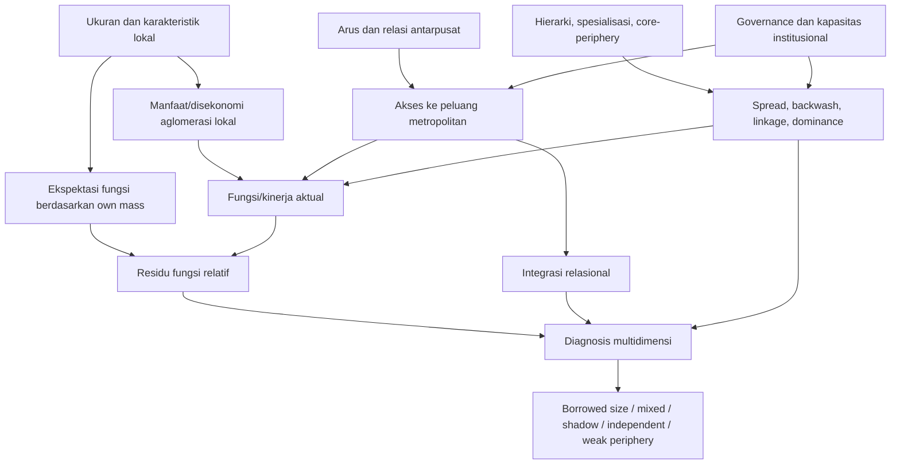

# Peta Dasar Teori Tier 1: *Borrowed Size* dan *Agglomeration Shadow* Jakarta - draft

> **Status:** candidate evidence package, bukan naskah Bab 2 final dan bukan Synthesis Product.
>
> **Tanggal:** 9 September 2026.
>
> **Tujuan:** menjawab pertanyaan teoretis dan definisional dari 19 sumber Tier 1, lalu memetakan konvergensi, komplementaritas, ketegangan, dan batas perbandingannya untuk Bab 2.1 dan Bab 2.3.

## Cara Membaca Dokumen

Corpus ini terdiri atas 19 karya yang membangun teori, mekanisme, model, atau lensa analitis. Corpus ini **bukan** 19 penelitian terdahulu. Pertanyaan tentang unit analisis, data, metode, lokasi studi, dan temuan empiris tetap berada pada corpus 73 penelitian terdahulu untuk Bab 2.2.

Penanda epistemik:

- `[S]` = klaim atau konsep yang dinyatakan atau diparafrasekan dari sumber; locator merujuk baris TXT canonical.
- `[I]` = inferensi analitis untuk menghubungkan sumber dengan pertanyaan skripsi; bukan klaim yang ditulis sumber.
- `[A]` = posisi atau arsitektur yang sudah terdapat dalam catatan Argument; tidak dibuat atau dipromosikan oleh dokumen ini.
- `[C]` = kandidat definisi, proposisi, atau arsitektur yang masih memerlukan peninjauan pengguna.
- `[G]` = hasil navigasi Graphify; tidak cukup menjadi bukti tanpa verifikasi pada TXT sumber.

Canonical source root:

`/Users/mac/Documents/Mac/[2] Obsidian Vault/zettelkasten/graphify-lab/full-corpus-txt/`

## Batas Corpus dan Provenance

- 19 kode terkunci: `T01`, `T03`, `T05`, `T06`, `T07`, `T08`, `T09`, `T14`, `T16`, `T17`, `M07`, `M08`, `M13`, `M14`, `M16`, `M17`, `Z01`, `Z03`, `P02`.
- Database corpus: `output/kajian/database_sitasi_dasar_teori.md`.
- Corpus penelitian terdahulu tetap berada di `output/kajian/kajian_penelitian_terdahulu_borrowed_size_dan_agglomeration_shadow_jakarta_bahan_bab_2_2.md`.
- Semua 19 TXT tersedia dan terwakili dalam reviewed graph.
- Audit Graphify memeriksa 2.246 locator node/edge dengan nol locator yang melampaui batas file.
- Confidence reviewed graph: 1.372 `EXTRACTED`, 43 `INFERRED`, dan 2 `AMBIGUOUS`.
- Empat edge manual tetap dipisahkan dari raw extraction dan memiliki locator yang valid.
- `T03` tetap merupakan bab buku dengan path lokal `source/working-paper/`.
- `Z01` memiliki nama file `1996` dan typo `eonomics`, sedangkan metadata title page menunjukkan edisi kedelapan International Edition dan copyright 2012.
- `Z03` adalah draft Desember 1967, bukan edisi komersial final.
- Locator berbasis ekstraksi PDF ke TXT; beberapa artefak layout/OCR mungkin masih ada.

## Question Bank Teoritis

### Pertanyaan Inti

Pertanyaan ini dapat diterapkan pada semua sumber, tetapi jawabannya tidak harus memiliki panjang atau bentuk yang sama.

- Masalah atau fenomena apa yang hendak dijelaskan?
- Apa objek penjelasan teoretisnya?
- Apa konstruk dan definisi eksplisitnya?
- Relasi apa yang diasumsikan ada antarkonstruk?
- Mekanisme apa yang menghubungkan konstruk-konstruk tersebut?
- Apa asumsi spasial, temporal, institusional, dan ekonominya?
- Pada level atau skala teorisasi apa mekanisme bekerja?
- Apa kondisi yang memungkinkan mekanisme tersebut berlaku?
- Apa mekanisme tandingan, efek negatif, atau batas cakupannya?
- Apa yang tidak dapat disimpulkan tentang Jakarta?
- Apakah bagian yang dibaca merupakan teori, model, kritik, ilustrasi, atau rekomendasi normatif?
- Apa fungsi sumber bagi skripsi: konsep, mekanisme, asumsi, batasan, counterpoint, atau konteks?

### Pertanyaan Definisional

- Apa definisi eksplisit konsep dalam sumber?
- Konsep tersebut berfungsi sebagai kondisi, proses, mekanisme, hasil, relasi, atau lensa analitis?
- Apa atribut minimal konsep tersebut?
- Apa konsep pembanding, lawan, atau konsep yang berdekatan?
- Istilah apa yang tampak sinonim tetapi memiliki fungsi berbeda?
- Apa yang dapat dan tidak dapat disimpulkan dari konsep tersebut?
- Apa contoh non-instance yang membantu menetapkan batas konsep?
- Di mana konsep tersebut berada dalam arsitektur teori: premis, mekanisme, moderator, outcome, atau lensa interpretif?
- Apakah definisi tersebut dapat dipakai untuk *borrowed size*, *agglomeration shadow*, integrasi metropolitan, atau pusat sekunder tanpa perluasan yang tidak sahih?
- Bagian mana yang merupakan definisi kerja penelitian, bukan definisi sumber?

### Modul A - Aglomerasi dan Disekonomi

- Bagaimana `sharing`, `matching`, dan `learning` menghasilkan manfaat aglomerasi?
- Bagaimana ukuran, kepadatan, biaya transportasi, dan *increasing returns* berhubungan?
- Kapan aglomerasi menghasilkan kemacetan, harga lahan, polusi, atau eksklusi?
- Apakah ukuran lokal, fungsi metropolitan, produktivitas, dan kesejahteraan dibedakan?
- Apakah sumber memberi mekanisme atau hanya alasan konseptual untuk mengharapkan fungsi tertentu?

### Modul B - Spread, Backwash, dan Polarisasi

- Melalui mekanisme apa pertumbuhan pusat menyebar ke wilayah sekitar?
- Melalui mekanisme apa pusat menarik tenaga kerja, modal, fungsi, atau permintaan?
- Dalam kondisi apa *spread* dan *backwash* dapat hadir bersamaan?
- Apa perbedaan `growth pole`, `trickle-down`, `backwash`, `spread`, dan `cumulative causation`?
- Apa batas penggunaan teori agar tidak berubah menjadi klaim bahwa Jakarta pasti menaungi pusat sekitarnya?

### Modul C - Hierarki, Pusat Sekunder, dan Spesialisasi

- Bagaimana *threshold*, *range*, dan hierarki menjelaskan fungsi berorde tinggi?
- Apa dasar teoretis untuk membedakan pusat sekunder dari unit administratif biasa?
- Apakah pertumbuhan sektor tertentu berarti kematangan fungsi lokal?
- Bagaimana spesialisasi sektoral berbeda dari spesialisasi fungsional?
- Apa keterbatasan asumsi ruang seragam dalam *central-place theory*?

### Modul D - Jaringan, Aksesibilitas, dan Polisentrisitas

- Apa perbedaan *accessibility*, *connectivity*, *mobility*, *proximity*, dan integrasi aktual?
- Kapan jaringan menghasilkan *complementarity* atau *synergy*?
- Apakah banyak pusat otomatis berarti jaringan fungsional yang kohesif?
- Apa peran arus, posisi jaringan, massa lokal, dan hubungan lintas pusat?
- Bukti apa yang dibutuhkan sebelum hubungan dengan Jakarta disebut relasional?

### Modul E - Governance dan Geografi Fungsional

- Bagaimana institusi dan koordinasi lintas batas memoderasi manfaat jaringan?
- Apa perbedaan wilayah fungsional dan yurisdiksi administratif?
- Apakah sumber memberi mekanisme yang dapat diukur atau hanya lensa perencanaan?
- Bagaimana strategi spasial membentuk perhatian dan tindakan tanpa menjadi bukti kausal?
- Apa yang boleh digunakan sebagai konteks interpretatif tetapi tidak boleh dimasukkan sebagai indikator?

## Source Cards

### T01 - Alonso (1973)

`source_file: /Users/mac/Documents/Mac/[2] Obsidian Vault/zettelkasten/graphify-lab/full-corpus-txt/T01-alonso-1973-urban-zero-population-growth-no-doi.txt`

**Peran teoretis:** sistem metropolitan terbuka, distribusi penduduk, dan intuisi awal tentang akses terhadap konsentrasi ukuran yang lebih besar.

- `[S]` Pertumbuhan penduduk nol pada tingkat nasional tidak berarti setiap lokalitas stabil; migrasi, pertambahan alami, dan perubahan ekonomi menghasilkan pertumbuhan, penyusutan, atau stabilitas lokal yang berbeda (TXT L67-L124).
- `[S]` Kota nyata berbeda dari korporasi munisipal; kota terdiri atas penduduk, relasi sosial, institusi, dan lingkungan fisik, sedangkan korporasi munisipal terutama merupakan entitas perpajakan dan layanan (TXT L133-L158; L239-L280).
- `[S]` Tidak ada ukuran kota ideal yang berlaku umum; yang penting adalah konfigurasi ukuran kota yang saling berinteraksi (TXT L719-L755).
- `[S]` *Population potential* dan akses ke pusat penduduk lain dapat memberi kota metropolitan kecil sebagian keuntungan ukuran besar melalui fasilitas bersama, layanan bisnis, pasar tenaga kerja, permintaan, dan fasilitas konsumsi (TXT L756-L808).
- `[S]` Stabilitas penduduk dapat menyembunyikan emigrasi kaum muda dan tekanan ekonomi; pertumbuhan nol tidak otomatis berarti keseimbangan sejahtera (TXT L837-L916).
- `[I]` T01 memberi intuisi yang berguna untuk sisi komplementaritas *borrowed size*, tetapi tidak memberi definisi operasional modern, ambang, residu fungsi-ukuran, atau kriteria jaringan.
- `[S]` Istilah *agglomeration shadow* tidak ditemukan. Mekanisme *sharing*, *matching*, dan *learning* juga tidak diberikan sebagai mikrofoundasi.

**Pertanyaan terbuka:** kapan *population potential* berubah menjadi manfaat fungsi, kapan berubah menjadi ketergantungan, dan siapa yang menerima atau menanggung redistribusi tersebut?

### T03 - Duranton dan Puga (2004)

`source_file: /Users/mac/Documents/Mac/[2] Obsidian Vault/zettelkasten/graphify-lab/full-corpus-txt/T03-duranton-puga-2004-micro-foundations-of-urban-agglomeration-economies-10.1016-S1574-0080-04-80005-1.txt`

**Peran teoretis:** mikrofoundasi ekonomi aglomerasi dan pasangan manfaat-disekonomi.

- `[S]` Masalahnya adalah menjelaskan mengapa manusia dan aktivitas ekonomi terkonsentrasi dalam kota meskipun ruang terbuka tersedia; objeknya adalah mekanisme mikro yang membentuk *increasing returns* lokal (TXT L107-L160).
- `[S]` Tiga dasar mikro dibedakan: *sharing*, *matching*, dan *learning* (TXT L161-L174).
- `[S]` *Sharing* bekerja melalui fasilitas indivisibel, variasi pemasok input, spesialisasi tugas, dan pooling risiko (TXT L175-L205; L300-L329).
- `[S]` *Matching* dapat memperbaiki kualitas dan peluang pasangan ekonomi, tetapi dapat pula menghasilkan *business stealing* dan terlalu banyak perusahaan (TXT L1166-L1173; L1281-L1312; L1485-L1509).
- `[S]` *Learning* mencakup eksperimen, transmisi keterampilan, dan akumulasi pengetahuan; mikrofoundasi limpahan pengetahuan masih diakui lemah (TXT L1748-L1844; L2010-L2028).
- `[S]` *Crowding*, biaya komuter, biaya lahan, koordinasi gagal, dan kompetisi dapat membalik manfaat aglomerasi (TXT L607-L638; L1619-L1626).
- `[I]` T03 memberi dasar untuk menjadikan ukuran lokal sebagai baseline fungsi, tetapi tidak menjelaskan manfaat yang diperoleh melalui jaringan antarkota.
- `[S]` *Borrowed size* dan *agglomeration shadow* tidak didefinisikan dalam TXT.

**Pertanyaan terbuka:** bagaimana membedakan manfaat aglomerasi lokal dari manfaat yang dipinjam melalui pusat lain, dan kapan kompetisi berubah menjadi *shadow*?

### T05 - Myrdal (1957)

`source_file: /Users/mac/Documents/Mac/[2] Obsidian Vault/zettelkasten/graphify-lab/full-corpus-txt/T05-myrdal-1957-economic-theory-and-under-developed-regions-no-doi.txt`

**Peran teoretis:** kausasi kumulatif, ketimpangan regional, *backwash*, dan *spread*.

- `[S]` Myrdal menolak asumsi keseimbangan stabil dan menjelaskan ketimpangan sebagai proses kausal yang dapat menguat (TXT L639-L707).
- `[S]` Perubahan biasanya memunculkan perubahan pendukung yang bergerak ke arah sama; proses menjauh dari keseimbangan (TXT L802-L823).
- `[S]` *Backwash effects* bekerja melalui migrasi, modal, perdagangan, dan relasi sosial yang menguntungkan wilayah ekspansif dan merugikan wilayah lain (TXT L1335-L1344; L1478-L1487).
- `[S]` *Spread effects* dapat menyebar melalui permintaan, produksi, pekerjaan, dan pembentukan pusat baru, tetapi tidak otomatis mengimbangi *backwash* (TXT L1501-L1534).
- `[S]` Subsidi, standar layanan, dan kebijakan kesejahteraan dapat melemahkan spiral regional yang menurun; konsentrasi berlebihan juga dapat memunculkan disekonomi (TXT L1241-L1262; L1652-L1685).
- `[I]` T05 memberi mekanisme makro untuk membedakan manfaat penyebaran dari penarikan balik, tetapi tidak memberi indikator *borrowed size* atau *shadow*.
- `[S]` Kedua istilah tersebut tidak ditemukan dalam TXT.

**Pertanyaan terbuka:** kapan *spread* mengalahkan *backwash*, bagaimana menimbang jeda waktu dan skala spasial, dan apa syarat jaringan yang membedakan manfaat penyebaran dari bayangan?

### T06 - Duranton dan Puga (2005)

`source_file: /Users/mac/Documents/Mac/[2] Obsidian Vault/zettelkasten/graphify-lab/full-corpus-txt/T06-duranton-puga-2005-from-sectoral-to-functional-urban-specialisation-10.1016-j.jue.2004.12.002.txt`

**Peran teoretis:** pergeseran dari spesialisasi sektoral ke spesialisasi fungsional.

- `[S]` Sumber menjelaskan pemisahan lokasi fasilitas manajemen dan produksi sebagai dasar spesialisasi fungsional (TXT L45-L58; L139-L168).
- `[S]` Jika biaya mengelola pabrik dari kantor pusat yang jauh turun di bawah ambang tertentu, perusahaan menjadi multi-lokasi; kota besar mengkhususkan kantor pusat dan jasa bisnis, kota lain mengkhususkan pabrik dan input sektoral (TXT L920-L947).
- `[S]` Jasa bisnis dapat dipakai lintas sektor, sedangkan input antara terutama menguntungkan sektor tertentu (TXT L294-L336; L530-L542).
- `[S]` Biaya integrasi, kemacetan, biaya hidup, dan bentuk kota dapat melawan pemisahan dan konsentrasi (TXT L159-L168; L1020-L1036).
- `[I]` T06 membantu membedakan pertumbuhan produksi pinggiran dari pematangan fungsi keputusan dan layanan.
- `[S]` *Borrowed size* dan *agglomeration shadow* tidak ditemukan.

**Pertanyaan terbuka:** apakah fungsi kota yang dipinjam mencakup fungsi keputusan, layanan, atau hanya produksi; dan bagaimana institusi serta jarak mengubah ambang pemisahan?

### T07 - Krugman (1991)

`source_file: /Users/mac/Documents/Mac/[2] Obsidian Vault/zettelkasten/graphify-lab/full-corpus-txt/T07-krugman-1991-increasing-returns-and-economic-geography-10.1086-261763.txt`

**Peran teoretis:** *increasing returns*, biaya transportasi, permintaan endogen, dan core-periphery.

- `[S]` Model dua wilayah menghubungkan manufaktur ber-*increasing returns*, pertanian yang terikat lahan, mobilitas pekerja, dan biaya transportasi (TXT L263-L342).
- `[S]` Konsentrasi manufaktur memperbesar pasar lokal melalui *backward linkage* dan memperbanyak variasi barang melalui *forward linkage* (TXT L181-L198).
- `[S]` Biaya transportasi tidak memiliki efek linear sederhana; biaya tinggi dapat menahan divergensi, sedangkan biaya rendah dapat memungkinkan konsentrasi, tetapi biaya nol membuat lokasi tidak relevan (TXT L582-L590; L722-L724).
- `[S]` Elastisitas substitusi `alpha` dibaca sebagai indeks terbalik kekuatan *increasing returns* atau skala ekonomi (TXT L387-L391).
- `[S]` Kompetisi pasar lokal, pangsa manufaktur rendah, skala ekonomi lemah, dan biaya transportasi tinggi menahan konsentrasi (TXT L470-L479; L789-L797).
- `[I]` T07 menjelaskan kondisi yang memungkinkan core-periphery, tetapi tidak memberi definisi *borrowed size* atau *agglomeration shadow*.

**Pertanyaan terbuka:** bagaimana menerjemahkan parameter model ke sistem Jakarta yang berbasis jasa, multipusat, dan memiliki arus aktual yang tidak sepenuhnya tercakup oleh biaya transportasi?

### T08 - Fujita, Krugman, dan Venables (1999)

`source_file: /Users/mac/Documents/Mac/[2] Obsidian Vault/zettelkasten/graphify-lab/full-corpus-txt/T08-fujita-krugman-venables-1999-the-spatial-economy-cities-regions-and-international-trade-no-doi.txt`

**Peran teoretis:** sintesis aglomerasi lintas skala, core-periphery, ambang, dan *agglomeration shadow*.

- `[S]` Aglomerasi dijelaskan melalui interaksi *increasing returns*, biaya transportasi, dan mobilitas faktor (TXT L321-L325; L2570-L2579).
- `[S]` *Backward* dan *forward linkages* memperbesar pasar lokal, variasi barang, dan penguatan konsentrasi (TXT L2583-L2635; L2672-L2703).
- `[S]` *Break point* dan *sustain point* menunjukkan bahwa perubahan biaya transportasi dapat mengubah stabilitas equilibrium simetris dan core-periphery (TXT L2862-L2908; L3091-L3126).
- `[S]` Kerangka urban systems menempatkan eksternalitas konsentrasi berhadapan dengan biaya komuter dan disekonomi ukuran kota; pendekatan ini tidak sepenuhnya menjelaskan lokasi antarkota (TXT L1055-L1170).
- `[S]` *Agglomeration shadow* disebut sebagai hinterland dekat kota yang tidak cukup menguntungkan untuk operasi baru dan dapat mengunci lokasi; titik potensial juga dapat dilewati ketika berada dalam bayangan kota yang sudah ada (TXT L5872-L5888; L9231-L9242; L9482-L9496).
- `[S]` Model sangat stilistis dan sensitif terhadap dua sektor, mobilitas faktor, *iceberg transport costs*, dan dinamika yang disederhanakan (TXT L2583-L2635; L3189-L3194).
- `[I]` T08 memberi dasar langsung untuk membaca *shadow* sebagai eksklusi spasial dan *lock-in*, tetapi belum memberi definisi diagnosis fungsi-ukuran yang akan dipakai dalam skripsi.
- `[S]` Istilah *borrowed size* tidak berfungsi sebagai konsep terdefinisi dalam bagian yang dibaca.

**Pertanyaan terbuka:** bagaimana membedakan *shadow* dari basis lokal lemah, kemacetan, atau ketergantungan; dan bagaimana memasukkan jaringan banyak kota tanpa menghapus mekanisme ambang?

### T09 - Arthur (1990)

`source_file: /Users/mac/Documents/Mac/[2] Obsidian Vault/zettelkasten/graphify-lab/full-corpus-txt/T09-arthur-1990-silicon-valley-locational-clusters-when-do-increasing-returns-imply-monopoly-10.1016-0165-4896-90-90064-E.txt`

**Peran teoretis:** *path dependence*, *lock-in*, konsentrasi historis, dan *agglomeration shadow*.

- `[S]` Model mengikuti pilihan lokasi perusahaan heterogen yang masuk secara berurutan; konfigurasi sebelumnya memengaruhi pilihan berikutnya (TXT L46-L61; L101-L116; L150-L183).
- `[S]` Urutan masuk dan keunggulan geografis awal dapat memilih salah satu hasil akhir; ini adalah *path dependence* dan kontingensi historis (TXT L201-L206; L275-L308).
- `[S]` *Increasing returns* tak terbatas dapat mengunci satu lokasi, sedangkan returns yang terbatas memungkinkan beberapa lokasi berbagi industri (TXT L351-L360; L430-L532).
- `[S]` *Agglomeration shadow* muncul ketika manfaat aglomerasi pusat membuat lokasi tetangga tidak cukup menarik dan menjadi *orphaned* (TXT L570-L598).
- `[S]` Disekonomi, heterogenitas preferensi, dan returns terbatas dapat menahan monopoli spasial (TXT L523-L617).
- `[I]` T09 memberi mekanisme shadow yang bersifat dinamis dan spasial, tetapi tidak memberi indikator fungsi metropolitan, radius, atau kriteria *borrowed size*.
- `[S]` *Borrowed size* tidak ditemukan.

**Pertanyaan terbuka:** kapan *shadow* dibatasi pada fungsi tertentu, berapa lama bertahan, dan bagaimana membedakannya dari basis lokal lemah atau ketergantungan institusional?

### T14 - Christaller (1966 [1933])

`source_file: /Users/mac/Documents/Mac/[2] Obsidian Vault/zettelkasten/graphify-lab/full-corpus-txt/T14-christaller-1966-central-places-in-southern-germany-no-doi.txt`

**Peran teoretis:** *central place*, *central goods*, hierarki, *range*, *threshold*, dan *economic distance*.

- `[S]` *Central place* adalah lokasi yang fungsi utamanya menjadi pusat wilayah; pusat orde tinggi melayani wilayah lebih luas dan mencakup pusat orde rendah (TXT L538-L566).
- `[S]` *Central goods/services* ditawarkan di sejumlah titik pusat; *centrality* berarti kepentingan relatif tempat terhadap wilayahnya dan derajat pelaksanaan fungsi pusat, bukan jumlah penduduk semata (TXT L602-L622).
- `[S]` *Range* adalah jarak terjauh yang masih bersedia ditempuh konsumen; *economic distance* mencakup biaya, waktu, ketidaknyamanan, dan penilaian subjektif, bukan kilometer semata (TXT L680-L722; L1455-L1475).
- `[S]` Batas bawah *range* berfungsi sebagai padanan kerja *threshold*, tetapi tidak boleh direduksi menjadi ambang populasi universal (TXT L1663-L1677).
- `[S]` Pusat orde tinggi dapat menarik pelanggan dari pusat rendah, tetapi fungsi juga dapat dibagi antara *sister cities* (TXT L1193-L1206; L1326-L1333).
- `[S]` Skema ideal mengabaikan topografi, sejarah, politik, dan keragaman kondisi; teori bersifat statis dan tidak lengkap (TXT L1973-L1984; L2980-L2992).
- `[I]` T14 memberi baseline hierarki fungsi dan definisi kerja *centrality*, bukan definisi langsung pusat sekunder dalam konteks Jakarta.
- `[S]` *Borrowed size* dan *agglomeration shadow* tidak didefinisikan.

**Pertanyaan terbuka:** apakah *threshold* diukur melalui penduduk, permintaan, pendapatan, penjualan, atau kapasitas layanan; dan kapan pelemahan pusat kecil merupakan *shadow*, spesialisasi, atau kompetisi?

### T16 - Hirschman (1958)

`source_file: /Users/mac/Documents/Mac/[2] Obsidian Vault/zettelkasten/graphify-lab/full-corpus-txt/T16-hirschman-1958-the-strategy-of-economic-development-no-doi.txt`

**Peran teoretis:** *ability to invest*, *complementarity*, *induced investment*, *linkages*, *growth pole*, *trickle-down*, dan polarisasi.

- `[S]` Hambatan pembangunan bukan hanya kurangnya tabungan, tetapi kemampuan menghimpun keputusan dan menyalurkan tabungan potensial ke peluang produktif (TXT L1023-L1061).
- `[S]` Investasi dapat menginduksi investasi berikutnya melalui penurunan biaya, peningkatan permintaan, atau penciptaan kebutuhan terhadap aktivitas lain (TXT L1136-L1189; L1852-L1883).
- `[S]` *Unbalanced growth* berjalan sebagai rantai disequilibrium yang menciptakan tekanan dan peluang lanjutan (TXT L1614-L1791).
- `[S]` *Backward linkage* mendorong produksi input; *forward linkage* mendorong pemakaian output sebagai input aktivitas baru (TXT L2578-L2614).
- `[S]` *Trickle-down* bekerja melalui pembelian, investasi, dan pekerjaan; *polarization* bekerja melalui kompetisi dan migrasi tenaga terampil, modal, serta pengusaha (TXT L4519-L4679).
- `[S]` *Low-level equilibrium trap* memiliki pembahasan khusus dan locator T16 Ch. 2 L1270-L1287; ia bukan sinonim otomatis dari *shadow*.
- `[I]` T16 menjelaskan rantai pertumbuhan dan ketergantungan yang dapat menjadi jembatan menuju kerangka skripsi, tetapi tidak menyediakan baseline ukuran lokal atau indikator fungsi.
- `[S]` *Borrowed size* dan *agglomeration shadow* tidak ditemukan.

**Pertanyaan terbuka:** kapan *trickle-down* mengungguli polarisasi, dan bagaimana membedakan *shadow* dari periferalitas atau lemahnya *ability to invest*?

### T17 - Perroux (1955)

`source_file: /Users/mac/Documents/Mac/[2] Obsidian Vault/zettelkasten/graphify-lab/full-corpus-txt/T17-perroux-1955-note-sur-la-notion-de-pole-de-croissance-10.3406-ecoap.1955.2522.txt`

**Peran teoretis:** *growth pole*, industri penggerak, eksternalitas, dominasi, dan pertumbuhan yang tidak merata.

- `[S]` Pertumbuhan muncul pada titik atau kutub dengan intensitas serta efek akhir yang berbeda, bukan tersebar seragam (TXT L75-L100; L162-L174).
- `[S]` Output, input, teknik produksi, dan pembelian jasa menciptakan efek induksi pada industri pemasok, komplementer, substitusi, dan konsumsi (TXT L285-L314; L349-L412).
- `[S]` *Industrie motrice* meningkatkan output industri lain; *industrie-clef* memiliki efek induksi yang lebih luas, tetapi statusnya bergantung pada himpunan terdampak dan periode (TXT L507-L559).
- `[S]` Kompleks industrial dapat melibatkan monopoli/oligopoli, dominasi, konflik, eliminasi, subordinasi, atau kerja sama (TXT L568-L615).
- `[S]` Agglomerasi meningkatkan kontak dan tenaga kerja terampil, tetapi dapat menghasilkan disparitas; pusat pertumbuhan dapat berubah menjadi stagnasi (TXT L617-L671).
- `[I]` T17 berguna untuk membedakan efek induksi dari penyebaran otomatis; ia bukan definisi *borrowed size* atau *shadow*.
- `[S]` Kedua istilah tidak muncul sebagai konsep bernama dalam TXT.

**Pertanyaan terbuka:** kapan efek induksi berubah menjadi *spread* versus *backwash*, dan apakah pusat yang stagnan mengalami *shadow*, *lock-in*, atau mekanisme lain?

### M07 - Levine, Grengs, dan Merlin (2019)

`source_file: /Users/mac/Documents/Mac/[2] Obsidian Vault/zettelkasten/graphify-lab/full-corpus-txt/M07-levine-grengs-merlin-2019-from-mobility-to-accessibility-transforming-urban-transportation-and-land-use-planning-no-doi.txt`

**Peran teoretis:** perbedaan *mobility*, *proximity*, *connectivity*, *accessibility*, *derived demand*, dan equity.

- `[S]` *Mobility* menekankan wilayah yang dapat dicapai; *accessibility* menekankan nilai destinasi yang dapat dicapai (TXT L238-L260).
- `[S]` Sebagian perjalanan merupakan *derived demand*; kecepatan tidak cukup jika tidak memperbesar kemampuan mencapai destinasi (TXT L277-L313; L341-L351).
- `[S]` *Mobility*, *proximity*, dan *connectivity* adalah sarana berbeda menuju aksesibilitas; connectivity dalam M07 juga memiliki makna pengiriman barang/jasa, bukan sekadar edge jaringan (TXT L468-L520).
- `[S]` Accessibility adalah potensi interaksi, bukan perilaku aktual; ukuran dapat menggabungkan origin, destinasi, impedansi, moda, dan waktu (TXT L539-L565; L2149-L2274).
- `[S]` Equity tidak identik dengan accessibility; distribusi manfaat perlu dianalisis menurut kelompok, lokasi, dan moda (TXT L832-L849; L4451-L4466).
- `[I]` Accessibility potensial tidak cukup untuk menyebut integrasi fungsional aktual, apalagi *borrowed size*.
- `[S]` *Borrowed size* dan *agglomeration shadow* tidak ditemukan.

**Pertanyaan terbuka:** bukti apa yang menjembatani peluang akses menjadi interaksi aktual, dan bagaimana akses berubah menjadi spillover atau *shadow*?

### M08 - Batty (2013)

`source_file: /Users/mac/Documents/Mac/[2] Obsidian Vault/zettelkasten/graphify-lab/full-corpus-txt/M08-batty-2013-the-new-science-of-cities-no-doi.txt`

**Peran teoretis:** kota sebagai sistem terbuka berbasis relasi, arus, jaringan, hierarki, dan kompleksitas.

- `[S]` Relasi antartempat lebih menentukan pemahaman kota daripada atribut intrinsik tempat; kota dipahami melalui interaksi dan jaringan (TXT L715-L731; L1217-L1243).
- `[S]` Arus bekerja lintas ruang-waktu, sementara jaringan menyediakan struktur bagi perpindahan manusia, material, energi, dan informasi (TXT L2650-L2687).
- `[S]` Kota adalah sistem kompleks terbuka yang tidak selalu kembali ke keseimbangan; keteraturan dapat muncul dari proses bottom-up (TXT L1181-L1199; L1603-L1697).
- `[S]` Hierarki dapat bertumpang tindih dan berbentuk *semi-lattice*, bukan pohon kaku; arus dapat bergerak ke atas dan ke bawah (TXT L1521-L1584; L1719-L1729).
- `[S]` Aglomerasi berhadapan dengan dekonsentrasi; penurunan biaya transportasi/komunikasi dapat menghasilkan *edge cities* dan pola polisentris (TXT L1308-L1406).
- `[S]` *Scaling* adalah regularitas bersyarat, bukan hukum universal; sumber tidak menawarkan teori kota lengkap (TXT L2268-L2347; L2485-L2494).
- `[I]` M08 memberi dasar untuk memahami integrasi sebagai arus dan relasi, tetapi tidak memberi benchmark fungsi lokal atau kriteria manfaat versus ketergantungan.
- `[S]` *Borrowed size* dan *agglomeration shadow* tidak ditemukan.

**Pertanyaan terbuka:** arus apa yang paling tepat menjadi bukti integrasi dan bagaimana menentukan batas sistem kota yang terbuka?

### M13 - Albrechts (2004)

`source_file: /Users/mac/Documents/Mac/[2] Obsidian Vault/zettelkasten/graphify-lab/full-corpus-txt/M13-albrechts-2004-strategic-spatial-planning-reexamined-10.1068-b3065.txt`

**Peran teoretis:** lensa perencanaan strategis, selektivitas, visi, tindakan, governance, dan implementasi.

- `[S]` *Strategic spatial planning* merespons keterbatasan perencanaan tata guna lahan tradisional yang pasif, lokal, kaku, dan berorientasi fisik (TXT L152-L187).
- `[S]` SPP adalah seperangkat konsep, prosedur, dan alat yang harus disesuaikan dengan situasi; ia mencakup proses, desain institusional, dan mobilisasi (TXT L296-L309).
- `[S]` “Strategic” berarti memilih keputusan dan tindakan yang lebih penting ketika sarana terbatas; visi jangka panjang dihubungkan dengan tindakan jangka pendek dan pembelajaran (TXT L485-L583).
- `[S]` Implementasi membutuhkan integrasi substantif, organisasional, instrumental, hukum, anggaran, kapasitas teknis, dan komitmen lintas aktor (TXT L621-L687).
- `[S]` Strategi dapat menjadi kosmetik, direbut aktor kuat, atau digagalkan sektor dengan anggaran dan kapasitas lebih besar (TXT L704-L723).
- `[I]` M13 adalah moderator/lensa governance; bukan mekanisme ekonomi *borrowed size* atau *shadow*.
- `[S]` Kedua istilah tidak ditemukan.

**Pertanyaan terbuka:** siapa yang menentukan isu strategis, siapa yang dirugikan oleh seleksi, dan kapan koordinasi mengubah kondisi lokal secara nyata?

### M14 - Healey (2009)

`source_file: /Users/mac/Documents/Mac/[2] Obsidian Vault/zettelkasten/graphify-lab/full-corpus-txt/M14-healey-2009-in-search-of-the-strategic-in-spatial-strategy-making-10.1080-14649350903417191.txt`

**Peran teoretis:** *strategic work*, framing, attention, dan trajektori tindakan dalam governance urban.

- `[S]` Tidak semua strategi spasial melakukan *strategic work*; sebagian hanya memenuhi kepatuhan formal atau mengulang arah yang sudah berjalan (TXT L97-L105; L144-L188).
- `[S]` Strategi spasial menyediakan *reference frame* bersama yang dapat membentuk diskursus dan tindakan lintas institusi (TXT L218-L235).
- `[S]` *Attention* dan *framing ideas* menyederhanakan ketidakpastian, membentuk agenda, dan menentukan isu yang menjadi terlihat atau terpinggirkan (TXT L280-L288; L658-L728).
- `[S]` Struktur kesempatan dapat meluas atau menyusut selama praktik; strategi tidak bersifat cetak biru deterministik (TXT L324-L360; L494-L509).
- `[S]` Frame dapat menjadi retorika, dipaksakan oleh suara kuat, atau menghapus kepentingan tertentu (TXT L679-L817).
- `[I]` M14 dapat dipakai untuk menelaah bagaimana manfaat atau *shadow* dibingkai dan ditindaklanjuti secara kelembagaan, bukan untuk menjelaskan mekanisme ekonomi.
- `[S]` *Borrowed size* dan *agglomeration shadow* tidak ditemukan.

**Pertanyaan terbuka:** siapa yang berwenang membentuk frame, kapan frame menjadi tindakan, dan apakah framing mengurangi atau memperkuat *shadow*?

### M16 - Healey (2006)

`source_file: /Users/mac/Documents/Mac/[2] Obsidian Vault/zettelkasten/graphify-lab/full-corpus-txt/M16-healey-2006-transforming-governance-challenges-of-institutional-adaptation-and-a-new-politics-of-space-10.1080-09654310500420792.txt`

**Peran teoretis:** adaptasi institusional, ruang relasional, kapasitas aktor kolektif, dan politik ruang.

- `[S]` Institusi berupa norma, aturan, dan praktik yang terus diproduksi melalui tindakan; perubahan institusi mencakup makna dan materialitas (TXT L240-L249).
- `[S]` Transformasi governance berjalan melalui sumber daya material, otoritas/regulasi, dan gagasan/kerangka makna (TXT L320-L342).
- `[S]` Inovasi governance perlu bergerak dari episode menuju arena investasi/regulasi, rutinitas, dan asumsi budaya; prosesnya menghadapi resistensi dan pembatasan (TXT L410-L472).
- `[S]` Ruang governance bersifat relasional, dengan batas, kohesi, dan eksklusi yang tidak dapat dibaca dari struktur organisasi sederhana (TXT L284-L312).
- `[S]` *Collective actor capacity* dibangun melalui jaringan politik, keahlian, pengetahuan, dan kemampuan membawa gagasan ke arena lain (TXT L495-L522).
- `[S]` Konsultasi dapat melegitimasi strategi tanpa mengubah distribusi kekuasaan; kapasitas institusional tidak otomatis inklusif (TXT L938-L966).
- `[I]` M16 memberi moderator institusional yang dapat memperkuat, menahan, atau membelokkan efek jaringan.
- `[S]` *Borrowed size* dan *agglomeration shadow* tidak ditemukan.

**Pertanyaan terbuka:** bagaimana mengukur kapasitas kolektif, kapan inovasi melewati batas arena, dan bagaimana membedakan kapasitas inklusif dari penangkapan oleh elite?

### M17 - Faludi (2012)

`source_file: /Users/mac/Documents/Mac/[2] Obsidian Vault/zettelkasten/graphify-lab/full-corpus-txt/M17-faludi-2012-multi-level-territorial-governance-three-criticisms-10.1080-14649357.2012.677578.txt`

**Peran teoretis:** kritik terhadap territorialism dan pembacaan governance yang terlalu bertingkat kaku.

- `[S]` *Governance* mencakup koordinasi sosial, jaringan antarorganisasi, kelompok nonnegara, dan gerakan sosial; ia tidak boleh direduksi menjadi hubungan vertikal antarpemerintah (TXT L130-L139; L241-L249).
- `[S]` Type I berupa yurisdiksi umum yang bertingkat dan bersarang, sedangkan Type II berupa yurisdiksi khusus, fleksibel, berbasis tugas, dan dapat beririsan (TXT L394-L468).
- `[S]` *Functional territories* dapat berupa wilayah komuter, otoritas transportasi, daerah aliran sungai, atau distrik layanan; wilayah tersebut parsial dan melintasi batas administratif (TXT L429-L439).
- `[S]` Ruang dan skala bersifat relasional, dinamis, dan dibentuk oleh proses, jaringan, arus, serta koalisi aktor (TXT L581-L668).
- `[S]` *Soft space* dan jaringan tidak otomatis berhasil; akuntabilitas, kewenangan, kapasitas koordinasi, dan konflik tetap penting (TXT L708-L718).
- `[I]` M17 membantu menguji mismatch antara functional territory dan yurisdiksi, tetapi bukan teori ekonomi *borrowed size* atau *shadow*.
- `[S]` Kedua istilah tidak ditemukan.

**Pertanyaan terbuka:** siapa yang memiliki kewenangan saat functional territories beririsan, dan melalui mekanisme apa governance memengaruhi manfaat atau ketergantungan?

### Z01 - O'Sullivan (Urban Economics)

`source_file: /Users/mac/Documents/Mac/[2] Obsidian Vault/zettelkasten/graphify-lab/full-corpus-txt/Z01-o'sullivan-1996-urban-eonomics.txt`

**Peran teoretis:** sintesis textbook tentang keseimbangan lokasi, rumah tangga, perusahaan, aglomerasi, lahan, transportasi, dan pemerintah lokal.

- `[S]` Urban economics menempatkan rumah tangga sebagai pemaksimal utilitas dan perusahaan sebagai pemaksimal laba; keputusan tersebut membentuk ukuran dan struktur kota (TXT L956-L964; L1040-L1073).
- `[S]` Keseimbangan lokasi terjadi ketika tidak ada pihak yang memiliki insentif pindah; upah, harga rumah, dan sewa mengompensasi perbedaan aksesibilitas (TXT L1218-L1276).
- `[S]` *Localization economies* dan *urbanization economies* mencakup input bersama, labor pooling, matching, dan knowledge spillovers (TXT L2926-L2935; L3640-L3860).
- `[S]` Ukuran kota adalah trade-off antara produktivitas/upah dan waktu perjalanan, sewa, kemacetan, dan polusi (TXT L4095-L4164; L4324-L4340).
- `[S]` Bid-rent, aksesibilitas, transportasi, dan perjalanan membentuk penggunaan lahan dan harga rumah (TXT L6579-L6584; L7192-L7366; L7544-L7758).
- `[S]` Eksternalitas membuat keseimbangan pasar berbeda dari optimum sosial; pemerintah lokal dapat menginternalisasi sebagian eksternalitas tetapi tidak selalu menghasilkan hasil efisien (TXT L1296-L1329; L19185-L19323).
- `[I]` Karena Z01 adalah textbook synthesis, ia berguna untuk kosakata dan baseline urban economics, bukan sebagai satu teori asli atau definisi *borrowed size*.
- `[S]` Kedua istilah tidak muncul dan tidak didefinisikan.

**Pertanyaan terbuka:** pada skala apa aglomerasi bekerja, kapan kedekatan menjadi komplementaritas, dan siapa yang menanggung biaya eksternalitas?

### Z03 - Friedmann (1967)

`source_file: /Users/mac/Documents/Mac/[2] Obsidian Vault/zettelkasten/graphify-lab/full-corpus-txt/Z03-friedmann-1967-a-generalized-theory-of-polarized-development.txt`

**Peran teoretis:** pembangunan terpolarisasi, core-periphery, otoritas, ketergantungan, komunikasi, dan organisasi teritorial.

- `[S]` Ruang adalah *field of forces* yang mencakup energi, kekuasaan keputusan, dan komunikasi; pembangunan merupakan perubahan struktur, bukan sekadar ekspansi (TXT L130-L141; L262-L285).
- `[S]` Sistem hierarkis-terpusat dapat kurang inovatif; sistem multisentris lebih inovatif tetapi dapat mengalami kebuntuan (TXT L344-L405).
- `[S]` *Core regions* adalah titik interaksi tinggi; periferi didefinisikan melalui ketergantungan pada inti, termasuk relasi otoritas-ketergantungan (TXT L679-L713).
- `[S]` Inti mengorganisasi periferi melalui pasokan, pasar, administrasi, transfer sumber daya, informasi, spesialisasi, dan skala urbanisasi (TXT L773-L836; L952-L970).
- `[S]` Penguatan inti dapat menjadi disfungsional bila penyebaran tidak dipercepat dan ketergantungan tidak dikurangi; komunikasi dapat memperluas inti atau melahirkan inti baru (TXT L1051-L1079).
- `[S]` Penerapan empiris dalam teks adalah ilustrasi dan sumber hipotesis, bukan pembuktian sistematis (TXT L195-L200; L1087-L1093).
- `[I]` Z03 memberi bahasa kekuasaan, otoritas, dan ketergantungan yang tidak ada dalam model ekonomi murni.
- `[S]` *Borrowed size* dan *agglomeration shadow* tidak ditemukan.

**Pertanyaan terbuka:** bagaimana mengukur *communication field*, menentukan inti/periferi nested di Jakarta, dan membedakan transfer sumber daya dari penyebaran fungsi?

### P02 - Meijers (2005)

`source_file: /Users/mac/Documents/Mac/[2] Obsidian Vault/zettelkasten/graphify-lab/full-corpus-txt/P02-meijers-2005-polycentric-urban-regions-and-the-quest-for-synergy-is-a-network-of-cities-more-than-the-sum-of-the-parts-10.1080-00420980500060384.txt`

**Peran teoretis:** polisentrisitas sebagai jaringan, komplementaritas, kerja sama, eksternalitas jaringan, dan sinergi.

- `[S]` Wilayah polisentris terdiri atas kota yang berbeda secara historis/administratif, berdekatan, dan terhubung; jaringan kota dibaca melalui hubungan, arus, dan interdependensi (TXT L97-L116; L303-L318; L872-L880).
- `[S]` Sinergi dapat muncul melalui kerja sama, komplementaritas, atau eksternalitas; polisentrisitas sendiri tidak otomatis menghasilkan sinergi (TXT L183-L230).
- `[S]` Komplementaritas berarti diferensiasi penawaran aktivitas atau tempat dengan pasar geografis yang sebagian beririsan; ia memerlukan transferabilitas dan interaksi (TXT L337-L430).
- `[S]` Eksternalitas dapat positif atau negatif; interaksi tinggi, kohesi, kemampuan menyesuaikan perilaku, dan pencegahan *free-rider* menjadi kondisi penting (TXT L322-L335).
- `[S]` Sinergi adalah konsep yang fuzzy karena menyembunyikan mekanisme berbeda dan tidak menetapkan siapa yang memperoleh manfaat atau apakah hubungan simetris (TXT L183-L228).
- `[I]` P02 berguna untuk membedakan morfologi banyak pusat dari integrasi fungsional, tetapi tidak memberi definisi langsung *borrowed size* atau *shadow*.
- `[S]` Kedua istilah tidak ditemukan.

**Pertanyaan terbuka:** kapan komplementaritas menjadi sinergi, kapan menjadi substitusi/kompetisi, dan apakah manfaat jaringan tersebar simetris?

## Sintesis Perbandingan Antarteori

### 1. Ekonomi aglomerasi dan disekonomi

T03 memberi mikrofoundasi `sharing`, `matching`, dan `learning`; T06 menjelaskan reorganisasi perusahaan dan spesialisasi fungsional; T07 dan T08 memformalkan *increasing returns*, biaya transportasi, *linkages*, dan core-periphery; T09 menambahkan urutan historis, *path dependence*, dan *lock-in*; Z01 memberi sintesis keseimbangan lokasi, bid-rent, eksternalitas, dan trade-off ukuran.

**Konvergensi:** konsentrasi dapat memberi manfaat dan biaya. Tidak satu pun sumber membenarkan asumsi bahwa ukuran atau kepadatan selalu menghasilkan hasil positif.

**Komplementaritas:** T03 menjelaskan mekanisme mikro; T07/T08 menjelaskan kondisi spasial-makro; T09 menjelaskan kontingensi waktu; T06 menjelaskan pembagian fungsi; Z01 menyediakan kosakata urban economics.

**Ketegangan:** teori keseimbangan dan optimasi lokasi tidak identik dengan teori path dependence dan lock-in. Aglomerasi lokal juga tidak sama dengan manfaat jaringan antarkota. Pertumbuhan produksi tidak otomatis berarti pematangan fungsi keputusan atau layanan.

### 2. Kausasi kumulatif, growth pole, dan core-periphery

T05 mengembangkan kausasi kumulatif dan membedakan *spread* dengan *backwash*. T16 memusatkan perhatian pada *ability to invest*, complementarity, linkage, *unbalanced growth*, *trickle-down*, dan polarization. T17 memusatkan perhatian pada *growth pole*, industri penggerak, kompleks industri, dan efek induksi. Z03 menambahkan otoritas, ketergantungan, komunikasi, dan struktur inti-periferi.

**Konvergensi:** pertumbuhan pusat dapat menghasilkan efek penyebaran dan penarikan balik secara bersamaan; arah akhir bergantung pada kondisi penerima, struktur, dan kapasitas.

**Komplementaritas:** T05 memberi mekanisme kumulatif makro; T16 memberi rantai investasi dan linkage; T17 memberi relasi industri/pole; Z03 memberi dimensi kekuasaan dan otoritas.

**Ketegangan:** *growth pole*, *polarization*, *backwash*, dan *agglomeration shadow* tidak boleh dipertukarkan. Mereka dapat berdekatan secara mekanistik, tetapi tidak memiliki definisi, objek, dan kriteria identifikasi yang sama.

**Graph finding:** graph menunjukkan citation links Z03 ke T16 dan T17, tetapi tidak menunjukkan edge langsung T05 ke T16 untuk `cumulative causation` dan `low-level equilibrium trap`. Perbedaan tersebut harus dipertahankan sebagai perbedaan teori, bukan disatukan karena vocabulary yang mirip.

### 3. Hierarki, jaringan, aksesibilitas, dan polisentrisitas

T14 memberi hierarchy, *central goods*, *range*, *threshold*, *economic distance*, dan *centrality*. M07 membedakan *mobility*, *proximity*, *connectivity*, dan accessibility sebagai potensi interaksi. M08 menempatkan kota dalam sistem terbuka berbasis arus dan jaringan. P02 menjelaskan bahwa polisentrisitas baru menjadi sinergis bila terdapat complementarity, cooperation, externalities, transferability, dan kapasitas organisasi.

**Konvergensi:** keberadaan beberapa pusat atau aksesibilitas potensial tidak cukup untuk menyimpulkan integrasi fungsional.

**Komplementaritas:** T14 menjelaskan fungsi pusat dan hierarki; M07 menjelaskan peluang akses; M08 menjelaskan arus dan sistem; P02 menjelaskan kondisi sinergi jaringan.

**Batas perbandingan:** `centrality` T14 bukan otomatis network centrality modern; accessibility M07 bukan integrasi aktual; polisentrisitas morfologis bukan sinergi; arus M08 bukan otomatis manfaat.

**Graph finding:** query `polycentricity network externalities` tidak menemukan bridge langsung P02-Z01 ke M07 atau T14. Query `central place central goods range` menemukan 51 node T14 dan lima node M07 karena co-retrieval kata `place`, tetapi tidak ada edge T14-M07 atau T14-P02. Hubungan tersebut masih harus dibangun sebagai inferensi analitis yang diverifikasi, bukan dibaca dari graph.

### 4. Planning, governance, dan geografi fungsional

M13 membahas visi, selektivitas, tindakan, dan implementasi strategis. M14 membahas *strategic work*, attention, framing, dan trajektori tindakan. M16 membahas adaptasi institusional, ruang relasional, dan *collective actor capacity*. M17 membedakan Type I/Type II governance, functional territories, dan batas relasional. P02 memberi ide kapasitas organisasi regional sebagai prasyarat sinergi.

**Kesimpulan register:** sumber-sumber ini adalah lensa governance dan planning, bukan mekanisme ekonomi aglomerasi. Mereka dapat dipakai sebagai moderator atau kondisi institusional: kapasitas koordinasi, kewenangan, framing, investasi, dan akuntabilitas dapat memperkuat atau menahan efek jaringan.

**Graph finding:** query planning-governance menghasilkan cluster M13-M14-M16 yang dihubungkan satu citation edge dan dua inferred similarity edges. M17 dan P02 tetap terpisah. Keterpisahan graph ini tidak membuktikan ketidakcocokan teoretis, tetapi mencegah kita menyebutnya sebagai satu teori terpadu tanpa kerja konseptual tambahan.

### 5. Kategori perbandingan yang harus dipertahankan

- **Convergence:** klaim berbeda yang mengarah pada mekanisme sejenis dan memiliki objek teoretis yang cukup sebanding.
- **Complementarity:** sumber menjelaskan bagian berbeda dari rantai yang sama.
- **Tension:** sumber memakai asumsi atau arah penjelasan yang sulit dipertahankan bersamaan.
- **Different theoretical register:** sumber tidak bertentangan karena bekerja pada register berbeda, misalnya ekonomi aglomerasi versus governance.
- **Not comparable:** istilah atau objek tampak sama tetapi fungsi teoretisnya berbeda.
- **Silence:** sumber tidak membahas konsep yang hendak dipakai; diam tidak boleh diubah menjadi dukungan.

## Definisi Kerja Kandidat

Bagian ini bukan definisi yang dapat diatribusikan kepada satu sumber. Ia adalah kandidat kerja yang dibangun dari source cards, graph navigation, dan arsitektur Argument yang sudah ada.

### Aglomerasi dan disekonomi aglomerasi

`[C]` Ekonomi aglomerasi adalah manfaat yang muncul dari kedekatan dan konsentrasi melalui mekanisme berbagi, pencocokan, pembelajaran, spesialisasi, serta penggunaan bersama. Disekonomi aglomerasi adalah biaya yang meningkat bersama konsentrasi, termasuk kemacetan, harga lahan, polusi, dan kompetisi yang menyingkirkan fungsi tertentu.

Sumber utama: T03, T06, T07, T08, T09, Z01. Definisi ini tidak mengasumsikan semua manfaat bekerja pada semua fungsi atau skala.

### Ukuran lokal, fungsi, dan kinerja

`[C]` Ukuran lokal adalah massa yang dimiliki unit itu sendiri. Fungsi adalah kapasitas menyediakan aktivitas atau layanan tertentu. Kinerja adalah hasil yang dicapai pada konstruk yang dipilih. Ketiganya tidak boleh dipertukarkan tanpa alasan.

Sumber pendukung: T01, T03, T06, T14, Z01. Sumber Tier 1 tidak menyediakan satu definisi universal tentang pusat sekunder atau fungsi metropolitan yang dapat langsung dipindahkan ke Jakarta.

### Aksesibilitas, konektivitas, dan integrasi

`[C]` Aksesibilitas adalah potensi mencapai peluang dengan memperhitungkan peluang dan impedansi. Konektivitas adalah keberadaan atau kualitas hubungan dalam jaringan. Integrasi fungsional adalah relasi yang termanifestasi melalui arus atau interaksi aktual.

Sumber utama: M07 dan M08; P02 menambahkan syarat interaksi, transferabilitas, kohesi, dan kapasitas organisasi. Skor aksesibilitas potensial saja tidak cukup untuk menyatakan integrasi aktual.

### Polisentrisitas

`[C]` Polisentrisitas morfologis merujuk pada susunan beberapa konsentrasi. Polisentrisitas fungsional merujuk pada hubungan, arus, dan interdependensi antarpusat. Sinergi adalah hasil yang bersyarat, bukan sinonim dari banyak pusat.

Sumber utama: P02, M08, T14. P02 tidak menjamin bahwa setiap wilayah polisentris menghasilkan sinergi.

### *Borrowed size*

`[C]` *Borrowed size* adalah pola ketika suatu tempat memiliki fungsi atau kinerja yang lebih tinggi daripada ekspektasi berdasarkan ukuran dan karakteristik lokal karena memperoleh akses dan memobilisasi manfaat melalui hubungan dengan pusat atau jaringan lain.

Status evidensi:

- T01 memberi intuisi tentang *population potential* dan manfaat akses terhadap konsentrasi lain (TXT L756-L808).
- Tidak ada definisi operasional modern yang lengkap dalam corpus 19 ini.
- Kriteria pembanding ukuran, fungsi aktual, integrasi relasional, kompatibilitas unit/periode, dan ketahanan berasal dari arsitektur Argument dan perlu dipertahankan sebagai `[A]/[C]`, bukan diklaim sebagai definisi T01.
- Sumber langsung untuk operasionalisasi modern perlu ditarik dari corpus penelitian/konsep yang terpisah jika akan dipakai dalam Bab 2.1.

### *Agglomeration shadow*

`[C]` *Agglomeration shadow* adalah pola ketika posisi dekat atau terhubung dengan pusat dominan berkaitan dengan penghambatan fungsi atau kinerja lokal relatif terhadap ekspektasi, melalui kompetisi, penarikan faktor, dominasi, penguncian lokasi, atau konsentrasi fungsi berorde tinggi.

Status evidensi:

- T08 membahas shadow sebagai hinterland yang tidak cukup menguntungkan untuk operasi baru dan titik yang terlewati oleh lokasi dominan (TXT L5872-L5888; L9231-L9242).
- T09 membahas shadow sebagai lokasi tetangga yang menjadi *orphaned* karena manfaat aglomerasi pusat (TXT L570-L598).
- T05, T16, T17, dan Z03 menyediakan mekanisme tetangga seperti *backwash*, polarization, dominance, dan dependency, tetapi tidak boleh disebut definisi shadow.
- Kedekatan, waktu tempuh singkat, arus keluar, atau defisit satu fasilitas secara sendiri-sendiri belum cukup untuk label ketat.

### Kondisi campuran

`[C]` Kondisi campuran diperlukan ketika unit memiliki surplus fungsi pada satu dimensi dan defisit atau ketergantungan pada dimensi lain, atau ketika klasifikasi berubah menurut indikator, bobot, ambang, atau wilayah tangkapan. Kategori ini melindungi analisis dari biner borrowed/shadow yang terlalu percaya diri.

## Arsitektur Teori Kandidat Untuk Bab 2.3

Arsitektur ini adalah kandidat pemetaan, bukan model sebab-akibat yang sudah terbukti.

Rantai tersebut memiliki batas berikut:

- T03/T06/T07/T08/T09/Z01 memberi fondasi untuk ukuran, aglomerasi, disekonomi, dan fungsi lokal.
- T05/T16/T17/Z03 memberi mekanisme penyebaran, penarikan balik, polarisasi, linkage, dominance, dan dependency.
- T14/M07/M08/P02 memberi bahasa hierarki, aksesibilitas, arus, jaringan, polisentrisitas, dan sinergi.
- M13/M14/M16/M17 memberi kondisi governance dan planning, bukan bukti ekonomi langsung.
- *Borrowed size* dan *agglomeration shadow* tetap merupakan diagnosis relasional tingkat menengah yang memerlukan integrasi beberapa lapisan, bukan teori tunggal dari satu sumber.

## Peta Graphify Untuk Navigasi Evidence

Reviewed baseline: 1.407 nodes, 1.417 directed edges, 1.407 undirected edges, 30 hyperedges, 159 components, 50 ordinary orphans, dan 754 weak nodes.

### Query Utama

- `borrowed size and agglomeration shadow`: 46 node ditemukan, tujuh ditampilkan pada budget; T01, T08, T09, Z01, dan Z03 muncul. Graph tidak memberi direct relation antara *Borrowed Size* dan *Agglomeration Shadow*.
- `polarized development core periphery`: 48 label match dan 61 node traversal; hubungan eksplisit utama adalah citation/edge dari Z03 ke T16/T17. T07 dan T08 tidak otomatis menjadi bridge hanya karena vocabulary-nya berdekatan.
- `agglomeration functional specialisation`: 56 node dan 68 edge; T03, T06, T07, T09, dan Z01 muncul. Bridge T03-T06 yang bersifat similarity tetap `INFERRED`.
- `cumulative causation growth poles low level equilibrium`: 105 node dan 116 edge; query perlu dibersihkan dari lexical matches yang tidak relevan. Tidak ada direct edge T05 cumulative causation ke T16 low-level equilibrium trap.
- `polycentricity network externalities`: 42 node; P02 dan Z01 muncul, tetapi tidak ada direct bridge ke M07 atau T14.
- `accessibility land use transport equity`: 62 node; tiga hyperedge M07 memuat accessibility logic, equity, dan measurement chain.
- `strategic spatial planning multilevel governance`: 74 node dan 70 edge pada traversal yang diperluas; M13-M14-M16 memiliki bridge terbatas, sedangkan M17 dan P02 tetap terpisah.
- `central place central goods range`: 56 node, terutama T14; M07 muncul karena co-retrieval kata `place`, bukan karena direct conceptual edge. Tidak ada direct T14-M07 atau T14-P02.

### Aturan Penggunaan Graph

- Graph adalah alat navigasi untuk menemukan istilah, sumber, dan locator; graph bukan sumber teori tambahan.
- Directed graph adalah rujukan arah relasi; undirected graph adalah proyeksi navigasi yang kehilangan sebagian arah dan multiplicity.
- Hyperedge tidak boleh diubah menjadi semua pasangan binary. `Connectivity` M07 memiliki dukungan hyperedge meskipun degree binary-nya nol.
- `EXTRACTED` berarti relasi tercatat dengan locator; ia tetap harus dibaca pada TXT untuk sintesis.
- `INFERRED` dan `AMBIGUOUS` tetap terlihat dan tidak dipromosikan menjadi evidence.
- Community labels provisional; 196 reviewed communities bukan 159 connected components. Snapshot 200/200 adalah pre-patch dan stale.
- Missing path berarti relasi tidak direpresentasikan dalam extraction; ia tidak membuktikan bahwa relasi substantif tidak ada.

### Empat Manual Edges Yang Diverifikasi

- T01: relasi `Distribution Problem` dan `Compensatory Payments`, TXT L267-L280.
- T16: relasi `The Strategy of Economic Development` dan `Low-Level Equilibrium Trap`, TXT L1270-L1287.
- T07: relasi `Elasticity of Substitution` dan `Economies of Scale`, TXT L387-L391.
- M13: relasi `Comprehensive Planning` dan `Traditional Land-Use Planning`, TXT L172-L187.

Keempatnya adalah relasi konseptual/reference yang tervalidasi, bukan hubungan kausal atau ekuivalensi konsep.

## Rute Ke Bab 2

| Bagian | Fungsi | Sumber Tier 1 yang relevan | Batas |
|---|---|---|---|
| 2.1 Konsep kunci | Menetapkan kosakata dan definisi kerja | T01, T03, T06, T14, M07, M08, P02, T08, T09, Z01 | Jangan mengatribusikan definisi kerja gabungan kepada satu penulis |
| 2.2 Penelitian terdahulu | Membandingkan fokus, data, metode, temuan, dan gap empiris | Corpus 73 penelitian terdahulu | Jangan mengubah 19 sumber teori menjadi tabel penelitian empiris |
| 2.3 Kerangka teori/konseptual | Menyusun mekanisme, moderator, proposisi, dan batas klaim | T03/T06/T07/T08/T09/Z01; T05/T16/T17/Z03; T14/M07/M08/P02; M13/M14/M16/M17 | Diagram tetap kandidat sampai diuji oleh desain dan data |

### Rute 2.1

- Definisikan aglomerasi dan disekonomi melalui T03, T06, T07, T08, T09, Z01.
- Bedakan ukuran lokal, fungsi, kinerja, dan fungsi metropolitan.
- Gunakan T14 untuk hierarchy, central place, central goods, range, dan economic distance.
- Gunakan M07 untuk accessibility, mobility, proximity, connectivity, dan equity.
- Gunakan M08/P02 untuk sistem kota, arus, network, polycentricity, complementarity, dan synergy.
- Presentasikan *borrowed size* dan *agglomeration shadow* sebagai definisi kerja yang dibangun dari beberapa sumber, bukan sebagai definisi tunggal T01/T08/T09.

### Rute 2.2

Bab 2.2 tetap menggunakan 73 penelitian terdahulu untuk membandingkan:

- unit/lokus kajian;
- data dan periode;
- metode dan operasionalisasi;
- temuan manfaat, shadow, atau hasil campuran;
- keterbatasan dan gap Jakarta.

Corpus 19 sumber dapat disebut sebagai genealogi teori di sekitar Bab 2.2, tetapi tidak boleh mengisi kolom empirisnya tanpa evidence yang sesuai.

### Rute 2.3

Bangun empat lapisan:

1. Ekonomi aglomerasi dan disekonomi untuk baseline own mass dan fungsi.
2. Polarisasi, kausasi kumulatif, growth pole, dan core-periphery untuk spread/backwash/linkage/dominance.
3. Sistem kota, hierarki, jaringan, aksesibilitas, dan polisentrisitas untuk relasi antarpusat.
4. *Borrowed size-agglomeration shadow* sebagai diagnosis fungsi relatif yang menggabungkan integrasi, residu, manfaat, beban, dan ketahanan.

M13-M17 dapat ditempatkan sebagai moderator institutional/governance jika penelitian memiliki evidence atau pembahasan yang mendukungnya. Mereka tidak boleh dipakai sebagai mekanisme ekonomi utama hanya karena muncul dalam corpus Tier 1.

## Proposisi Kandidat dan Batas Klaim

Proposisi berikut adalah `[C]`, bukan temuan:

- `[C] P1 - Efek jaringan bersyarat:` setelah ukuran dan karakteristik lokal diperhitungkan, integrasi fungsional yang lebih kuat dapat berkaitan dengan surplus pada sebagian fungsi, tetapi tidak harus pada semua fungsi.
- `[C] P2 - Kemungkinan shadow:` pada pusat tertentu, integrasi kuat dengan Jakarta dapat berkaitan dengan defisit fungsi relatif dan/atau beban ketergantungan yang lebih tinggi.
- `[C] P3 - Heterogenitas fungsi:` arah dan besar hubungan berbeda menurut pekerjaan, layanan, amenitas, fungsi keputusan, dan kinerja.
- `[C] P4 - Own mass dan posisi jaringan:` basis lokal, posisi jaringan, serta kapasitas penyerapan dapat memengaruhi kemampuan mengubah akses menjadi fungsi lokal.
- `[C] P5 - Morfologi tidak cukup:` banyak pusat tidak dengan sendirinya membuktikan integrasi fungsional, surplus fungsi, atau rendahnya ketergantungan.
- `[C] P6 - Ketidakpastian klasifikasi:` sebagian unit dapat berpindah kelas ketika proksi, bobot, ambang, wilayah tangkapan, atau spesifikasi diubah.

Label *borrowed size* atau *agglomeration shadow* sebaiknya dipakai hanya bila empat gerbang berikut terpenuhi:

1. Bukti relasional dengan Jakarta atau jaringan, bukan sekadar kedekatan atau waktu tempuh.
2. Fungsi aktual dibandingkan dengan ekspektasi berdasarkan ukuran dan karakteristik lokal.
3. Unit, periode, wilayah tangkapan, populasi sasaran, dan konstruk cukup kompatibel.
4. Hasil bertahan terhadap pilihan proksi, bobot, ambang, dan spesifikasi yang masuk akal.

Jika gerbang tidak terpenuhi, gunakan istilah yang lebih sempit seperti `aksesibilitas potensial`, `surplus/defisit fungsi relatif`, `ketergantungan komuter`, atau `belum terklasifikasi`.

## Unresolved Issues Untuk Review Pengguna

- Apakah definisi kerja *borrowed size* perlu mengambil definisi modern dari corpus penelitian/konseptual di luar 19 sumber Tier 1?
- Fungsi apa yang akan menjadi konstruk utama: pekerjaan, layanan, amenitas, fungsi keputusan, produktivitas, kesejahteraan, atau beberapa dimensi terpisah?
- Apa bukti arus aktual yang tersedia untuk membedakan accessibility potential dari integrasi fungsional?
- Bagaimana pusat sekunder didefinisikan tanpa menyamakan status administratif dengan fungsi pusat?
- Apakah governance M13-M17 dipakai sebagai moderator analitis, konteks interpretatif, atau tidak dimasukkan ke model inti?
- Bagaimana membedakan *agglomeration shadow* dari periferalitas lemah, *lock-in*, *backwash*, dominance, atau ketergantungan institusional?
- Apakah hasil akan dilaporkan per dimensi fungsi sebelum membuat kelas komposit?
- Unit analisis final, indikator, dan metode tetap harus ditentukan pada Bab 3 setelah audit data dan kajian 73 penelitian terdahulu.

## Batasan Dan Audit

- Reviewed graph memiliki 1.407 nodes, 1.417 directed edges, 1.407 undirected edges, 30 hyperedges, 159 components, 50 ordinary orphans, dan 754 weak nodes.
- Raw extraction memiliki 1.413 edges; angka pre-patch tersebut tidak boleh dicampur dengan reviewed 1.417 edges.
- `GRAPH_REPORT.md` membulatkan ambiguous edges menjadi 0%; audit tetap menemukan dua edge `AMBIGUOUS`.
- Angka weak nodes 640 pada report dan 754 pada structural audit memakai denominator berbeda; jangan menyamakan keduanya.
- Hyperedge provenance lebih kasar daripada node/edge provenance; hyperedge membership tidak sama dengan seluruh pasangan binary.
- Fragment token metadata tidak tersedia dan bernilai `0`; angka tersebut bukan ukuran usaha membaca.
- Graph path tidak membuktikan kausalitas, urutan historis, arah efek, atau validitas empiris.
- Community labels hanya navigasi. Jangan mengubahnya menjadi struktur teori, folder, tag, atau kategori permanen.
- Dokumen ini tidak mengedit catatan Argument. Ia menyajikan candidate package yang harus masuk ke Argument melalui peninjauan pengguna.

## Artefak Yang Dipakai

- `output/kajian/database_sitasi_dasar_teori.md`
- `output/kajian/kajian_penelitian_terdahulu_borrowed_size_dan_agglomeration_shadow_jakarta_bahan_bab_2_2.md`
- `argument/argument/Bab 2 - Dasar Teori dan Konsep Kunci Borrowed Size dan Agglomeration Shadow Jakarta.md`
- `graphify-lab/runs/tier1-19-txt/graphify-out/graph.json`
- `graphify-lab/runs/tier1-19-txt/graphify-out/graph-directed.json`
- `graphify-lab/runs/tier1-19-txt/graphify-out/.graphify_extract_reviewed.json`
- `graphify-lab/runs/tier1-19-txt/graphify-out/health.json`
- `graphify-lab/runs/tier1-19-txt/graphify-out/GRAPH_REPORT.md`
- `graphify-lab/runs/tier1-19-txt/manual-edge-patch.json`
- `handoff-graphify-tier1.md`

## Perbedaan Pendapat Dan Keputusan Posisi Pengguna

Bagian ini mempertahankan perbedaan antarsumber. Istilah `tim` di bawah adalah pengelompokan analitis untuk membantu memilih posisi kerja; ia tidak berarti semua penulis dalam satu tim sepakat penuh atau pernah mengajukan perdebatan yang sama.

Pilihan interaktif berikut adalah keputusan pengguna pada 9 September 2026. Penanda `[U]` berarti **user-confirmed working choice**. Pilihan ini belum menjadi kesimpulan final skripsi dan masih dapat diuji oleh data, literatur tambahan, atau perubahan posisi pengguna.

### 1. Equilibrium Versus Kausasi Kumulatif

**Tim equilibrium/optimality**

- Z01 menjelaskan keseimbangan lokasi, kompensasi harga dan upah, serta trade-off manfaat aglomerasi dan biaya kota (TXT L1218-L1276; L4095-L4164).
- T14 membangun skema hierarki pusat secara deduktif dan mengakui bentuk ideal yang statis (TXT L286-L309; L1973-L1984).
- T07 dan T08 memakai equilibrium, stabilitas, parameter, dan titik ambang untuk menjelaskan kapan konsentrasi bertahan atau pecah (T07 TXT L515-L537; T08 TXT L2862-L2908).

**Tim cumulative/path-dependent**

- T05 menyatakan bahwa perubahan dapat menimbulkan perubahan lanjutan yang bergerak ke arah sama dan menjauh dari keseimbangan (TXT L802-L823).
- T09 menunjukkan bahwa urutan historis, keunggulan awal, dan returns dapat memilih hasil yang berbeda serta menciptakan *lock-in* (TXT L201-L206; L275-L308).
- M08 memahami kota sebagai sistem terbuka yang tidak selalu kembali ke equilibrium dan dapat menghasilkan keteraturan secara bottom-up (TXT L1181-L1199; L1603-L1697).

**Keputusan pengguna:** `[U] Sintesis bersyarat.`

**Konsekuensi kerja:** equilibrium dipakai sebagai baseline atau counterfactual analitis untuk membandingkan fungsi relatif; increasing returns, kausasi kumulatif, sejarah, dan lock-in dipakai untuk menjelaskan penyimpangan, divergensi, serta ketidakstabilan. Kedua tim tetap dipertahankan sebagai mekanisme alternatif. Tidak boleh diasumsikan bahwa Jakarta berada dalam equilibrium atau pasti terkunci.

### 2. Central-Place Hierarchy Versus Relational Network

**Tim hierarchy/central place**

- T14 mendefinisikan pusat melalui fungsi wilayah, *central goods*, *range*, *threshold*, dan orde pusat (TXT L538-L622; L1663-L1805).
- Fungsi orde tinggi memerlukan jangkauan dan permintaan yang lebih besar; pusat orde tinggi dapat menarik pelanggan dari pusat orde rendah (TXT L1193-L1206).

**Tim network/polycentricity**

- M08 memahami kota melalui arus, jaringan, relasi, dan hierarki yang dapat tumpang tindih atau berbentuk *semi-lattice* (TXT L715-L731; L1521-L1584).
- P02 membedakan susunan polisentris dari sinergi yang memerlukan hubungan, arus, komplementaritas, kerja sama, transferabilitas, dan kapasitas organisasi (TXT L97-L116; L183-L230; L337-L430).

**Keputusan pengguna:** `[U] Hierarki + jaringan.`

**Konsekuensi kerja:** T14 dipakai untuk mengidentifikasi dan membedakan fungsi pusat; M08 dan P02 dipakai untuk membaca relasi aktual dan posisi jaringan yang dapat mengubah fungsi tersebut. `Centrality` T14 tidak disamakan dengan network centrality; banyak pusat tidak dianggap otomatis terintegrasi atau sinergis.

### 3. Spread/Complementarity Versus Backwash/Shadow

**Tim spread/complementarity**

- T01 menunjukkan bahwa kota kecil dapat memperoleh sebagian keuntungan ukuran besar melalui akses terhadap konsentrasi penduduk, fasilitas, layanan, tenaga kerja, dan permintaan (TXT L756-L808).
- T16 menjelaskan *trickle-down* melalui pembelian, investasi, pekerjaan, dan complementarity (TXT L4519-L4652).
- T17 menjelaskan efek induksi dari industri penggerak, input, jasa, dan kompleks industri (TXT L285-L412; L507-L559).
- P02 menjelaskan kemungkinan sinergi melalui kerja sama, komplementaritas, dan eksternalitas jaringan (TXT L183-L230).

**Tim backwash/shadow/polarization**

- T05 menjelaskan migrasi, modal, perdagangan, dan relasi sosial yang dapat menguntungkan wilayah ekspansif dan merugikan wilayah lain (TXT L1335-L1534).
- T08 menjelaskan *agglomeration shadow* sebagai hinterland dekat pusat yang tidak cukup menarik bagi operasi baru (TXT L5872-L5888).
- T09 menjelaskan lokasi tetangga yang menjadi *orphaned* akibat manfaat aglomerasi pusat (TXT L570-L598).
- Z03 menjelaskan transfer sumber daya, dominasi, otoritas, dan ketergantungan inti-periferi (TXT L679-L713; L773-L836).

**Keputusan pengguna:** `[U] Dual effect.`

**Konsekuensi kerja:** hubungan dengan pusat besar tidak diberi tanda positif atau negatif sejak awal. *Spread*, complementarity, *borrowed size*, backwash, polarization, dependency, dan shadow dipertahankan sebagai kemungkinan yang bergantung pada fungsi, arus, posisi, kapasitas, periode, dan relasi kekuasaan. Satu pusat dapat memperoleh surplus pada fungsi tertentu dan mengalami defisit atau ketergantungan pada fungsi lain.

### 4. Accessibility Potential Versus Actual Functional Integration

**Tim accessibility potential**

- M07 mendefinisikan accessibility sebagai potensi mencapai peluang dengan memperhitungkan destinasi dan impedansi; ia bukan perilaku perjalanan aktual (TXT L539-L565).
- Skor dapat dibentuk dari origin, destinasi, biaya, moda, waktu, dan fungsi impedansi (TXT L2149-L2274).

**Tim actual interaction/flow**

- M08 menempatkan arus dan interaksi sebagai proses yang membentuk sistem kota (TXT L2650-L2687).
- P02 mensyaratkan interaksi, transferabilitas, kohesi, dan kapasitas jaringan agar komplementaritas dapat menghasilkan sinergi (TXT L322-L335; L420-L430).

**Keputusan pengguna:** `[U] Arus + akses.`

**Konsekuensi kerja:** accessibility potential dipakai sebagai struktur peluang, sedangkan integrasi fungsional memerlukan bukti arus atau interaksi aktual. Waktu tempuh, kedekatan, atau accessibility score tidak sendirian membuktikan *borrowed size*, sinergi, atau hubungan dengan Jakarta.

### 5. Governance Formal Versus Ruang Fungsional-Relasional

**Tim hierarchy/formal institution**

- M17 Type I mengorganisasi yurisdiksi umum yang bertingkat dan bersarang; kewenangan, akuntabilitas, dan pelayanan tetap melekat pada institusi formal (TXT L394-L468).
- M13 menekankan desain institusional, implementasi, anggaran, hukum, dan komitmen lintas aktor (TXT L296-L309; L621-L687).

**Tim functional/relational space**

- M17 Type II mengorganisasi fungsi tertentu secara fleksibel, melintasi batas, dan dapat beririsan; scale dibentuk oleh proses dan koalisi aktor (TXT L429-L439; L581-L668).
- M16 memahami governance melalui relasi sosial, arus sumber daya, otoritas, gagasan, dan kapasitas aktor kolektif (TXT L284-L342; L495-L522).

**Keputusan pengguna:** `[U] Moderator relasional.`

**Konsekuensi kerja:** governance tidak menjadi mekanisme ekonomi utama dan tidak direduksi menjadi struktur administratif. Ia dipakai sebagai kondisi yang dapat memperkuat, menahan, atau membelokkan efek jaringan dan polarisasi. Type I, Type II, kapasitas, kewenangan, framing, dan akuntabilitas tetap dapat menghasilkan prediksi yang berbeda.

### 6. Strategic Planning Versus Emergent Systems

**Tim strategic planning**

- M13 memandang perencanaan strategis sebagai visi, selektivitas, tindakan, governance, dan implementasi transformatif (TXT L296-L309; L485-L687).
- M14 menekankan *strategic work*, framing, attention, dan trajektori tindakan (TXT L179-L235; L658-L817).

**Tim emergent/path-dependent system**

- M08 menekankan proses bottom-up, arus, interaksi, dan keteraturan emergen dalam sistem kota terbuka (TXT L1181-L1199; L1603-L1697).
- T09 menunjukkan bahwa hasil spasial dipengaruhi urutan masuk, keunggulan awal, dan pilihan historis (TXT L201-L206; L275-L308).

**Keputusan pengguna:** `[U] Kombinasi bersyarat.`

**Konsekuensi kerja:** planning dapat membentuk frame, kapasitas, dan arena tindakan, tetapi tidak dianggap mengendalikan hasil secara deterministik. Hasil metropolitan dibaca sebagai interaksi antara intervensi strategis, institusi, keputusan lokal, arus, dan path dependence.

### 7. Sumber Utama Definisi *Borrowed Size*

**Tim intuisi Alonso**

- T01 memberikan bahasa *population potential* dan akses kota kecil terhadap fasilitas, pasar, tenaga kerja, serta permintaan yang terkait dengan konsentrasi lebih besar (TXT L756-L808).

**Tim literatur lanjutan**

- Corpus 19 tidak menyediakan definisi operasional modern yang lengkap tentang benchmark ukuran, fungsi aktual, surplus fungsi, atau integrasi relasional.
- Definisi langsung dan operasionalisasi modern perlu ditarik dari literatur konsep/empiris yang berada di luar corpus Tier 1 bila diperlukan.

**Keputusan pengguna:** `[U] Multi-sumber kandidat.`

**Konsekuensi kerja:** T01 dipertahankan sebagai genealogi dan intuisi, bukan satu-satunya otoritas. Definisi kerja menggabungkan own mass, external access, fungsi/kinerja, integrasi relasional, kompatibilitas, dan ketahanan, tetapi seluruh gabungan tersebut tetap ditandai `[C]` sampai disetujui dalam kerangka skripsi.

### 8. Batas Definisi *Agglomeration Shadow*

**Tim eksklusi spasial sempit**

- T08 menekankan hinterland dan operasi baru yang tidak cukup menarik di dekat pusat dominan (TXT L5872-L5888).
- T09 menekankan lokasi tetangga yang menjadi *orphaned* karena keunggulan aglomerasi pusat (TXT L570-L598).

**Tim efek negatif luas**

- T05, T16, T17, dan Z03 memberi mekanisme tetangga berupa *backwash*, polarization, dominance, dependency, dan transfer sumber daya.
- Mekanisme-mekanisme tersebut dapat relevan, tetapi tidak identik dengan definisi *shadow*.

**Keputusan pengguna:** `[U] Diagnosis relasional ketat.`

**Konsekuensi kerja:** label *shadow* memerlukan relasi dengan pusat dominan, defisit fungsi relatif, mekanisme eksklusi/penarikan/lock-in yang masuk akal, dan ketahanan klasifikasi. Backwash, dominance, dependency, atau periferalitas dapat menjadi penjelasan alternatif atau komponen mekanisme, tetapi tidak otomatis menjadi label *shadow*.

### Prinsip Mempertahankan Perbedaan

- Pilihan `[U]` tidak menghapus tim yang tidak dipilih; tim tersebut tetap menjadi counterposition dan sumber counterevidence.
- Sintesis bersyarat berarti kondisi pemisah harus dicari, bukan bahwa semua teori benar sekaligus.
- Jika data hanya mendukung accessibility potential, jangan menaikkannya menjadi integrasi aktual.
- Jika data hanya menunjukkan defisit fungsi, jangan menaikkannya menjadi *agglomeration shadow* tanpa bukti relasional.
- Jika bukti baru lebih mendukung posisi alternatif, perubahan posisi harus dicatat sebagai keputusan pengguna baru, bukan disembunyikan dalam definisi.

## Status Promosi

Dokumen ini sudah cukup sebagai paket kandidat untuk dibaca dan dikritik. Ia belum boleh diperlakukan sebagai:

- definisi final Bab 2.1;
- kerangka teori final Bab 2.3;
- sintesis produk pengguna;
- perubahan posisi intelektual pengguna;
- temuan empiris Jakarta.
